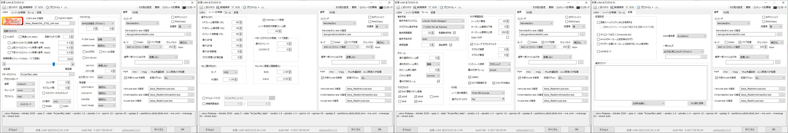
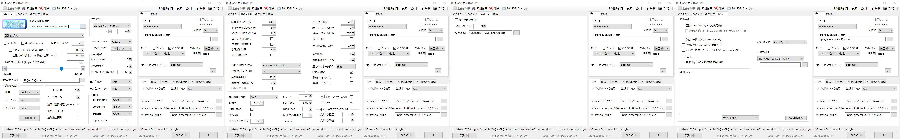
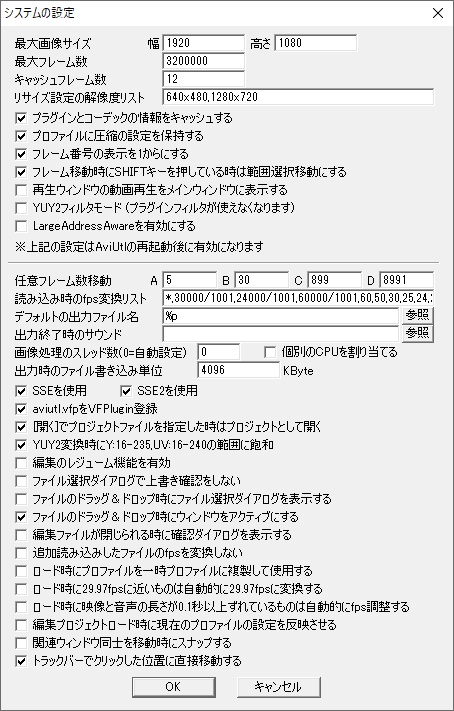
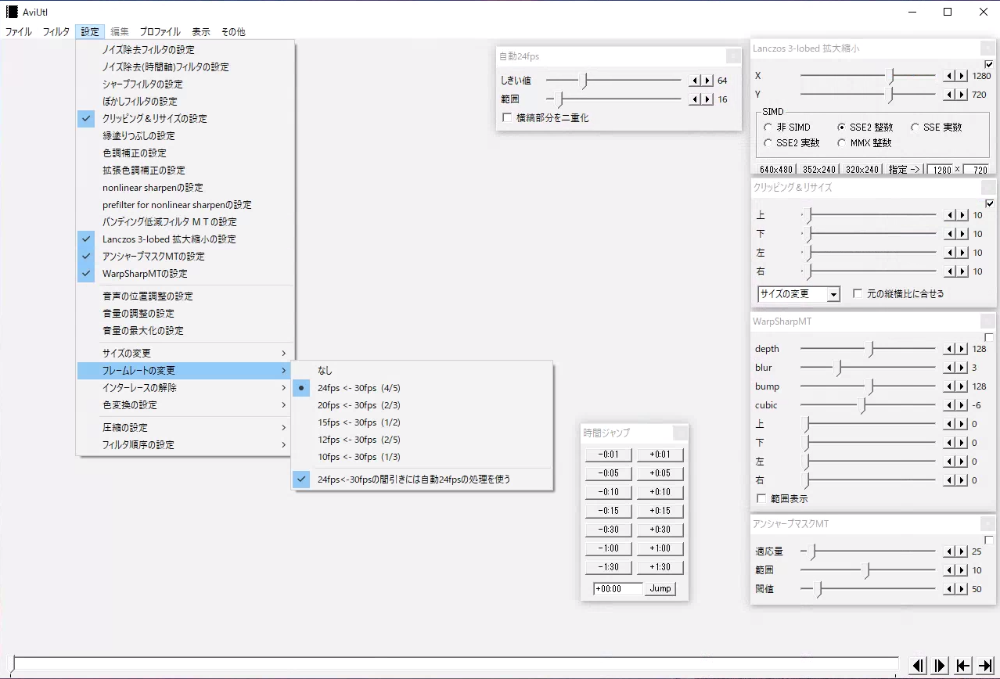
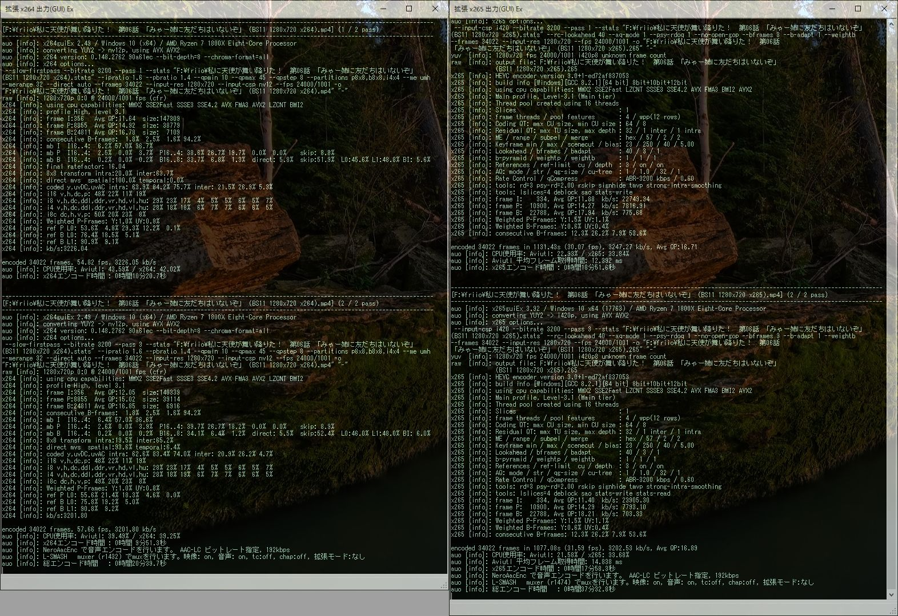
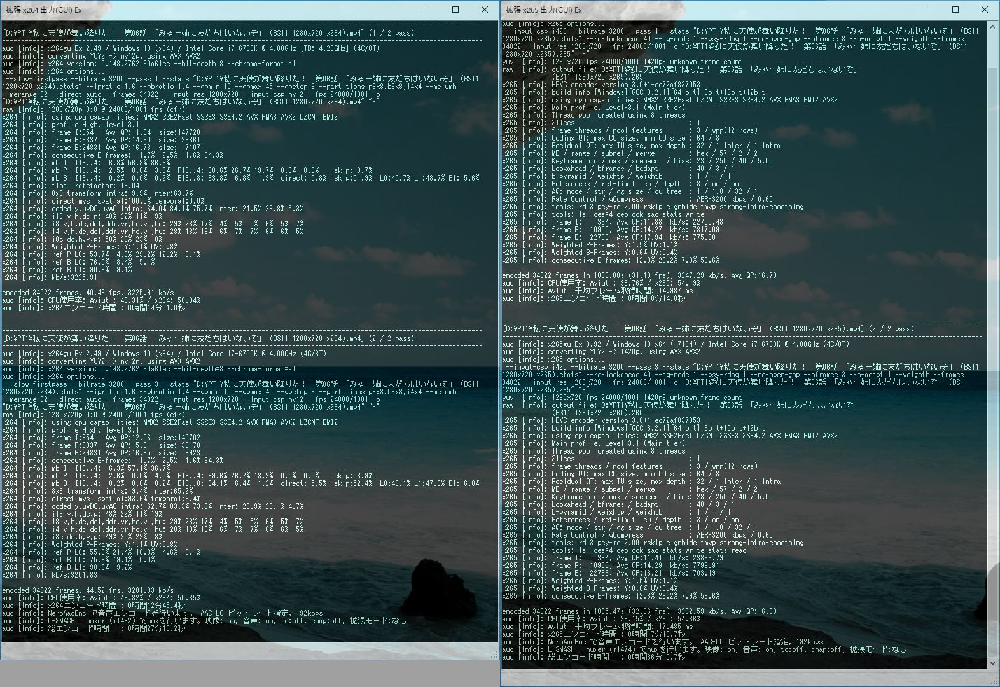
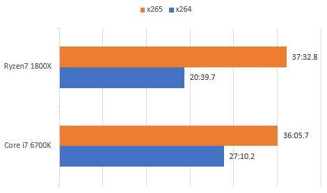

### x265エンコード検証

Zen2でまともにAVX2がサポートされるということでx265を試してみた。Ryzen7 1800Xなメイン機とCore i7 6700Kなサブ機の両方で検証。当然AviUtlの各種フィルタとコーデックの設定はすべて統一。

---

### 検証機材

|      | メイン機      |サブ機         |
|-----------|:------------:|:------------:|
| CPU     | Ryzen7 1800X      | Core i7 6700K       |
| クーラー   | Scythe 羅刹 SCRT-1000    | Scythe SCRT-1000   |
| M/B | MSI B350 TOMAHAWK    | Asus Z170-A       |
| MEM | TeamGroup DDR4 2133 8GB*2    | UMAX DDR4 2400 8GB*2       |
| SSD | SamsungSSD960EVO 250GB CrucialMX100 256GB IntelSSD335 240GB    | Intel SSD 320 120GB Crucial M500 120GB       |
| VGA | 玄人志向 RD-R5-230-E1GB/G2    | 玄人志向 GeForce GT610       |

---

### コーデックの設定

x264の設定

x265の設定

---

### AviUtlの設定

---

### エンコード所要時間

**メイン機(Ryzen7 1800X)**

←x264 x265→

**サブ機(Core i7 6700K)**

←x264 x265→

---

### まとめ表とグラフ

#### x264の結果

| x264     |Ryzen7 1800X      |Core i7 6700K         |
|-----------|:------------:|:------------:|
| 1pass      | 10:20.7       | 14:10.0      |
| 2pass      | 09:51.3       | 12:45.4      |
| Total      | 20:39.7       | 27:10.2      |

#### x265の結果

| x265     |Ryzen7 1800X      |Core i7 6700K         |
|-----------|:------------:|:------------:|
| 1pass      | 18:51.6       | 18:14.0      |
| 2pass      | 17:58.3       | 17:16.7      |
| Total      | 37:32.8       | 36:05.7      |

---

### 仕上がり画像(オリジナル→x265→x264の順)

---

### 結論

違いがよくわからないからx264のままでいいや

---