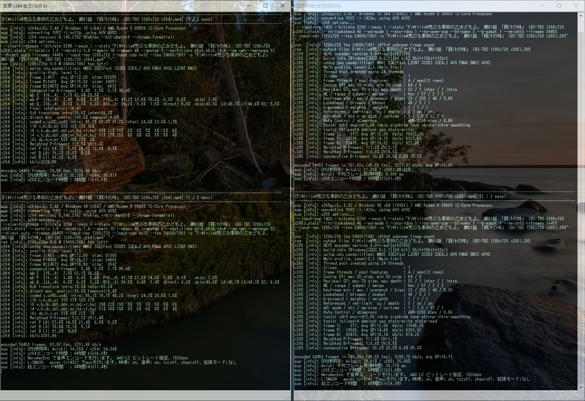
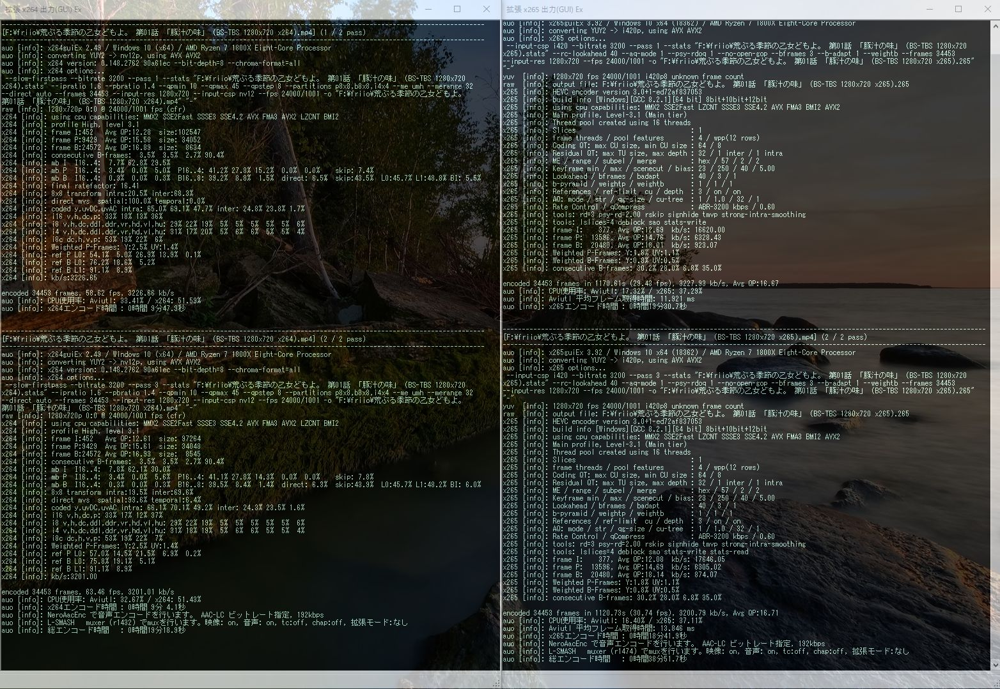
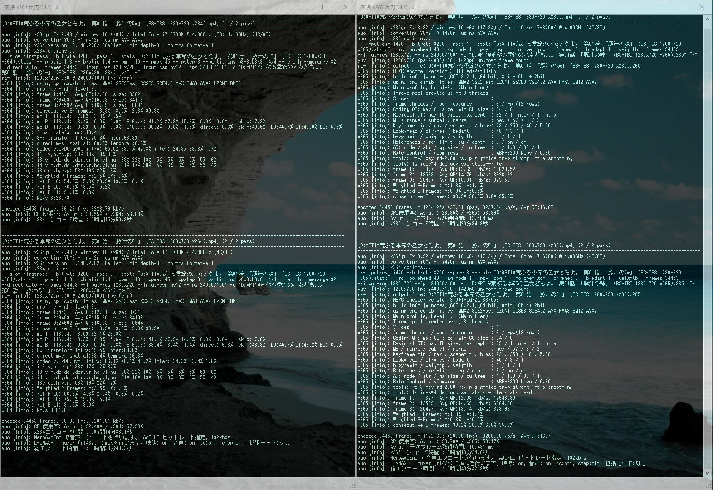
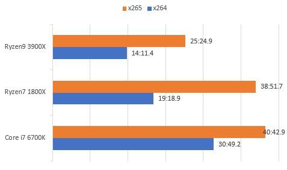

import { Link } from 'gatsby';

### x265エンコード検証 2

運よくRyzen9 3900Xが手に入ったので1800Xとエンコード時間の比較をした。

エンコードの設定は
<Link to="/blog/2019-02-14">
前回
</Link>
と同じ

---

### 検証機材

|     | Ryzen9 3900X | Ryzen7 1800X|Core i7 6700K         |
|-----------|------------|------------|------------|
| CPU      | **Ryzen9 3900X**      | Ryzen7 1800X      | Core i7 6700K       |
| クーラー  | Scythe 羅刹 SCRT-1000     | Scythe 羅刹 SCRT-1000    | Scythe SCRT-1000   |
| M/B | GIGABYTE B450 GAMING X    | GIGABYTE B450 GAMING X    | Asus Z170-A       |
| MEM | TeamGroup DDR4 2133 8GB*2    | TeamGroup DDR4 2133 8GB*2    | UMAX DDR4 2400 8GB*2       |
| SSD | SamsungSSD960EVO 250GB CrucialMX100 256GB IntelSSD335 240GB    | SamsungSSD960EVO 250GB CrucialMX100 256GB IntelSSD335 240GB    | Intel SSD 320 120GB Crucial M500 120GB       |
| VGA | 玄人志向 RD-R5-230-E1GB/G2    | 玄人志向 RD-R5-230-E1GB/G2    | 玄人志向 GeForce GT610       |

---

### というわけで早速エンコード結果のスクリーンショット

**Ryzen9 3900X**

**Ryzen7 1800X**

**Core i7 6700K**

---

### まとめ表とグラフ

#### x264の結果

| x264     |Ryzen9 3900X      |Ryzen7 1800X         |Core i7 6700K         |
|-----------|:------------:|:------------:|:------------:|
| 1pass      | 7:13.0	       | 9:47.9      |15:50.3      |
| 2pass      | 6:36.9       | 9:04.1      |14:36.1      |
| Total      | 14:11.4       | 19:18.9      |30:49.2      |

#### x265の結果

| x265     |Ryzen9 3900X      |Ryzen7 1800X         |Core i7 6700K         |
|-----------|:------------:|:------------:|:------------:|
| 1pass      | 12:31.9       | 19:30.7      |20:34.3      |
| 2pass      | 12:21.0       | 18:41.9      |19:34.0      |
| Total      | 25:24.9       | 38:51.7      |40:42.9      |

---

### 恒例の画質比較(オリジナル→x264→x265の順)

---

### 結論

相変わらず画質の違いは全然わからない

Ryzen9 3900X超速い

3950X楽しみ

---