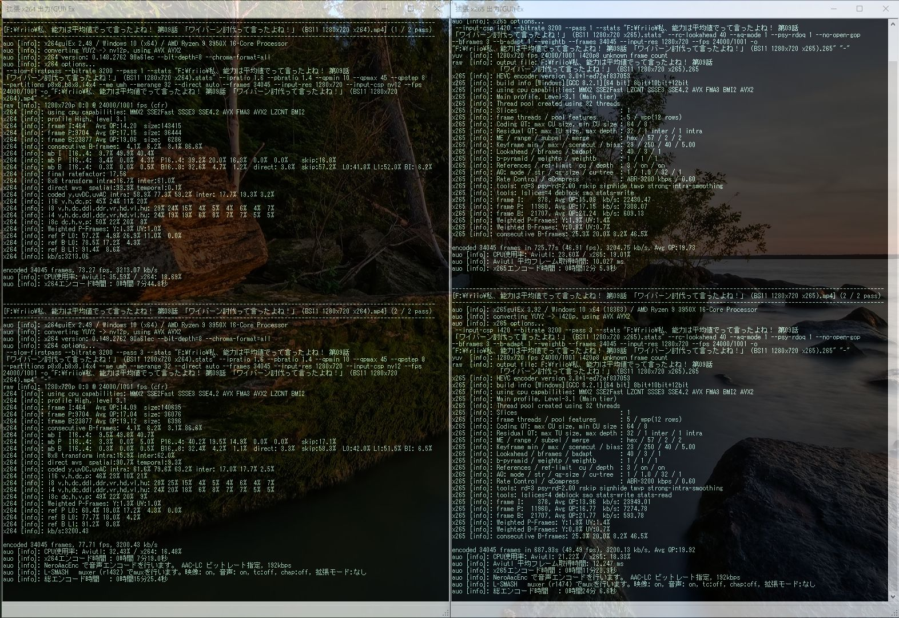
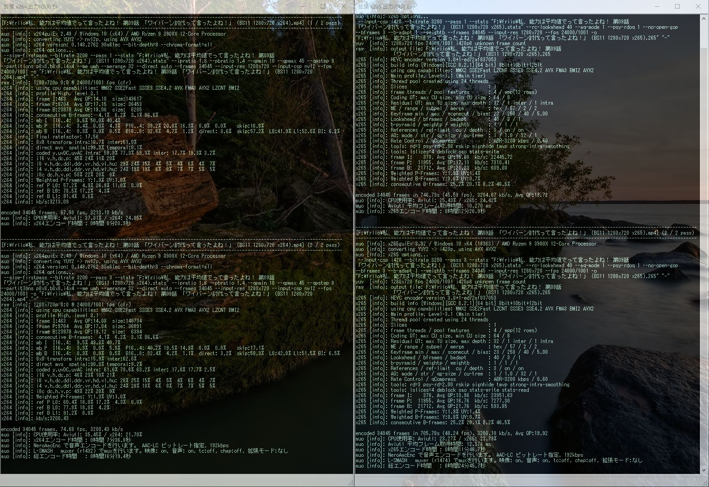
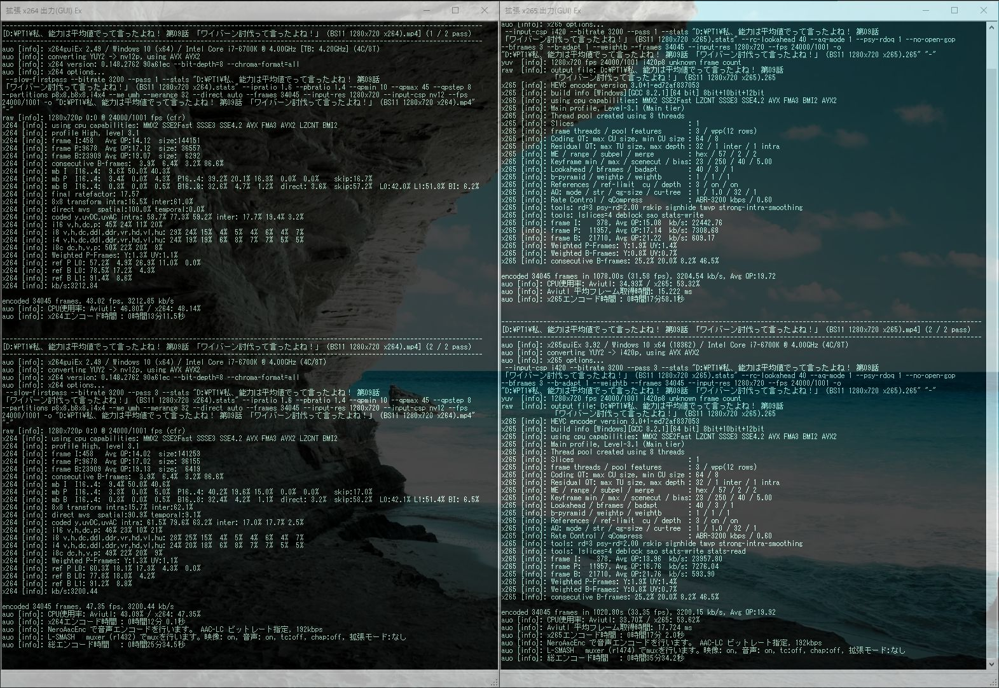
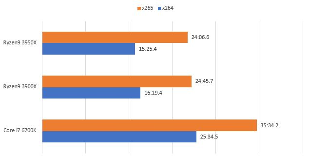

### x265エンコード検証 3

ちょっと出遅れたがRyzen9 3950Xが手に入ったので3900Xとエンコード時間の比較をした。

エンコードの設定は<a href="../blog/2019-07-08"><u>前回</u></a>と<a href="../blog/2019-02-14"><u>前々回</u></a>と同じ

---

### 検証機材

|     | Ryzen9 3950X | Ryzen9 3900X|Core i7 6700K         |
|-----------|------------|------------|------------|
| CPU      | **Ryzen9 3950X**      | Ryzen9 3900X      | Core i7 6700K       |
| クーラー  | Scythe 羅刹 SCRT-1000     | Scythe 羅刹 SCRT-1000    | Scythe SCRT-1000   |
| M/B | GIGABYTE B450 GAMING X    | GIGABYTE B450 GAMING X    | Asus Z170-A       |
| MEM | TeamGroup DDR4 2133 8GB*2    | TeamGroup DDR4 2133 8GB*2    | UMAX DDR4 2400 8GB*2       |
| SSD | SamsungSSD960EVO 250GB CrucialMX100 256GB IntelSSD335 240GB    | SamsungSSD960EVO 250GB CrucialMX100 256GB IntelSSD335 240GB    | Intel SSD 320 120GB Crucial M500 120GB       |
| VGA | 玄人志向 RD-R5-230-E1GB/G2    | 玄人志向 RD-R5-230-E1GB/G2    | 玄人志向 GeForce GT610       |

---

### というわけで早速エンコード結果のスクリーンショット

**Ryzen9 3950X**

**Ryzen9 3900X**

**Core i7 6700K**

---

### まとめ表とグラフ

#### x264の結果

| x264     |Ryzen9 3950X      |Ryzen9 3900X         |Core i7 6700K         |
|-----------|:------------:|:------------:|:------------:|
| 1pass      | 7:44.8	       | 8:20.9      |13:11.5      |
| 2pass      | 7:19.0       | 7:36.8      |12:00.1      |
| Total      | 15:25.4       | 16:19.4      |25:34.5      |

#### x265の結果

| x265     |Ryzen9 3950X      |Ryzen9 3900X         |Core i7 6700K         |
|-----------|:------------:|:------------:|:------------:|
| 1pass      | 12:05.9       | 12:26.9      |17:58.1      |
| 2pass      | 11:28.9       | 11:46.7      |17:02.0      |
| Total      | 24:06.6       | 24:45.7      |35:34.2      |

---

### 恒例の画質比較(オリジナル→x264→x265の順)

---

### 結論

やっぱり画質の違いはわからない

3950X思ったより速くない

温度に余裕はあるしクロックはちゃんと上がってるけどエンコード中にコア遊んじゃってる

3900Xからの買い替えは流石にあまり効果ない感じ

---