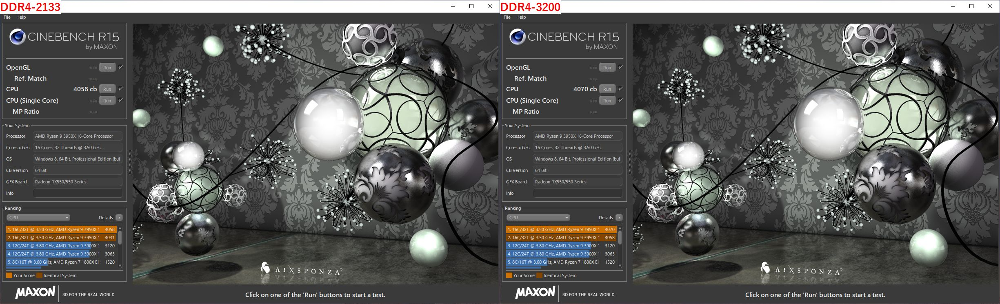
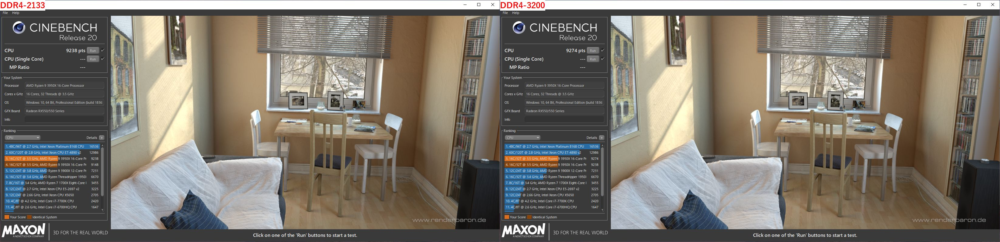
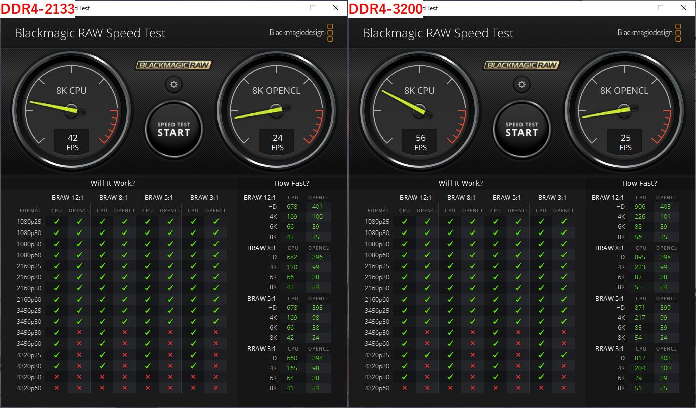
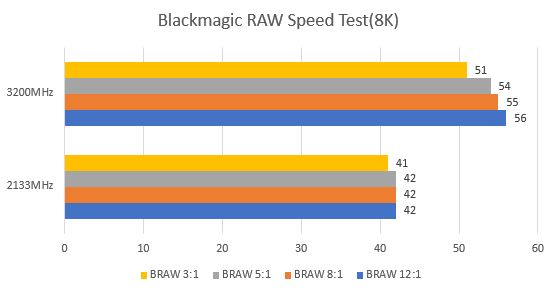
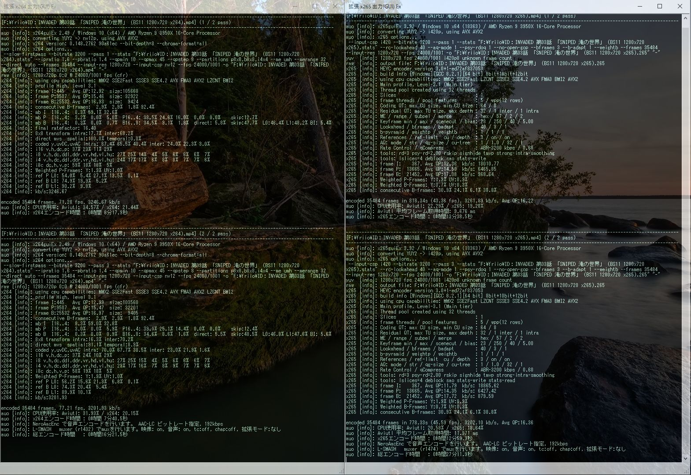
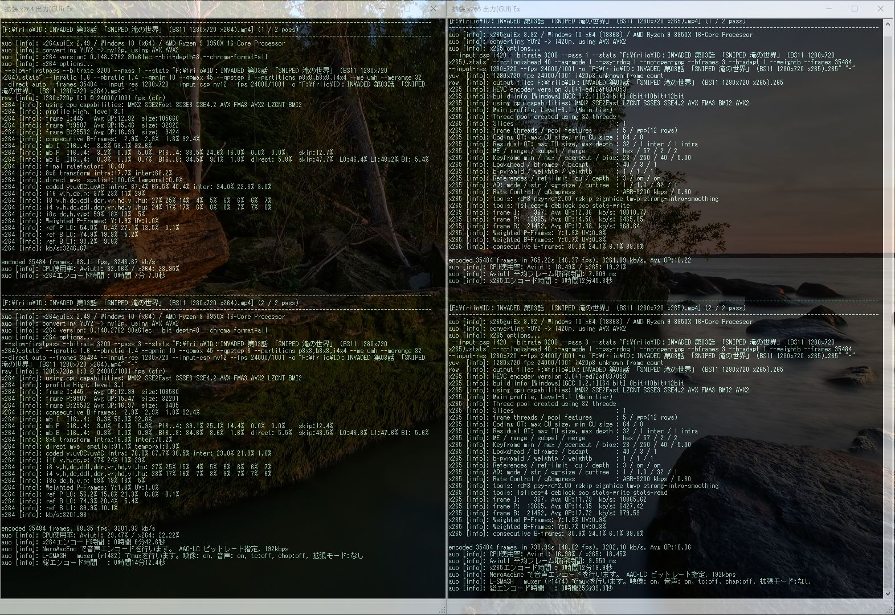
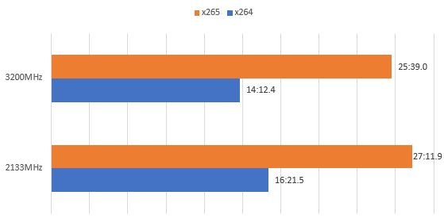

import { Link } from 'gatsby';

### x265エンコード検証 4

Skylakeフラゲしたときから使ってる2133MHzの低速メモリをネイティブ3200MHzに交換したので、パフォーマンスの検証をした

エンコードの設定は
<Link to="/blog/2019-12-03">
前回
</Link>
と
<Link to="/blog/2019-07-08">
前々回
</Link>
と
<Link to="/blog/2019-02-14">
前々々回
</Link>
と同じ、要するにいつものやつ。

---

### 検証機材

|     | Ryzen9 3950X | Ryzen9 3950X|
|-----------|------------|------------|
| CPU      | Ryzen9 3950X      | Ryzen9 3950X      |
| クーラー  | Scythe 羅刹 SCRT-1000     | Scythe 羅刹 SCRT-1000    |
| M/B | GIGABYTE B450 GAMING X    | GIGABYTE B450 GAMING X    |
| MEM | **Crucial W4U3200CM-16G**    | TeamGroup DDR4 2133 8GB*2    |
| SSD | SamsungSSD960EVO 250GB CrucialMX100 256GB IntelSSD335 240GB    | SamsungSSD960EVO 250GB CrucialMX100 256GB IntelSSD335 240GB    |
| VGA | 玄人志向 RD-R5-230-E1GB/G2    | 玄人志向 RD-R5-230-E1GB/G2    |

---

### CinebenchR15/20

**Cinebench R15**

**Cinebench R20**

| Cinebench     |2133MHz      |3200MHz         |
|-----------|:------------:|:------------:|
| R15      | 4058	       | 4070      |
| R20      | 9238       | 9274      |

---

### Blackmagic RAW Speed Testの結果

| Blackmagic RAW Speed Test(8K)     |2133MHz      |3200MHz         |
|-----------|:------------:|:------------:|
| BRAW 12:1      | 42	       | 56      |
| BRAW 8:1      | 42       | 55      |
| BRAW 5:1      | 42       | 54      |
| BRAW 3:1      | 41       | 51      |

---

### AviUtlとx264guiEx、x265guiExを使った動画エンコード結果

**2133MHz**

**3200MHz**

**まとめ表とグラフ**

| x264     |2133MHz      |3200MHz         |
|-----------|:------------:|:------------:|
| 1pass      | 8:17.9	       | 7:07.0      |
| 2pass      | 7:40.5	       | 6:42.6      |
| Total      | 16:21.5       | 14:12.4      |

| x265     |2133MHz      |3200MHz         |
|-----------|:------------:|:------------:|
| 1pass      | 13:38.5	       | 12:45.3      |
| 2pass      | 12:59.3	       | 12:19.9      |
| Total      | 27:11.9       | 25:39.0      |

---

### 結論

Cinebenchはメモリクロックによるスコアの違いは誤差程度だった

Blackmagic Speed Testは29%のスコア向上、x264は13%のエンコード時間短縮と如実に結果が変わった

特にx264は3900Xから3950Xに交換したときは5.5%の短縮にしかならなかったからメモリ交換の効果は高い

動画エンコードはメモリ速度の違いはあんまり関係ないと思ってたからちょっと意外だ

やっぱりRyzenは高速なメモリを使ったほうがいいですな

---