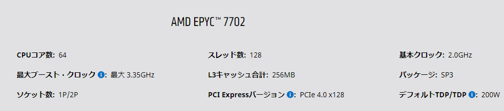
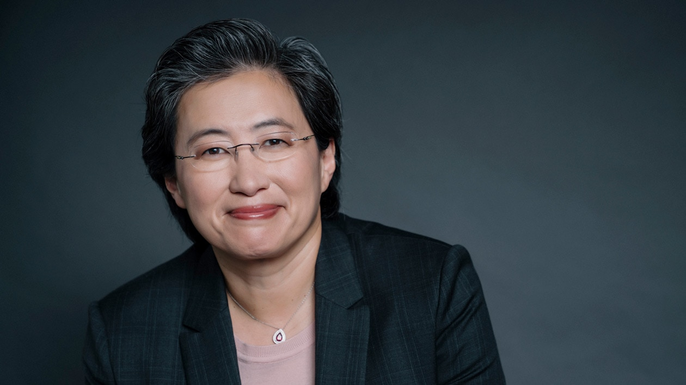

### 沖縄科学技術大学院大学(OIST)がAMD EPYCを採用

[<u>Okinawa Institute (OIST) deploys AMD EPYC processors</u>](https://videocardz.com/press-release/ios)

2020年10月1日、AMDと沖縄科学技術大学院大学(OIST)はAMD EPYC 7702プロセッサを新たなハイパフォーマンスコンピューティングシステムに採用することを発表しました。OISTのPhysics and Biology UnitのリーダーであるEddy Taillefer博士は"*OISTの大幅な成長に対応するためには、コア数の大幅な増加が必要*"であり、AMD EPYCは、コストパフォーマンスに優れた方法でこのコア数のニーズに対応できる唯一のテクノロジーであると述べています。

EPYCの採用はOISTのみならず、たとえばパブリッククラウド市場では、AWS、Azure、Google Cloud、IBM Cloud、Oracle Cloudといったメガクラウド各社や、スパコン/HPC分野ではオークリッジ国立研究所の"Frontier"、ローレンス・リバモア国立研究所の"El Capitan"、San Diego Supercomputer Centerの"Expanse"、CDNではCloudflareなど多くの企業や研究機関に拡大しています。

 

<small>藤井聡太二冠の自作パソコンで50万円のCPUとして話題になったRyzen Threadripper 3990XはクロックやPCIeレーン数の違いはありますがEPYC 7702のコンシューマー版です。</small>

### AMD CEO Lisa Su博士がRobert N. Noyce Awardを獲得

[<u>AMD CEO Dr. Lisa Su to Receive Semiconductor Industry’s Top Honor</u>](https://www.semiconductors.org/amd-ceo-dr-lisa-su-to-receive-semiconductor-industrys-top-honor/)

2020年9月15日、米国半導体協会(SIA)は2020年のRobert N. Noyce AwardがAMDのCEO Lisa Su博士に送られることが決まったと発表しました。この賞は"電子技術の発展を通して人類の発展に貢献した人物"に送られる栄誉の高い賞で、半導体に限らずコンピューター業界のリーダーに送られてきました。

賞の名前に冠されているRobert Noyceはショックレー研究所をGordon Mooreと共に飛び出しフェアチャイルドを1957年に創設、その後フェアチャイルドを飛び出しGordon Moore、Andy Groveと共に1968年にIntelを創業した半導体業界のレジェンドです。

Lisa Su博士は今回のRobert N. Noyce Awardの他に、2019年だけでも"The World’s Best CEO of 2019"、"The Best-Performing CEOs in the World"、"The Bloomberg 50"と数多くのアワードを獲得しています。

 

<small>AMDの創業年と同じ1969年生まれの彼女はAMDのCEOとしては創業者のJerry Sandersに続く二人目のRobert N. Noyce Awardの受賞者になりました。</small>

### 時代を塗り替えるAMD

なぜAMDは資金面で圧倒的に勝るはずのIntelを凌駕するCPUを開発できるのでしょうか。理由は4つあります。

##### 荒野の用心棒

最初の理由は伝説的なCPUアーキテクトJim Kellerです。彼は2000年代初頭、Athlon(K7)とAthlon64(K8)を開発し、Athlon64とそのサーバー向けのOpteronでは、IntelのPentiumを滅ぼし、Itaniumを滅ぼし、Xeonのシェアを大きく削ぎAMDに巨大な収益をもたらしました。

IntelはCPUを64bitに対応させ、4GB以上のメモリを扱えるようになる未来のコンピューティングのために、レガシーコードが動かなくなるIA-64アーキテクチャとそのCPUであるItaniumを作りました。IntelはIA-64で、自らが巨大企業になった最大の理由であるx86を捨て去る一大決心を胸に抱き、社運を賭けた挑戦を行っていました。それを彼はx64で真正面から打倒したのです。ItaniumとIA-64は滅びました。

その後、彼はAppleに入社し(Jim KellerのいたP.A.SemiをAppleが買収)、同社初のモバイルプロセッサーの設計に携わりました。そして2012年に古巣のAMDに呼び戻されます。

彼はChipletという新しい概念とそれを導入してもパフォーマンスの落ちない仕組みでZenアーキテクチャを設計しました。

従来高性能な半導体は大きく、高価でした。これは半導体チップ内は高速に通信できるが、チップの外の配線は遅いため、なるべくワンチップ内にあらゆる機能や性能を詰め込んで高性能化しようという考えに基づきます。

これをJim Kellerは小さくて安いCPUをたくさん作り、遅いチップ同士の配線でもパフォーマンスが落ちない工夫をした上でつなげようという発想にスイッチしました。小さなダイを配線でつなげているだけなので、Zen2と呼ばれる最新のRyzenは64コアというお化けとなりました。

大きくて原価の高いIntelはこれに追従できません。64コアというCPUをモノリシックなダイで作るとあまりにも巨大で高額になり商売にならないからです。

  
<small>AMDでZenアーキテクチャを開発した後の2016年、Teslaに移籍しElon Muskの野望を支えました。2018年、二度目のAMD時代の同僚でInelのSVPとなっていたRaja Koduriに誘われIntelに移籍しました。マイクロアーキテクチャとプロセス技術の両面で行き詰るIntelで三次元積層チップの開発に携わった後、2020年に同社を去りました。行く先々で業界を変革するプロセッサーを作る彼を西部劇の用心棒に例える向きもあります。</small>

##### Dr. Lisa Su

2つ目はLisa Su博士です。彼女はTexas Instruments、IBM、Freescale Semiconductorなどの技術部門で働いた後2012年にAMDに入社し、2014年にCEOに就任しました。彼女は非常に優秀な半導体の研究者で、今やほぼすべてのCPUがそうなった銅配線の研究や、IBMでCellを開発してヘテロジニアスプロセッサを生み出しました。銅が使われる以前の配線材料は抵抗の大きなアルミニウムでした。

彼女がCEOに就任した当時のAMDはBulldozerコアCPUのパフォーマンスがうまく伸びず、せっかくK8コアでハイエンドのコンピューター市場に参入したそのポジションを急速に失っていました。彼女はCellとPS3との関係でゲーム業界と太いパイプを持っていたため、GPUとCPUを融合させたAMDのAPUがPCより組み込みゲームに向いているとして、PS4やXboxに売り込み、当時瀕死だったAMDをなんとか延命することに成功します。

CEOに就任したLisa Su博士は製品開発のフォーカスを"ハイエンド・コンピューティング"に定め、退職した開発エンジニアを次々と引き戻します。CPUをまったく新しいアーキテクチャーから設計し、製品化するには少なくとも3年はかかります。そんな悠長な長期プロジェクトに関心を示さない証券市場を説得し、社内の開発エンジニアを鼓舞し、2017年、最初のZenアーキテクチャーによるCPUである第1世代のRyzenとそのサーバー向けであるEPYCを完成させました。2019年に第2世代のEPYCを開発し、AMDは彼女が目指したハイパフォーマンスコンピューティング市場に見事にカムバックを果たしました。

##### 敵失

3つ目はIntelの微細加工技術開発の遅れです。特にコバルト配線の失敗が最大の理由です。

Lisa Su達がIBM時代に開発した銅配線のCPUは現代のCPUの基本になっています。アルミニウムより銅のほうが電気抵抗は少ないので、当然抵抗の少ない効率の良いCPUが出来上がります。しかし、銅には周りの材料を腐食させる特性があり、銅には被覆を被せる必要があります。銅配線ではほかの材料と配線の間に被覆層が存在します。

Lisa Suが開発したころの銅配線はまだ太く、薄い被覆は何の問題もなかったのですが、CPUの内部が原子サイズまで微細化した現代では、被覆の厚みは相対的に厚く、微細化の邪魔となっていました。そこでIntelは被覆のいらないコバルトで配線をする次世代のCPUを開発しようと試みました。コバルト自体の抵抗値は銅よりも高いのですが、絶縁層が必要ないためその分配線幅が広くなりむしろ抵抗が減る、というアイディアです。

配線幅を広くとれて、配線のピッチを狭くできる新しい技術は10nm、7nmを実現するうえで必要不可欠な技術です。しかし、実際にできたものは製品にならないものでした。確かに銅よりコバルトのほうが電気抵抗が高いのは知っていましたが、それが微細化した時の電気抵抗が信じられないほど高かったのです。本来狙った高クロックで動作させると電気回路が焼き切れるほどでした。しかし、安全な低クロックで動作させると性能が前の世代のCPUより悪くなります。

もともと14nmではロードマップから1年遅れたIntelでしたが、コバルト配線を導入した10nmでは4年も停滞しました。そしてIntelは高クロックが求められるデスクトップ部門ではいまだに10nmへ移行できていません。

##### ファブレス化とTSMC

最後の理由は製造をGlobalfoundriesからTSMCに切り替えたことです。

2008年、AMDは製造部門をThe Foundry Companyとして分社化し、その後The Foundry Companyはアブダビ政府系ファンドの投資を受けGlobalfoundriesが正式に発足しました。AMDは第1世代と第2世代のRyzen(Summit Ridge、Pinnacle Ridge)、第1世代のEPYC(Naples)まではGFのファブを使用していました。ですが、当時からGFは最先端プロセスの開発競争についていけておらず、第1世代のRyzenとEPYCでさえSamsungから14nmのライセンスを受けて製造していました。

そしてGFは10nmをスキップして開発していたはずの7nm世代で最先端プロセス開発競争から脱落することが決定的となります。そこでLisa Su博士は製造をGFからTSMCに切り替える決断をします。このTSMCへの素早い切り替えはその後のAMDのリードを決定づける最大の要因となります。モバイルSoCの隆盛により潤うTSMCのプロセス開発技術はIntelを凌いでおり、TSMCのファブで製造されるAMDのCPUはその恩恵を享受することになったからです。

TSMCでの7nmプロセッサーの製造は、プロセス技術の開発で停滞するIntelとの技術面での差を広げる結果となりました。

### 7nmから先へ

2000年に、プロセスを微細化しさえすれば性能改善が手に入っていた時代が終わりました。Intelやその他のファウンダリは、銅配線やStrained silicon、High-K/MG、FinFETなどその時々で新技術を導入して微細加工技術を発展させてきました。TSMCとSamsungはすでにEUVリソグラフィを導入していますが、Intelはまだできていません。TSMCは次の新技術であるGAA-FETを導入する2nm製造施設の建造を先ごろ明らかにしました。

巨象が踊り、偏執狂が生き残る世界では先の見通しはまったく立ちません。

---