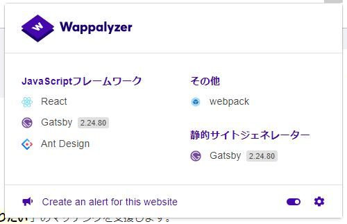

もともとWordpressのウェブアプリとしてRetwpayを作ったのでサービスの紹介ページもワードプレス内に作っていました。

宣伝するときも[<u>votepurchase.net</u>](https://votepurchase.net)をリンクしてたのですが、いかんせんWordpress丸出しでダサい。

テーマを変更することも考えたのですが2020年にWordpressテーマのカスタマイズに手を出すのも時代遅れなので、最新流行を使って本サイトを作りました。

使用した技術は

- <mark>GatsbyJS</mark>
- <mark>Firebase Hosting</mark>

 
ReactベースのSSGで2020年激熱なGatsbyJSを、サーバーレス時代らしくFirebaseにホスティングする、これだね。

Wordpressの重いビジュアルエディタではなく、ローカルのマークダウンで記事をサクサク書いていけるのは良い。

あと地味に気に入ってるのがWappalyzerの技術アイコンがReactになるところ。Reactアイコンはスタイリッシュで良い。

GatsbyのアイコンはイマイチかっこよくないけどReactのアイコンは良い。

そしてなんといってもGatsbyJSはページ遷移が超高速で良い。

というわけでこのブログまぁまぁ更新していけたらいいなと思っています。

<mark>Retwpayアプリをよろしくお願いします</mark>

---