### Ryzen5000シリーズことVermeerさんに向けてマザーボードを交換しました

AMDファンボーイなのでメインストリーム向けCPUはだいたい買っています。これまでのCPU遍歴はこちらです。

- Athlon64 3500+
- Athlon64 X2 4200+
- Phenom 9500
- PhenomII 940BE
- PhenomII 965BE
- PhenomII 1090T
- FX-8150
- FX-8350
- Ryzen 7 1800X
- Ryzen 9 3900X
- Ryzen 9 3950X（現在）

 
先日10/8にAMDが発表したVermeerことRyzen5000シリーズも当然最上位のRyzen 9 5950Xを買う予定です。マザーボードはGIGABYTE B450 Gaming Xを使っているのですが、Vermeer発売時点では対応BIOSがリリースされません。400シリーズに対応BIOSが提供されるのは来年1月とのこと。ファンボーイ的には新しいCPU出たら真っ先に使いたいので今のうちにVermeerに対応する500シリーズマザーボードに交換しておくことにしました。

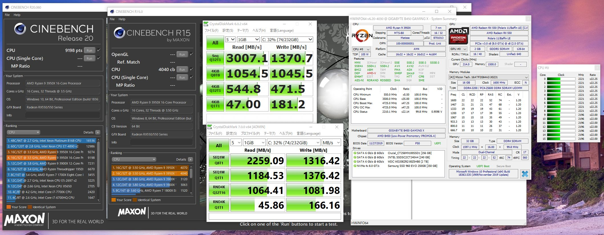

新しいマザーボードは、オーバークロックするわけでもないしPCIe4を積極的に使う理由もないのでB550の中から選ぶことにしました。メーカーにこだわりはないですが、今回は以前ツイッターにいいねをくれたGIGABYTEにしました。

というわけでVermeerさん用のB550 AORUS ELITEが到着。M.2スロットが2基ありせっかくなのでPCIe4 SSDも用意しました。意外と安かったので。

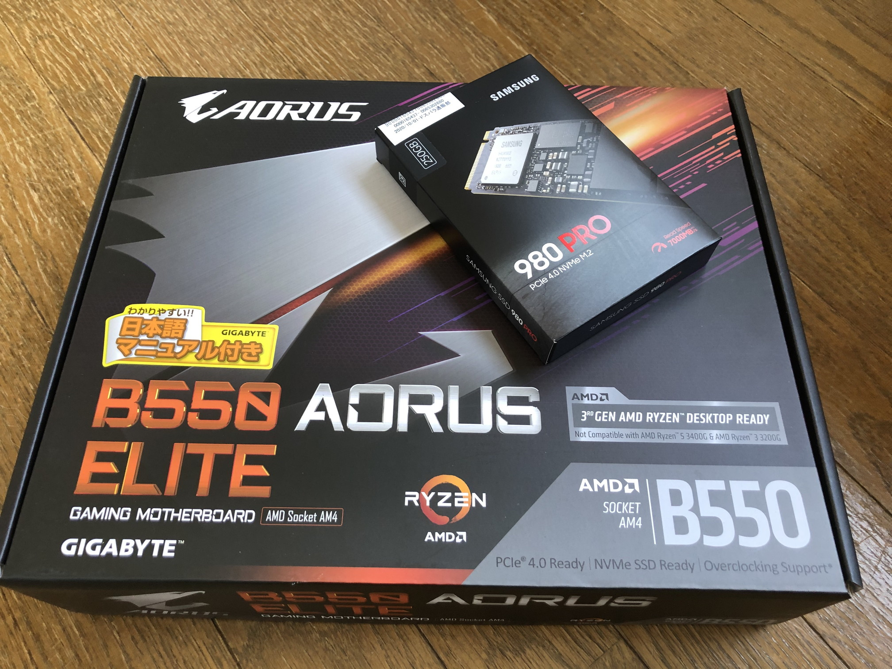

マザーボード交換したときの様子をお届けします。

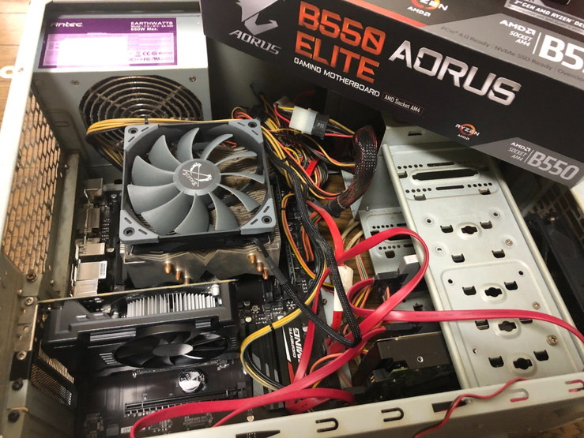

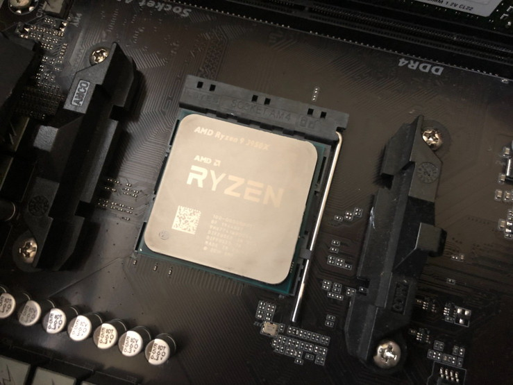

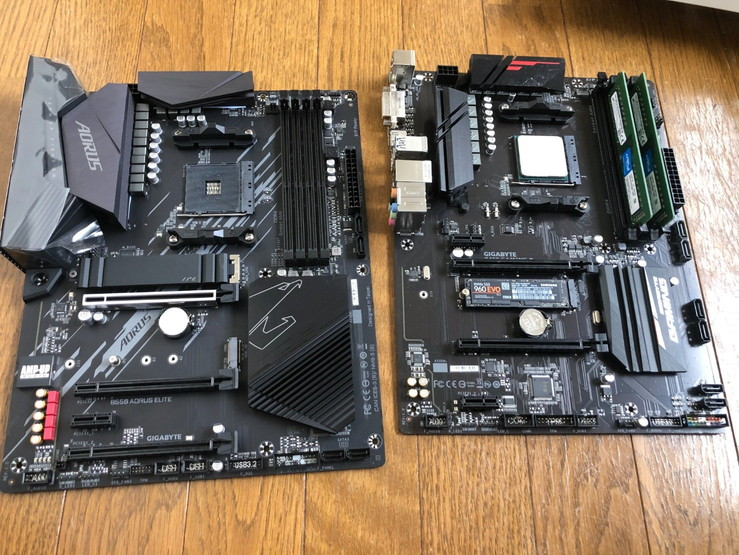

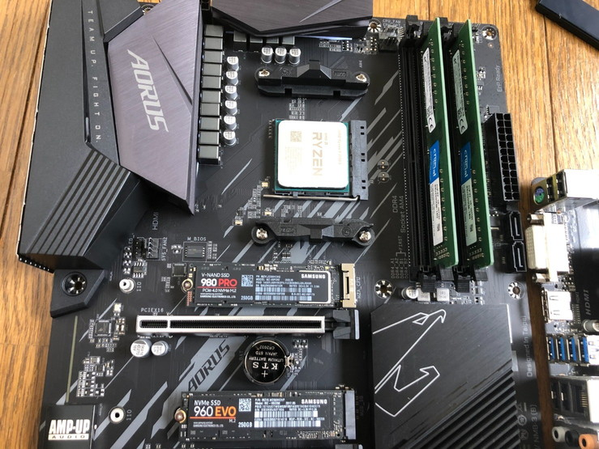

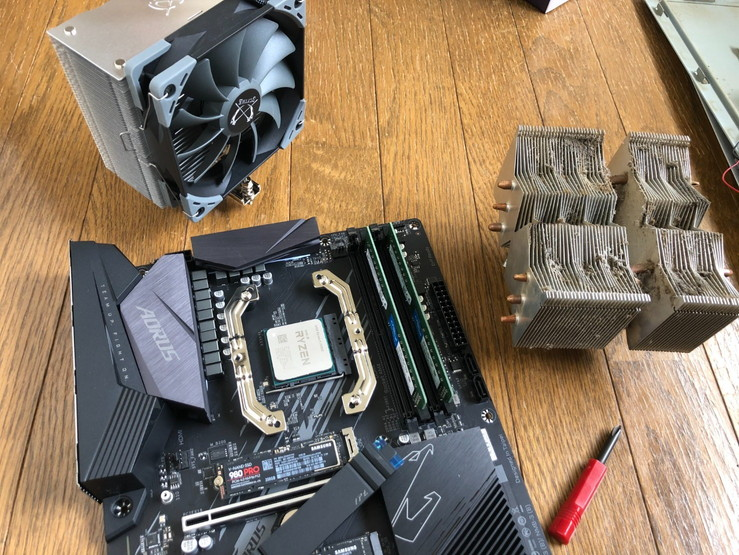

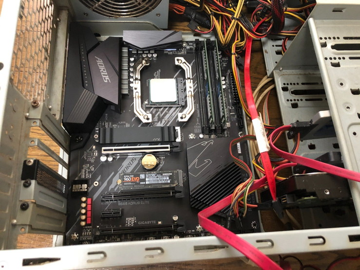

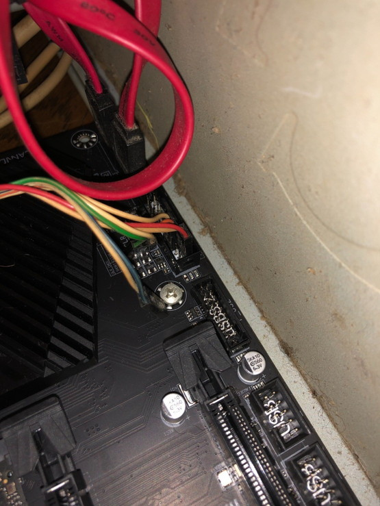

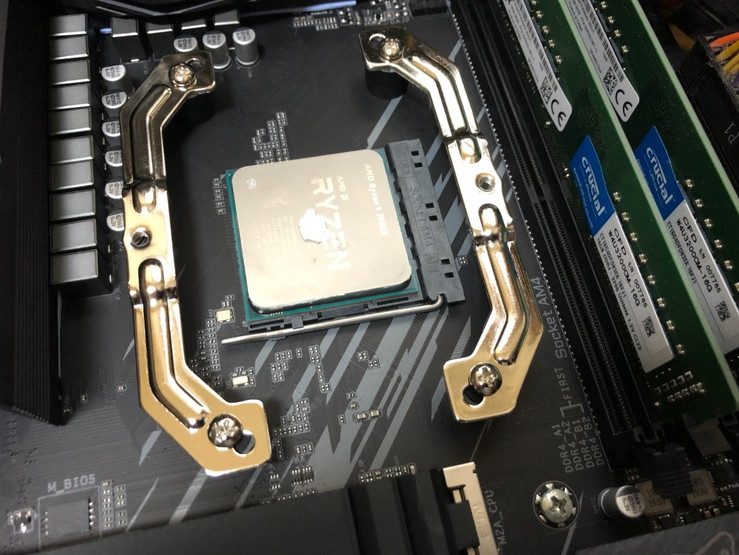

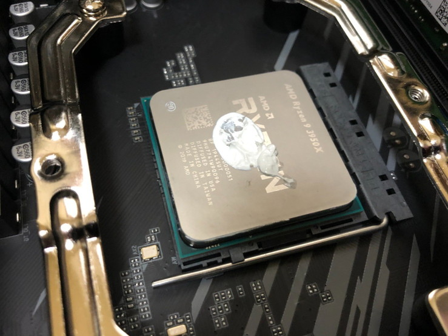

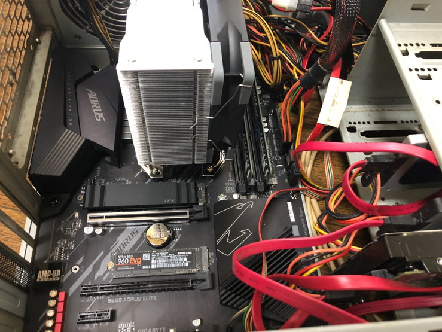

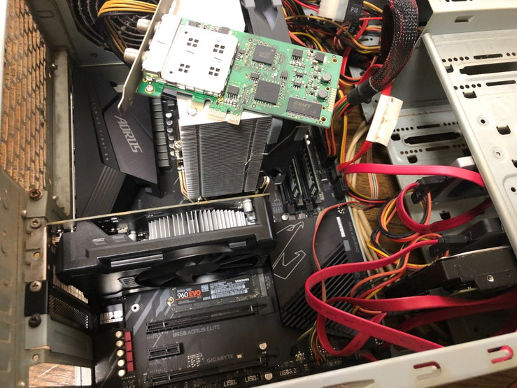

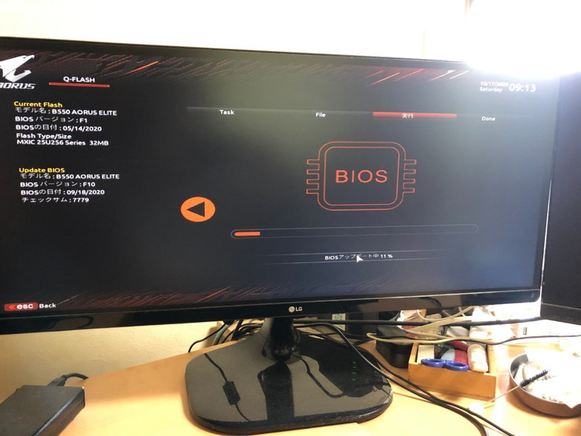

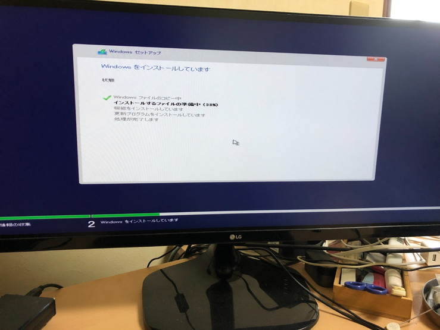

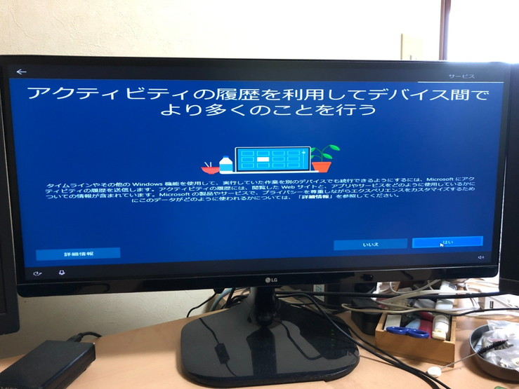

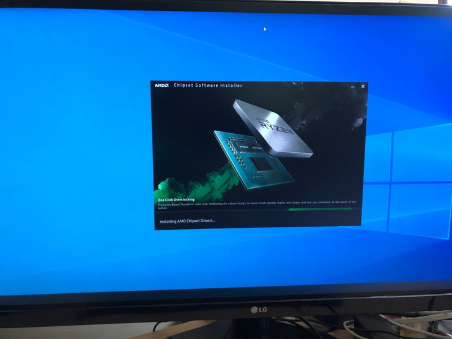

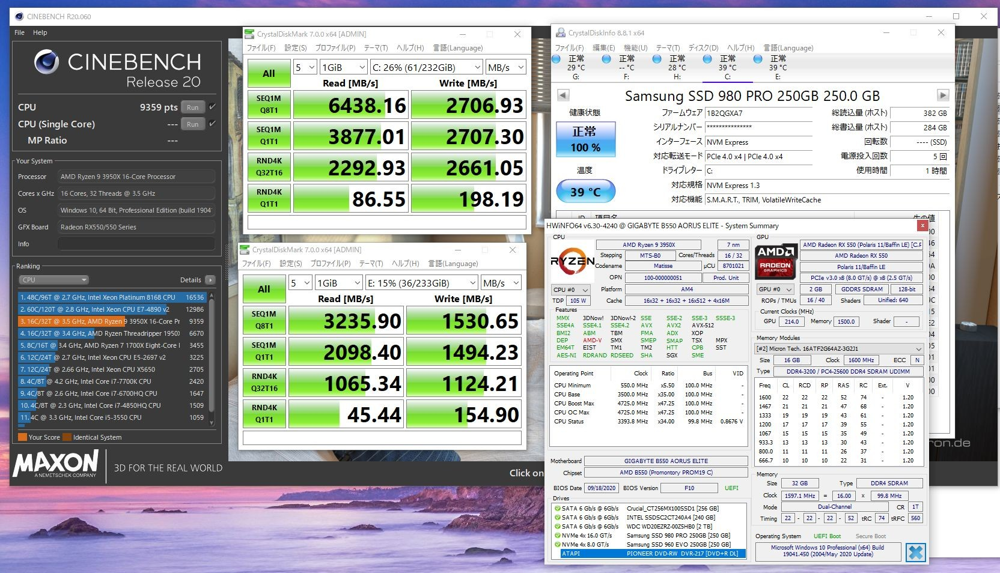

Cinebenchのスコアが150点くらい上がってるけどAGESAコードが更新されたからか虎徹効果かはわからない。SamsungのPCIe4 NVMe SSD速い。

よろしければRyzen 9 5950X買えるように祈ってください。

あと、開発はMacBookAir2020でやってるので自作パソコンのパフォーマンスが上がっても別にビルドが速くなったりはしない。

---