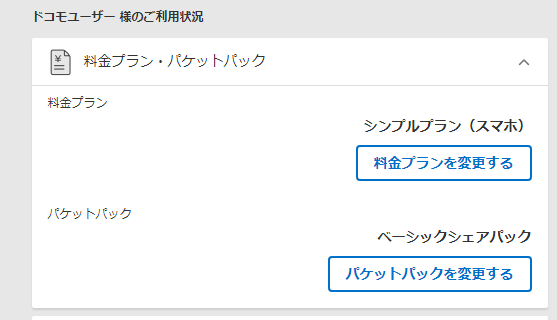

### Apple直販のiPhone12が届きました

本日10月23日、iPhone12/12Proの販売が開始されました。私のところにもApple Storeで注文していたiPhone12 64GB ブラックが届きました。筐体デザインの変更やカメラ性能の向上とともに初の5G対応iPhoneということもフィーチャーされています。

ただ、現状5G対応エリアは狭く、私の行動範囲には5Gがつながるエリアはありません。**新しいiPhoneを使いたいだけなのに、5G契約強制されてプレミア価格払わされる**のは納得いかないので初めてApple StoreでSIMフリー版のiPhoneを買いました。

無事、ドコモ4G契約のSIMで使用できました。

プランはギガホですらないシンプルプラン+シェアパックです。

5Gサービスインしてない国でも販売される端末だし4G SIMでも使えるだろうという判断の元で注文したのですが、auの4G SIMで使えないという情報がありビビってましたが無事使えて良かったです。

価格的に許容できる非ProのラインにOLEDが降りてきたので買い替えました。iPhoneX使い始めて3年経つし、筐体デザインも大きく変わるし、ということで。

ベゼルが薄くなったということで期待していたのですが、感覚的にはあんまり変わらない気がする。

驚いたのがナイトモードでした。

鮮明かと言われるとそうでもないが、確かに以前のカメラよりは明るく撮れています。

### CPUマニア的にはEUVで製造されたチップ(A14 Bionic)を使ってるという満足感があります。

これまで所有しているデバイスで最も進んだプロセスはRyzen 9 3950X(TSMC N7 + GF 12LPP)かMacBookAir2020(Intel 10nm+)のどっちかなって感じでしたが。iPhone12を手に入れたことにより自分が持ってる最先端のチップはTSMC N5になりました。

---