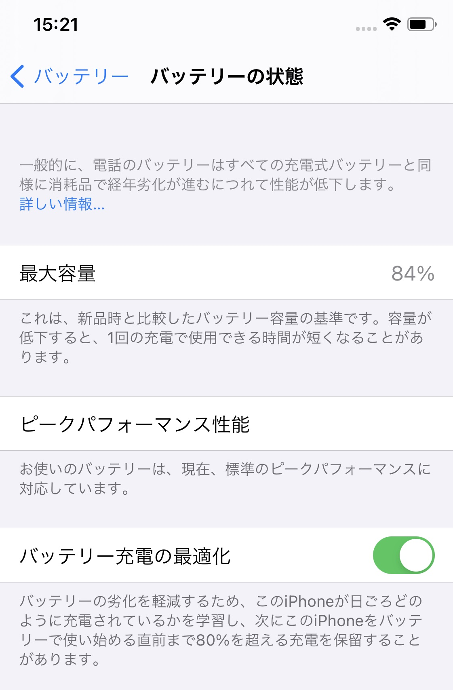
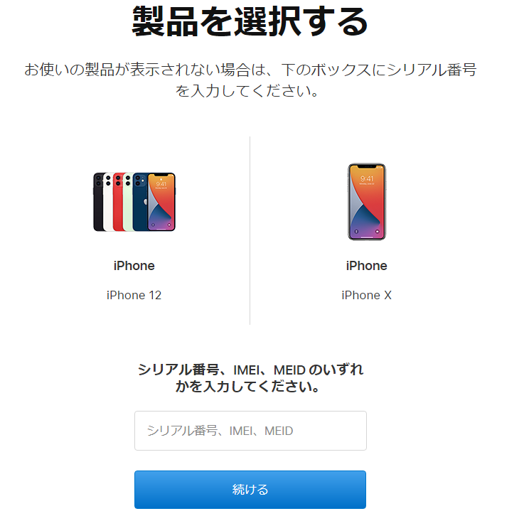
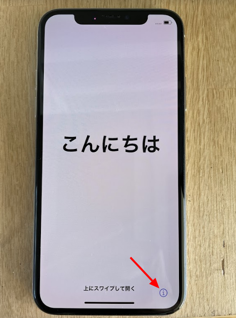
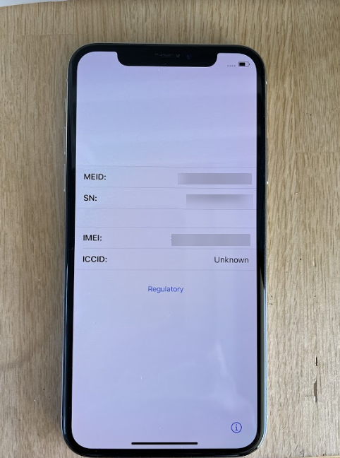
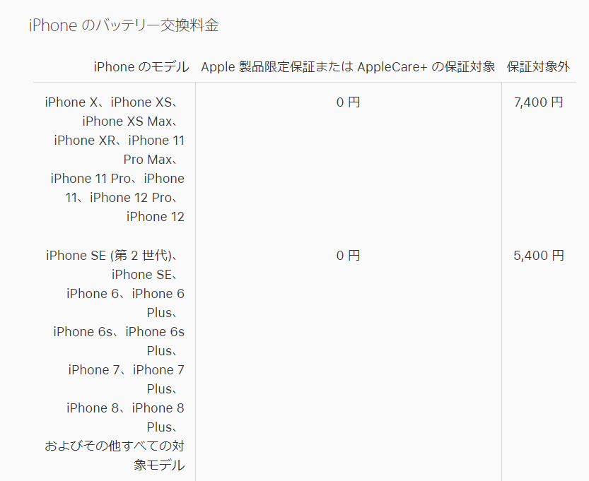
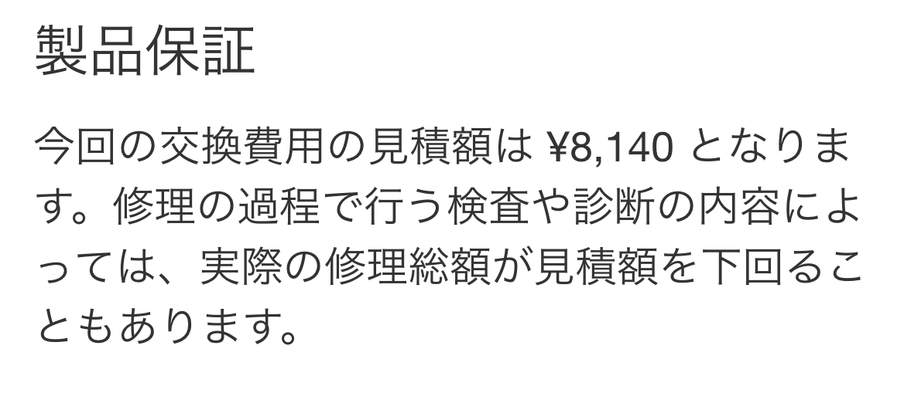
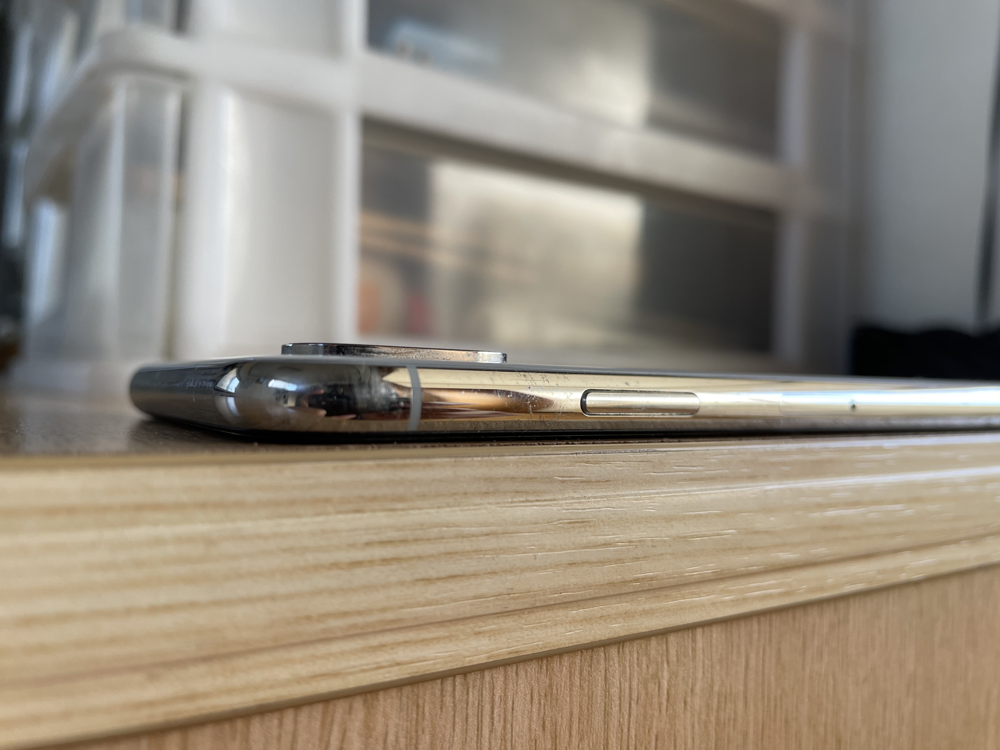

3年間使ったiPhoneXのバッテリーの健康状態が悪化していたのでApple公式の修理サービスを使うことにしました。非公式の持ち込みバッテリー交換はこれまで使ったことはあったのですが公式修理は初めて。

**ピークパフォーマンス性能**にはなっていますが最大容量が**84%**なのでこのまま使い続けるのは不安でした。

Appleのページから修理を申し込む場合、自分のApple IDに紐づけられていない端末は**シリアル番号**か**IMEI**か**MEID**を入力する必要があります。

私の場合、修理を申し込もうと考えた時点で、修理したいiPhoneは**リセットした上で自分のApple IDから削除**していたのでシリアル番号を入力する必要がありました。設定アプリの中から確認する方法は知っていたので、この時はいったんiPhoneの初期設定をして確認したのですが、初期設定画面で確認できるんですね。後から気づきました。

右下の**iアイコン**をタップ

MEID、SN(シリアル番号)、IMEIなど必要な情報が表示されます。

ちなみにiPhoneXのバッテリー交換料金は7400円となっています。

ですが、後から届いたメールでは8140円になってたので、HPに掲載されてる料金は**税別**のようですね。

バッテリーヘルスが悪化している以外に不具合はないのですが、側面のステンレスフレームに細かい擦り傷がたくさんついています。こういうのは修理されるのかな。

---