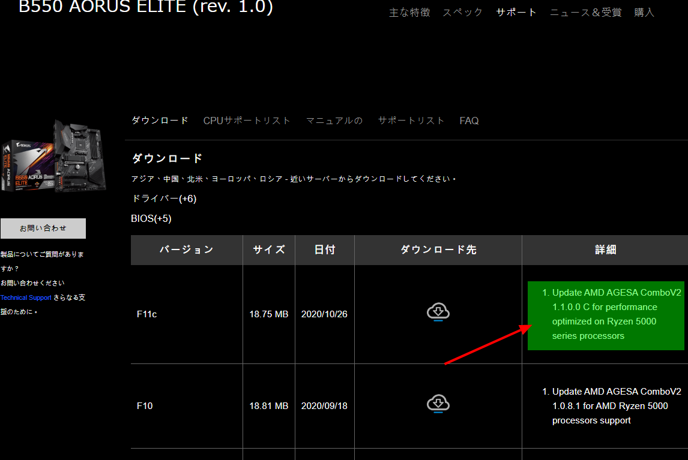

11/5の解禁に向けて、各マザーボードベンダーからRyzen5000シリーズ対応BIOSのリリースが始まりました。対応というか以前のBIOSでもブートはできるらしいですが、パフォーマンスの最適化が入ってる模様。当然ですが、私が先週買ってセットアップしたB550 AORUS ELITEにも最適化が入ったBIOS(F11c)がリリースされました。

BIOS上げたりWindowsクリーンインストールしたりした翌週にWindows10の2020H2は出るわBIOSの更新は出るわ、タイミング悪いなー。でも"**performance optimized**"は対応せざるを得ない。面倒だけどBIOS上げようと思います。Windowsの更新はどうしようかな。今回はスルーかな。

---