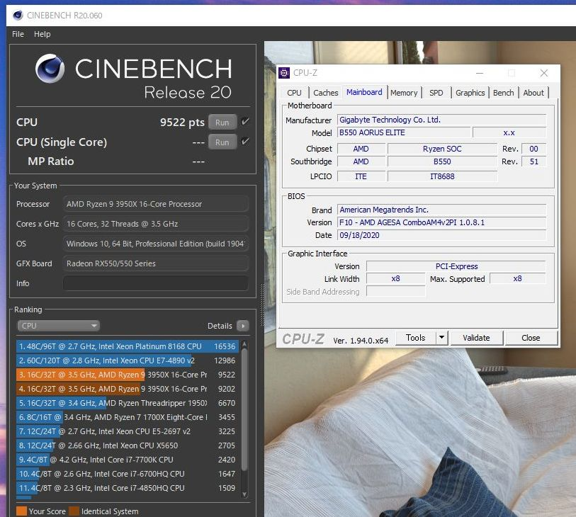
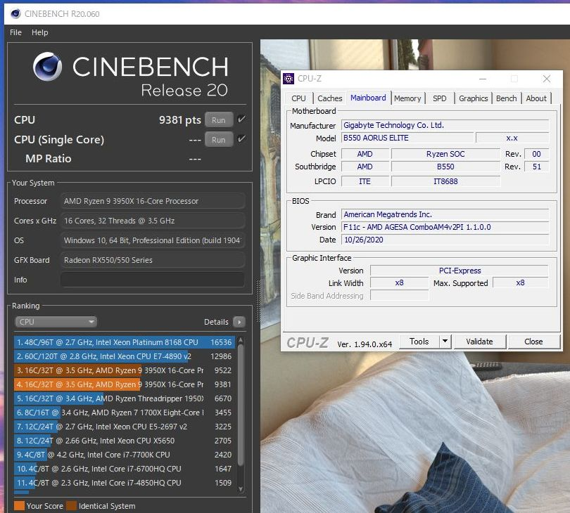

<a href="../blog/2020-10-27"><u>以前の記事</u></a>で書いた通り11/5のVermeerことRyzen5000シリーズ発売に向けてマザーボードベンダーから最適化BIOSが提供されています。OSクリーンインストールしたばっかりだし面倒だと思ってたんですが、"**performance optimized on Ryzen 5000 series processors**"とあれば入れざるを得ないのでBIOS更新しました。

Vermeer向けの最適化なので今使ってるMatisseには関係なさそうですが、アップデート前後でCinebenchR20を回してみました。

---
### 結果のスクリーンショット

**F10(AGESA ComboV2 1.0.8.1)**

**F11c(AGESA ComboV2 1.1.0.0 C)**

---

### Cinebench R20

|F10(旧BIOS)|F11c(新BIOS)|
|:---:|:---:|
|9522|9381|

---

微妙に下がってるけど誤差程度でした。旧BIOSで測ったときはコールドブート直後だったけど、新BIOSで測ったのはBIOS更新したりそこそこCPU動かした後だったので多分クロックが上がらなかったんだろうと思う。

Ryzen 9 5950X買えるように祈っててくださいお願いします。

---