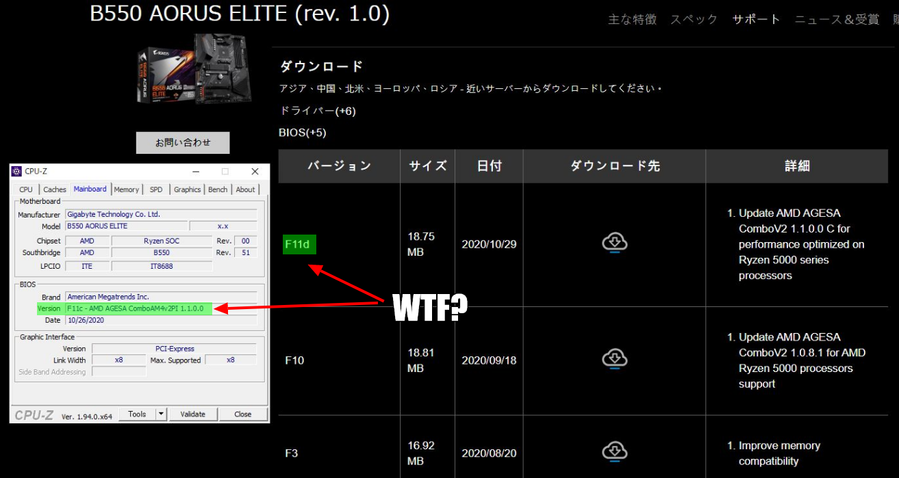
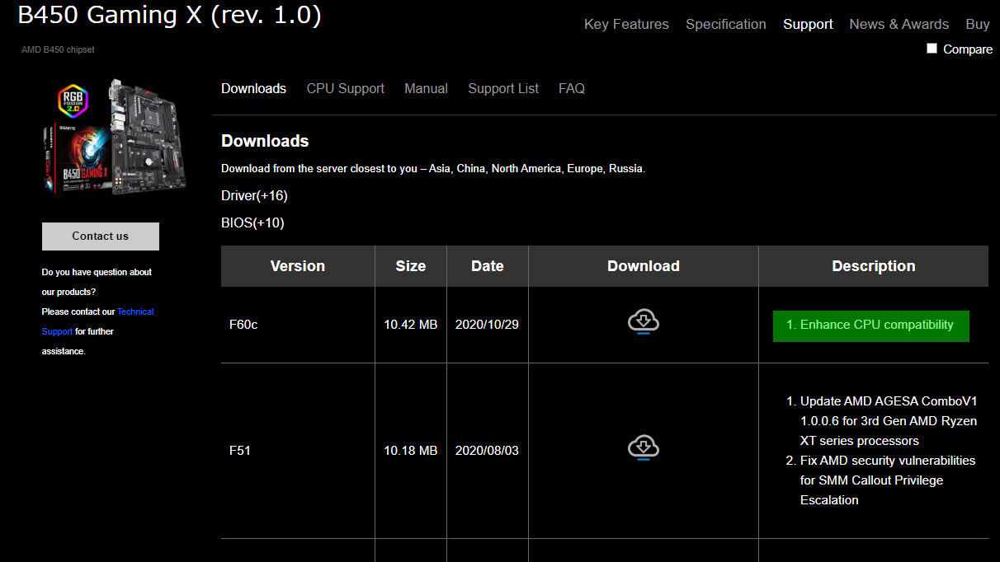

import { Link } from 'gatsby';

**Performance optimized on Ryzen 5000**ということで、<Link to="/blog/2020-10-31">前回、重い腰を上げてBIOSを更新</Link>したわけですが、数日後に再度BIOSが更新されていました。

AGESAコードは**ComboV2 1.1.0.0 C**のままなのでアップデートはしないでおこうと思います。

そもそもB450にVermeer対応BIOSが来るのは来年1月だ、という話だったので<Link to="/blog/2020-10-21">B550 AORUS ELITEに交換した</Link>のは以前書きました。ですがどうやらこれまで使っていたB450 Gaming XもBIOS更新が入りVermeerに対応した模様。

"**Enhance CPU compatibility**"だけでAGESAコードが書いてないのが気になる。あとCPUサポートリストにもRyzen5000シリーズが載ってない。解禁日以降に更新されるんだろうか。

まぁそんなことはどうでもいい。解禁まであと少しだ。Ryzen 9 5950X買えるように祈っててくださいお願いします

---