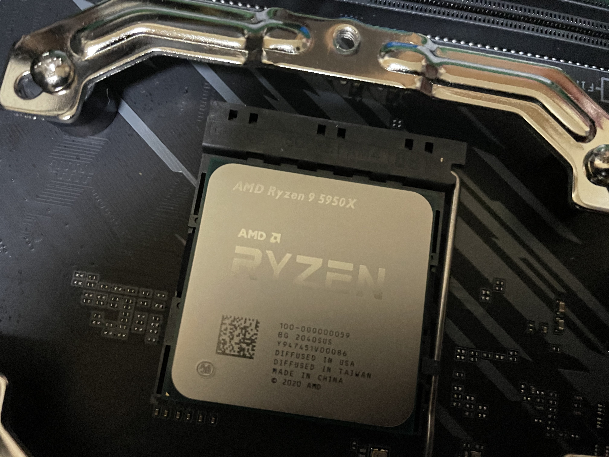
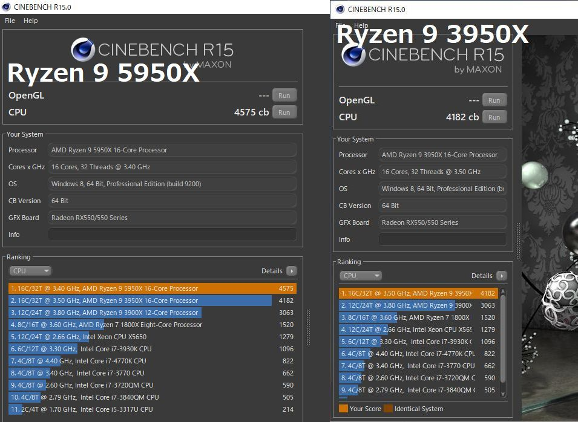
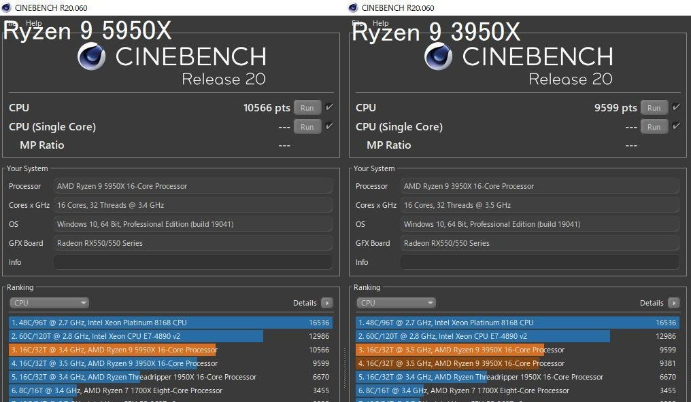
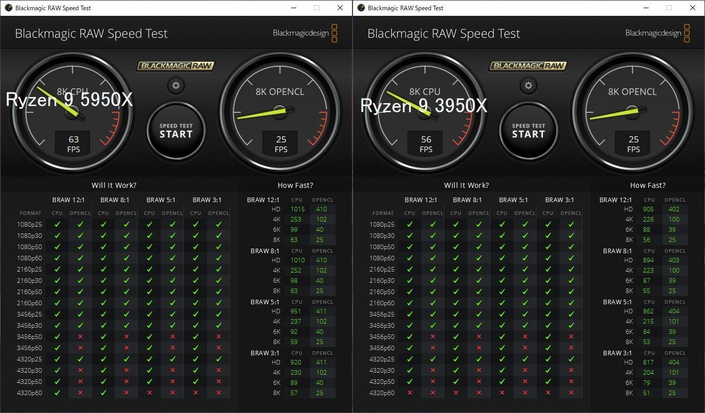
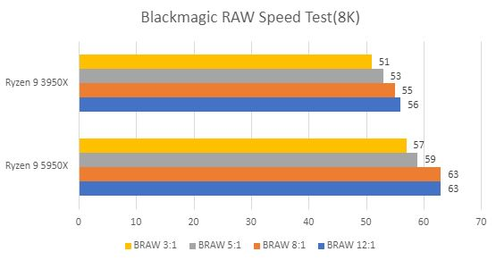
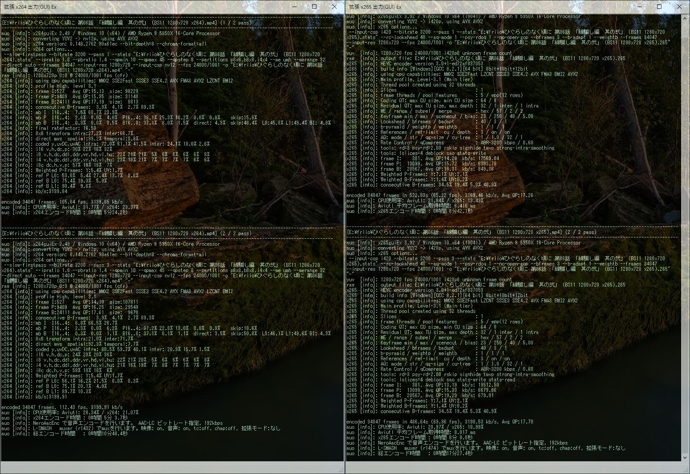
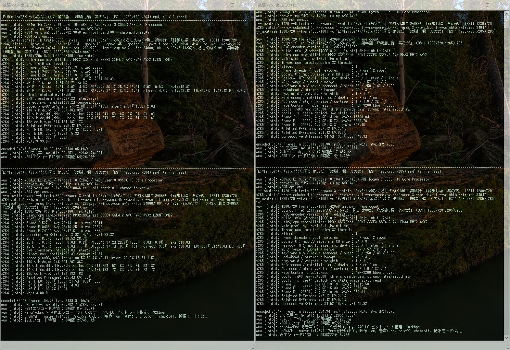
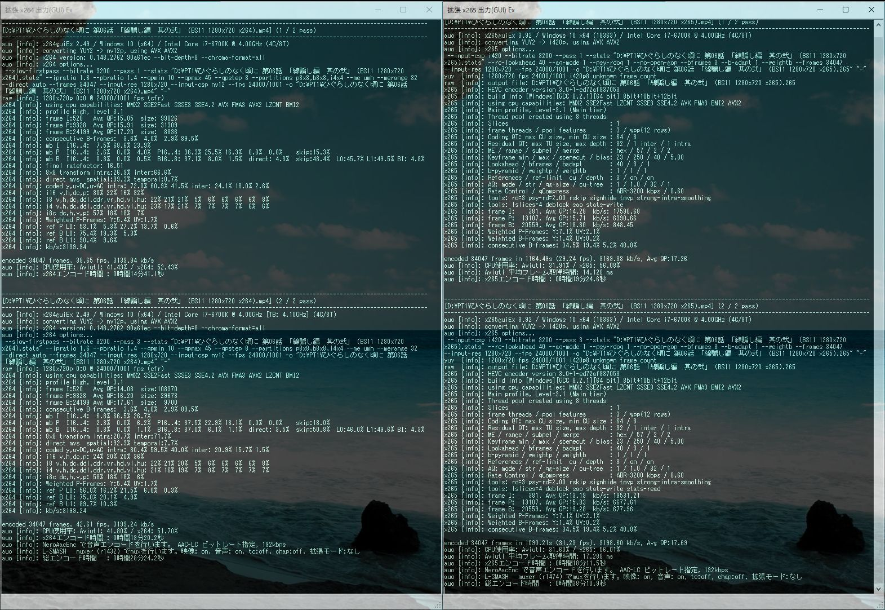
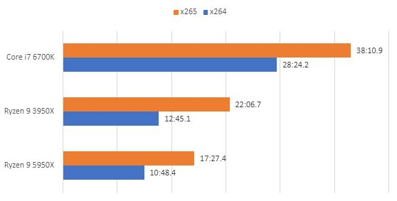

import { Link } from 'gatsby';

### Ryzen 9 5950Xを手に入れたのでパフォーマンスの検証をした

私は速いCPUとウェブページが大好きです。はじめましての方は"**blazing fast**🔥"なGatsby製のこのサイトのページスピードを堪能していってください。

さて、今日の本題です。幸運にも発売日当日にRyzen 9 5950Xを手に入れたのでパフォーマンスを検証しました。エンコードの設定はいつもと同じやつです。

- <Link to="/blog/2020-01-13">x265エンコード検証 4</Link>
- <Link to="/blog/2019-12-03">x265エンコード検証 3</Link>
- <Link to="/blog/2019-07-08">x265エンコード検証 2</Link>
- <Link to="/blog/2019-02-14">x265エンコード検証</Link> 

---

### 検証機材

|           | Ryzen9 5950X | Ryzen9 3950X|Core i7 6700K         |
|-----------|------------|------------|------------|
| CPU      | **Ryzen9 5950X**      | Ryzen9 3950X      | Core i7 6700K       |
| クーラー  | Scythe 虎徹Mark2     | Scythe 虎徹Mark2    | Scythe SCRT-1000   |
| M/B | GIGABYTE B550 AORUS ELITE    | GIGABYTE B550 AORUS ELITE    | Asus Z170-A       |
| MEM | Crucial W4U3200CM-16G    | Crucial W4U3200CM-16G    | UMAX DDR4 2400 8GB*2       |
| SSD | SamsungSSD980PRO 250GB SamsungSSD960EVO 250GB| SamsungSSD980PRO 250GB SamsungSSD960EVO 250GB| PLEXTOR PX-512M9PeG 512GB ADATA SU630 480GB       |
| VGA | 玄人志向 RD-RX550-E2GB/OC    | 玄人志向 RD-RX550-E2GB/OC    | 玄人志向 GF-GT710-E1GB/HS       |

---

### CinebenchR15/20

**Cinebench R15**

**Cinebench R20**

| Cinebench     |Ryzen 9 5950X      |Ryzen 9 3950X         |
|-----------|:------------:|:------------:|
| R15      | 4575      | 4182	       |
| R20      | 10566      | 9599       |

---

### Blackmagic RAW Speed Testの結果

| Blackmagic RAW Speed Test(8K)     |Ryzen 9 5950X         |Ryzen 9 3950X      |
|-----------|:------------:|:------------:|
| BRAW 12:1      |  63      |56	       |
| BRAW 8:1      | 63      | 55       |
| BRAW 5:1      |  59      |53       |
| BRAW 3:1      | 57      | 51       |

---

### AviUtlとx264guiEx、x265guiExを使った動画エンコード結果

**Ryzen 9 5950X**

**Ryzen 9 3950X**

**Core i7 6700K**

**まとめ表とグラフ**

| x264     |Core i7 6700K      |Ryzen 9 3950X         |Ryzen 9 5950X         |
|-----------|:------------:|:------------:|:------------:|
| 1pass      | 14:41.1	       | 6:24.0      | 5:24.2      |
| 2pass      | 13:20.2	       | 6:00.0      | 5:03.7      |
| Total      | 28:24.2       | 12:45.1      | 10:48.4      |

| x265     |Core i7 6700K      |Ryzen 9 3950X         |Ryzen 9 5950X         |
|-----------|:------------:|:------------:|:------------:|
| 1pass      | 19:24.6	       | 11:08.2      | 8:42.1      |
| 2pass      | 18:11.5	       | 10:27.5      | 8:08.0      |
| Total      | 38:10.9       | 22:06.7      | 17:27.4      |

---

### 恒例の画質比較(オリジナル→x264→x265の順)

---

### 結論

やっぱり画質の違いはわからない。

Ryzen 9 5950Xは3950Xに対してx264で**16%**、x265が**22%**も速くエンコードが終了している。つまり**5950Xめっちゃ速い**。Ryzen 9 5950Xは**約束された勝利のCPU**でした。

---