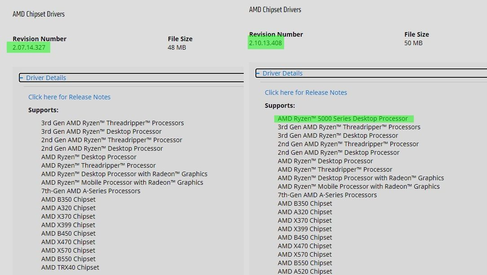
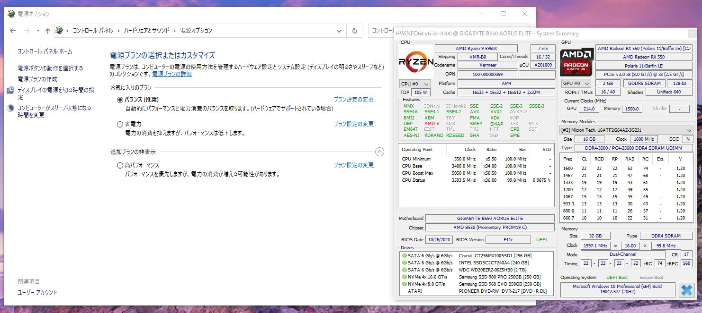
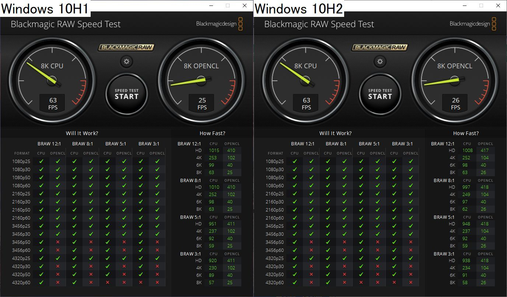
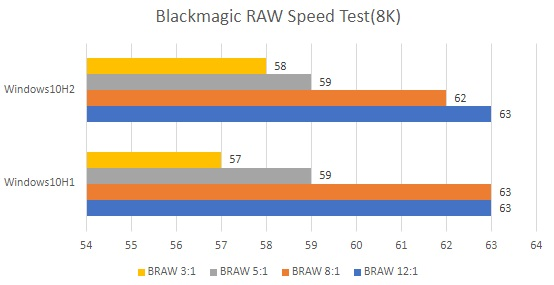

import { Link } from 'gatsby';

### Windows10を更新したので追加のパフォーマンス検証をした

<Link to="/blog/2020-11-07">前回</Link>、Ryzen 9 5950Xのパフォーマンスを確認しましたが、Windows10 20H1環境な上、チップセットドライバも古いままでした。Windows10 20H2ではスリープステートが追加されており、使ってないコアが完全にスリープするように変更されています。そのため遊んでるコアが無駄に電力を消費しなくなるため、アクティブなコアのクロックが上がりやすくなります。
 
 
シングルスレッド性能が上がる更新な感じですが、このアップデートがマルチスレッド性能にどう影響するか確認します。
 
 
というわけでWindows10 20H2と正式にRyzen 5000シリーズをサポートしたチップセットドライバを入れてパフォーマンスの追加検証をしました。

チップセットドライバを**2.07.14.327**から**2.10.13.408**へと更新

インストールすると電源プランから**AMD Ryzen Balanced**が消えて標準プランになる

---

### 検証機材

|           | Ryzen9 5950X | Ryzen9 5950X |
|-----------|------------|------------|
| CPU      | Ryzen9 5950X      | Ryzen9 5950X      |
| クーラー  | Scythe 虎徹Mark2     | Scythe 虎徹Mark2     
| M/B | GIGABYTE B550 AORUS ELITE    |GIGABYTE B550 AORUS ELITE    |
| MEM | Crucial W4U3200CM-16G    | Crucial W4U3200CM-16G    |
| SSD | SamsungSSD980PRO 250GB SamsungSSD960EVO 250GB| SamsungSSD980PRO 250GB SamsungSSD960EVO 250GB|
| VGA | 玄人志向 RD-RX550-E2GB/OC    |玄人志向 RD-RX550-E2GB/OC    |
| OS | **Windows 10 20H2**    |Windows 10 20H1    |
| Driver | **amd_chipset_software_2.10.13.408.exe**    |amd_chipset_software_2.07.14.327.exe    |

---

### Blackmagic RAW Speed Test

| Blackmagic RAW Speed Test(8K)|Windows10 20H1|Windows10 20H2|
|-----------|:------------:|:------------:|
| BRAW 12:1      |  63      |63	       |
| BRAW 8:1      | 63      | 62       |
| BRAW 5:1      |  59      |59       |
| BRAW 3:1      | 57      | 58       |

---

### 結論

マルチスレッドに関しては**誤差**ですな。

---