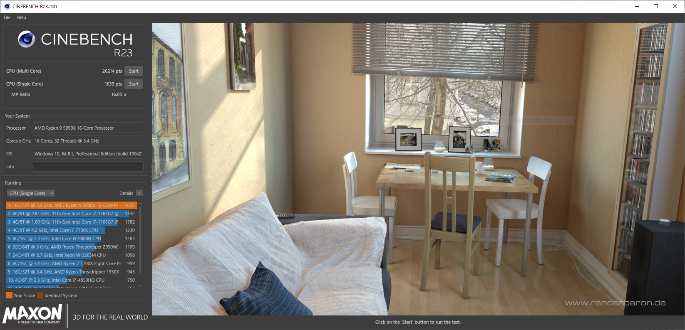

import { Link } from 'gatsby';

### Cinebench R23がリリースされました

定番CPUベンチマーク**Cinebench**の**Release 23**がリリースされました。R20のときは先にUWP版が先に出て、スタンドアローン版が出るまでラグがありましたが、今回は普通にzipでダウンロードできました。

マルチスレッドテストでも10分待たないといけなくなったのでお手軽度が少し下がりました。Core i9-10900KとかCore i9-9900KSあたりのブーストの仕様を考えるとある程度継続的な負荷を与えないと正確なスコアがとれないということなんでしょう。

[Cinebench R23](https://http.maxon.net/pub/cinebench/CinebenchR23.zip)

| CinebenchR23     |Ryzen 9 5950X |
|-----------|:------------:|
| Single      | 1633      |
| Multi      | 26214      |

---