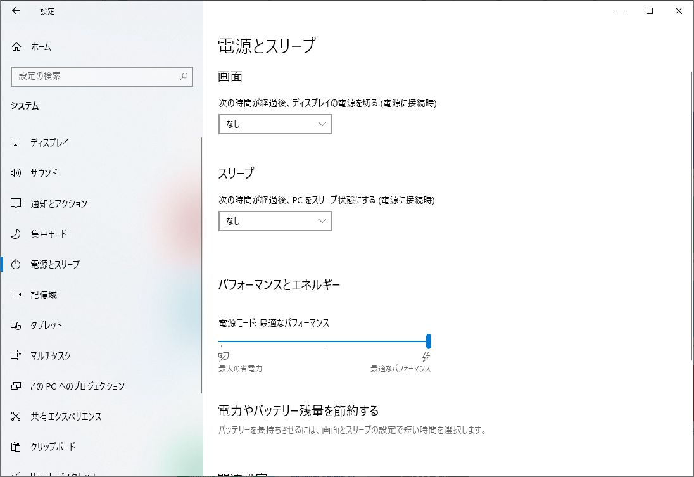

import { Link } from 'gatsby';

<Link to="/blog/2020-11-15">前回</Link>の続きです。
  

CPU交換して以来KP41によるBSoDが多発しており、BIOSやらドライバを更新したり、Windowsの再インストールを試しました。何をやっても改善せず、最終的にポチったメモリと電源が到着しました。

電源交換は結構な大工事になるので、とりあえずメモリだけ交換して様子見することにします。もしメモリ交換だけで改善したら電源ユニットは不要だったということになります。次世代のRyzenでソケット変更やらDDR5対応のためにマザーボードごと交換になるはずなのでそのときまで寝かせておきます。

あと**設定**の**電源とスリープ**の**パフォーマンスとエネルギー**を`高パフォーマンス`から`最適なパフォーマンス`に変更したらBSoD発生しなくなった気がするけど多分これは気のせいだと思う。

---