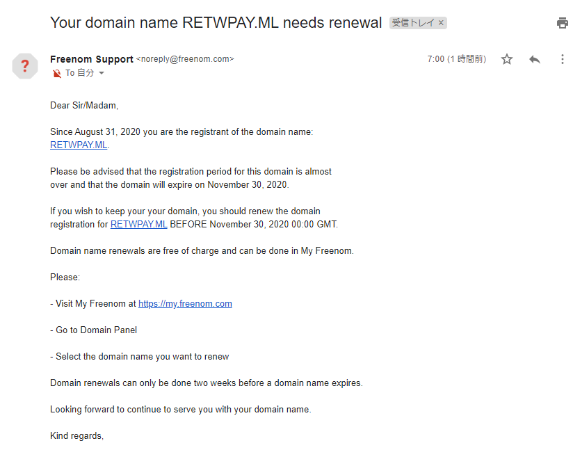
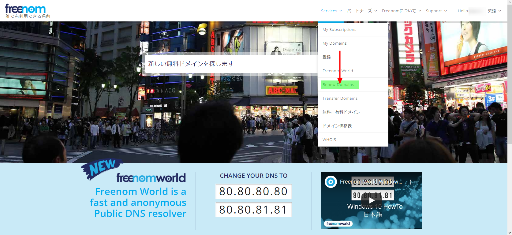
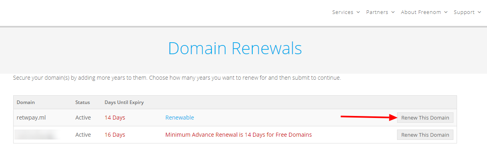
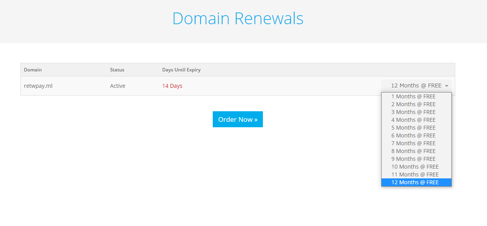
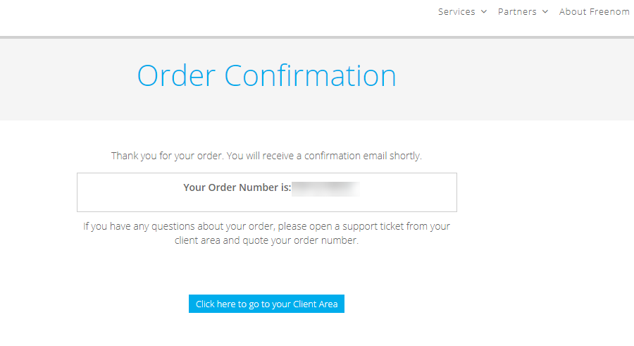
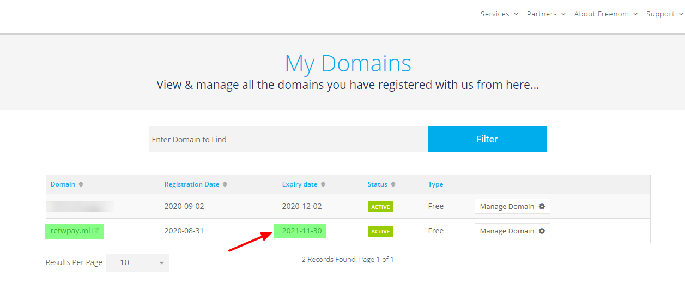

import { Link } from 'gatsby';

### 本サイトは完全無料で運営しています

このサイトのドメイン**retwpay.ml**はFreenomで取得した無料ドメインです。Freenomでは`.TK`/`.ML`/`.GA`/`.CF`/`.GQ`の5種類のドメインが無料で取得できます。ついでにいうと、ホスティングに利用しているFirebaseは`ストレージ1GB`まで`転送量は月10GB`まで**無料**なので、このサイトは**完全無料**で運営しています。

取得したドメインの期限が切れる2週間前になったのでFreenomからお知らせが来ていました。

### Freenomのドメイン更新手順を紹介します

まずは、[Freenom](https://www.freenom.com/ja/index.html)に行きログインします。

**Services**から**Renew Domains**を選択します。

更新したいドメインの**Renew This Domain**をクリックします。

ドメインの期限を選択します。今回は12か月を選択しました。期限を選んだら**Order Now**をクリックします。

更新完了画面になります。

念のため、トップページの**Services**→**My Domains**で`Expiry date`が更新されてることを確認します。

無事更新できました。

---