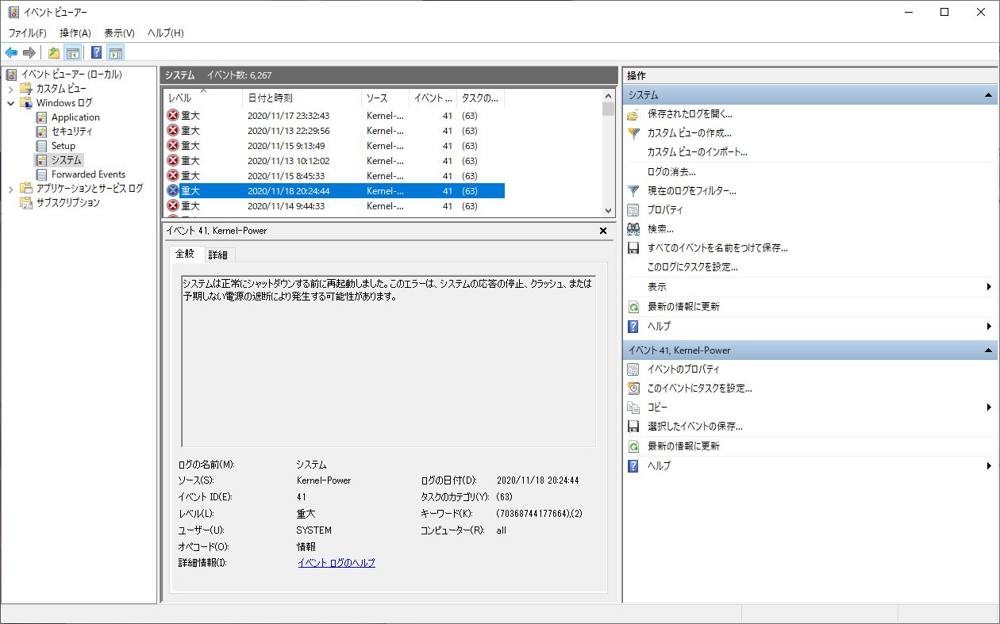

import { Link } from 'gatsby';

<Link to="/blog/2020-11-18">前回</Link>、メモリを交換したにもかかわらずKP41によるBSoDが発生したため電源ユニットを交換しました。
  

### しかし、18日早朝に交換して、その夜に再びBSoDが発生

これはいよいよ**Ryzen 9 5950X**が原因かと重い絶望に打ちひしがれながら日々を過ごしています。

### でもそれ以来、これを書いてる20日夜時点までBSoDが発生していない。

暖かい日が続いてるからか？相変わらずKP41病は謎ですな。

---