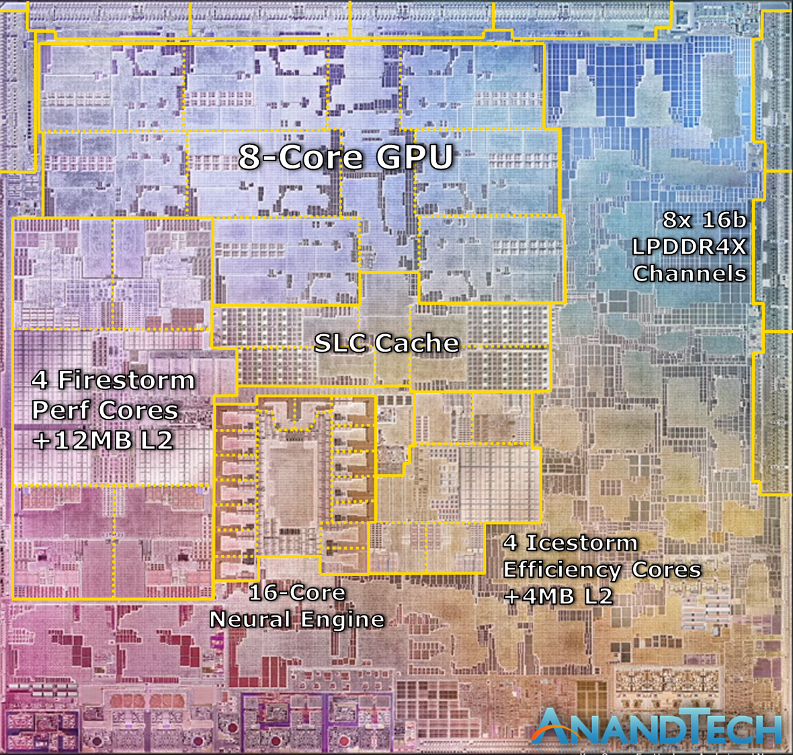

import { Link } from 'gatsby';

Appleは11月17日、Apple Siliconこと`M1 SoC`を搭載した`MacBook Air`、`13インチMacBook Pro`、`Mac mini`を発売しました。各所でベンチマークを始めとした評価記事が公開されており、M1チップの高い性能が話題になっています。

そのM1ですが

- 高性能4コアCPU(Firestorm)
- 高効率4コアCPU(Icestorm)
- 高性能8コアGPU
- 16コアNeural Engine
- HDR Video Processor, ISP, Audio Processor, Security Enclave

の組み合わせです。

今回投入されたMacBook Airと13インチMacBook ProはいずれもMacとしては低性能なエントリーモデルであるため、次の話題はすでにハイエンドの`16インチMacBook Pro`とそれに搭載されると考えられる`ハイパフォーマンスMシリーズ`に移っています。

TechPowerUPは`M1X`と呼ばれるハイエンドラップトップ向けチップは`8つの高性能コア`と`4つの高効率コア`を備えており`TSMC N5`で製造され`2021Q1`に登場すると報告しています。`8コアの高性能コアと4コアの高効率コアの組み合わせ`という話自体はBloombergが4月に記事にしており、今回の噂はそれを蒸し返した形となります。ただし、いずれの記事でもCPUコアについて触れるのみにとどまっており、GPUやメモリの構成は不明であると報告しています。

- *TechPowerUP* [Alleged Apple M1X Processor Specifications Surface](https://www.techpowerup.com/275102/alleged-apple-m1x-processor-specifications-surface)
- *Bloomberg* [Apple Aims to Sell Macs With Its Own Chips Starting in 2021](https://www.bloomberg.com/news/articles/2020-04-23/apple-aims-to-sell-macs-with-its-own-chips-starting-in-2021)

 

では、GPUやメモリも含めた`M1X`のSoC全体について、ダイサイズから予測してみましょう。幸いなことに`M1X`の元となる`M1`はすでに発売されておりダイサイズは`119mm²`であることが判明しています。

上の画像の各ユニットの寸法から計算すると以下の面積になります。

#### M1各ユニットのサイズ
| Unit | Size |
|------|:------:|
| Firestorm | 16mm² |
| Icestorm | 5.5mm² |
| GPU | 25mm² |
| MEM controller | 3mm² |
| SLC Cache | 6mm² |
| Neural Engine | 5.4mm² |

 

次にIntel Macに搭載されているCPUのダイサイズを確認しておきましょう。

### Intel CPU die size
| CPU | Code Name | Model | Size |
|-----|:---------:|:-----:|:----:|
| Core i9-9980HK | Coffee Lake-HR | 16inch MacBook Pro 2020 | 149mm² |
| Core i9-8950HK | Coffee Lake-H | 15inch MacBook Pro 2018 | 149mm² |
| Core i7-7920HQ | Kaby Lake-H | 15inch MacBook Pro 2017 | 126mm² |
| Core i7-1068NG7 | Ice Lake-U | MacBook Pro 2020 | 131mm² |
| Core i7-1060NG7 | Ice Lake-Y | MacBook Air 2020 | 131mm² |
| Core i7-8700B | Coffee Lake-H | Mac mini 2018 | 149mm² |
| Core i9-10910 | Comet Lake-S | iMac 2020 | 202mm² |

 

iMacやMac miniも載せましたが`15/16inch MacBook Pro`に搭載されるCPUのサイズ感を掴んでもらえれば十分です。

では、まず噂通り`119mm²`のM1に高性能コアが4つ追加された場合のサイズは

**119 + 16 = 135mm²**

まだ少し余裕がありますね。Twitterのトレンドにもなっていましたがプロユースでは`メモリ16GB`では足りない可能性があるのでメモコンも追加してみましょう。

**119 + 16 + 3 = 138mm²**

これで、`高性能8コア` + `高効率4コア` + `8コアGPU` + `メモリ32GB`のプロユースにも耐えうる`M1X`ができました。でもまだ少し余裕がありますね。今度はGPUを倍増してみましょう。 

**119 + 16 + 3 + 25 = 163mm²**

`高性能8コア` + `高効率4コア` + `16コアGPU` + `メモリ32GB`の最強スペックの`M1X`が出来上がりました。ただ`現行の16inch MacBook Pro 2020`に搭載されている`Core i9-9980HK`の`149mm²`を超えてしまっています。

しかし、ここまでGPUを強化すると現在搭載されている`Radeon Pro 5600M`に近い性能(5.3 TFLOPS)になるのでもしかしたらdGPUを省いたモデルになるかもしれません。あるいは、コードネーム**Lifuka**と呼ばれているApple オリジナルGPUが搭載される場合、M1XにGPUを混載する必要がなくなるので2パターン目に近いコンパクトな形、もしくはメモコンやNeural Engineが更に追加されるかもしれません。

一方で、iPhoneに搭載されるAシリーズチップはSnapdragonと比べて常に大型のダイを使用して常に競合よりも高い性能を引き出しています。そこから考えると

`高性能8コア` + `高効率4コア` + `16コアGPU` + `メモリ32GB`

という超絶性能なモノリシックSoCが`M1X`の正体だと考えています。

---