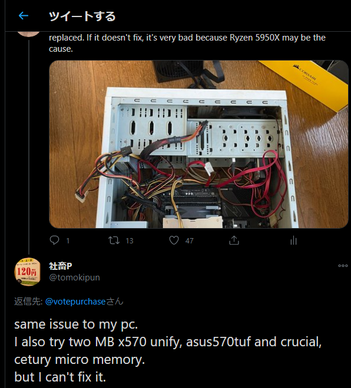
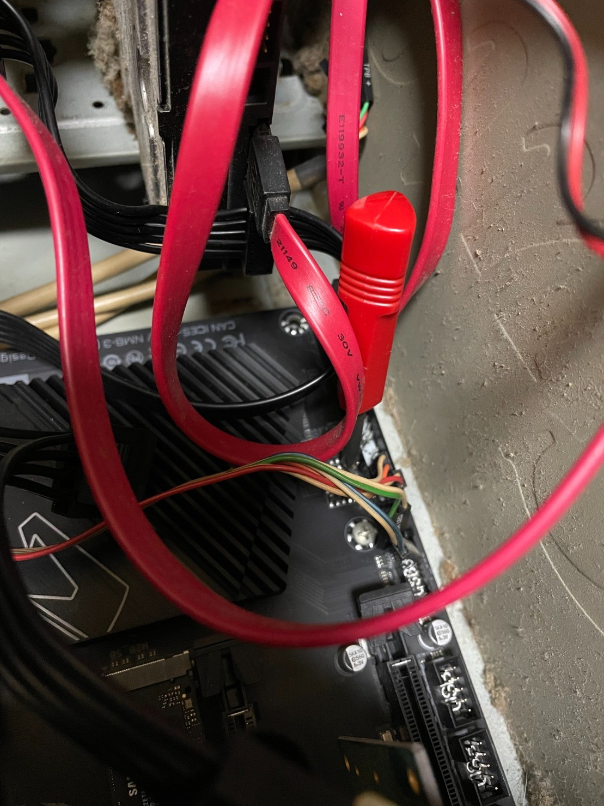

import { Link } from 'gatsby';

**Ryzen 9 3950X**を**Ryzen 9 5950X**に交換してから発生している**KP41によるBSoD**ですがまだ直っていません。**アイドル状態で放置**してると**Kernel Power 41**が発生して**クラッシュ→再起動**します。

ここまでの奮闘は以前のエントリーを参照してください。

- <Link to="/blog/2020-11-15">2020-11-15</Link>
- <Link to="/blog/2020-11-18">2020-11-18</Link>
- <Link to="/blog/2020-11-23">2020-11-23</Link>

ググってみるとVermeerのKP41問題は結構報告されてる模様です。

- [*Replaced 3950X with 5950X = WHEA and reboots*](https://www.overclock.net/threads/replaced-3950x-with-5950x-whea-and-reboots.1774627/)
- [*MSI Tomahawk X570 + Ryzen 5900x + Latest Bios = Any error you like*](https://www.reddit.com/r/MSI_Gaming/comments/jr625r/msi_tomahawk_x570_ryzen_5900x_latest_bios_any/)

あと、この問題をツイートしたら同じ症状が発生してる人がリプをくれました。



他のツイートを見るとこの人もアイドル時に発生しているようです。

#### 発生タイミングをまとめると

1. Windows起動直後
1. 高負荷時
1. アイドル時

の3パターンがあるみたいです。要するにPC使用シーンのほぼ全部ってことですね。上にあげたフォーラムではBIOSの熟成待ちという雰囲気になっているようです。**PBO2**が実装される**AGESA1.1.8.0**に期待ですね。それで直らなかったら症状が報告されてないASRockのマザーボードに交換しようと思っています。**Ryzen自体の初期不良**の可能性もあるけど、高額CPUなのでそうは考えたくはない。**選別不良で急激な電圧変化に耐えられないコアがいる**とは考えたくはない。

#### 解消しなかったけど追加でやったこと一覧

- BIOSアップデート`F11e`,`F11f`,`F11h`,`F11i`,`F11j`,`F11k`
- VRINロードラインキャリブレーションを`high`に変更
- SOC load-line Calibrationを`high`に変更
- Precision Boost Overdriveを`Auto`から`Enable`に変更
- Global C-state Controlを`Disable`に変更
- CPUコア電圧を`Auto`から`Normal`に変更
- Windows10の電源オプションを`高パフォーマンス`に変更
- GIGABYTEスレで推奨されている手順でBIOSアップデート

最後のGIGABYTEスレ推奨BIOS更新手順

```
X570、B550のBIOS更新〜更新後の手順 
USBメモリーにBIOSファイルを入れておく
DELキー連打でBIOSに入ります。
入ったらF7キーでデフォルト読み込ませF10でセーブ再起動
再度DELキー連打でBIOSに入りF8キーにて更新画面に行きUSB内のBIOSを指定し更新し再起動
BIOS更新後DELキー連打でBIOS画面に入れるのを確認出来たら電源ボタン押し電源OFF
電源のスイッチまたはコンセントを抜き30秒ほどしたらCMOSクリアをする（X570,B550ではこれ重要）
その後電源を入れDELキー連打でBIOS内に入ったらF7でデフォルト読み込みF10でセーブし再起動
もう一度DELキー連打でBIOSに入り自分に合ったXMPやハード類の細かい設定を行いF10でセーブする
```

ほぼ完全におまじないですな。一応やってみましたが効果はありませんでした。



B550 AORUS ELITEにはCMOSクリアスイッチがないのでピンをショートさせてやりました。最初に書きましたが症状は改善しませんでしたが。

頼む。直ってくれぃ。

---