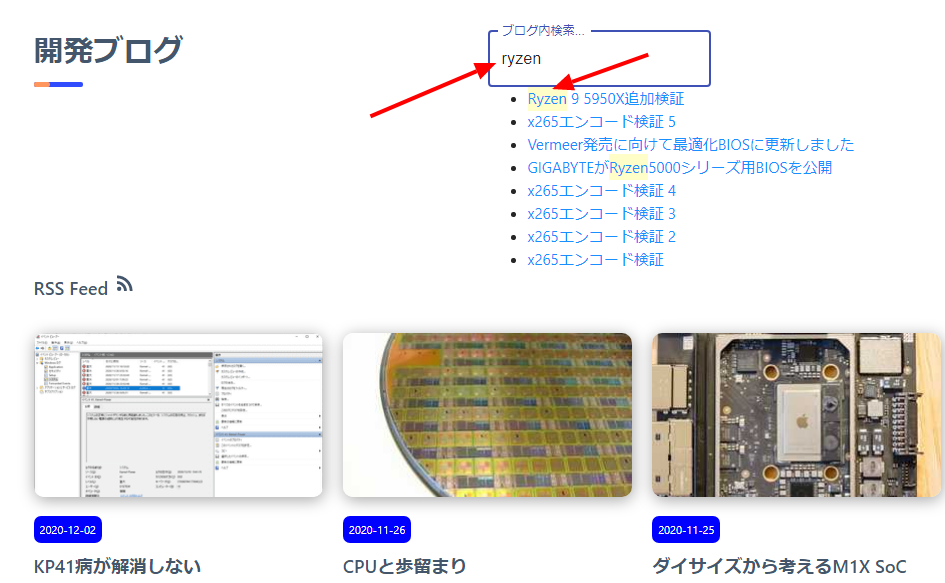

import { Link } from 'gatsby';

### ブログらしい見た目にしたかったので検索機能を追加しました



[Gatsby公式](https://www.gatsbyjs.com/docs/adding-search/)では検索機能の実装にAlgoliaなどのSaaSを利用するように案内されていますが、今回はビルド時に自分でJSONを作成して検索するようにしました。

### ``今回追加したコード``

### 検索ボックス用のコンポーネントを新規作成
**src\components\Search\index.jsx**

```javascript
import React, { useState, useEffect } from "react"
import { useStaticQuery, graphql } from "gatsby"
import { Link } from "gatsby"
import TextHighlighter from "./highlight"
import TextField from '@material-ui/core/TextField';

const SearchResult = props => {
  const tempData = useStaticQuery(graphql`
  query SearchData {
    allMdx( sort: { fields: [frontmatter___date], order: DESC } ) {
      edges {
        node {
          body
              frontmatter {
                date(formatString: "YYYY-MM-DD")
                title
                path
                excerpt
              }
        }
      }
    }
  }
  `)
  const [data, setData] = useState([])
  useEffect(() => {
    const temp = []
    tempData.allMdx.edges.map(e => {
      temp.push(e.node.frontmatter)
    })
    setData(temp)
  }, [])

  const [result, setResult] = useState([])
  const search = () => {
    const value = props.value.toLowerCase()
    const temp = data.filter(e => {
      const target = `
        ${e.title.toLowerCase()}
        ${e.excerpt.toLowerCase()}
      `
      return target.indexOf(value) !== -1
    })
    setResult(temp)
  }
  useEffect(() => {
    if (props.value !== "") {
      search()
    }
  }, [props.value])

  return (
      <div>
        <ul>
          {result.map(e => {
            return (
              <li key={e.slug}>
                <Link to={`/${e.path}/`}>
                  <TextHighlighter str={e.title} includes={props.value} />
                </Link>
              </li>
            )
          })}
        </ul>
      </div>
  )
}

const Search = props => {
  const [focus, setFocus] = useState(false)
  const [value, setValue] = useState("")
  const onFocus = () => {
    setFocus(true)
  }
  const onBlur = () => {
    setFocus(false)
  }
  const onChange = e => {
    setValue(e.target.value)
  }
  return (
    <div>
      <TextField 
        id="outlined-search"
        label="ブログ内検索..."
        type="search"
        variant="outlined"
        onFocus={onFocus}
        onBlur={onBlur}
        onChange={onChange}
      />
      <SearchResult focus={focus} value={value} />
    </div>
  )
}

export default Search
```

### ヒットした文字列をハイライトするコンポーネントを作成
**src\components\Search\highlight.js**

```javascript
import React from "react"

const TextHighlighter = props => {
  const { str, includes } = props
  const temp = str.toLowerCase()
  const start = temp.indexOf(includes.toLowerCase())
  const end = start + includes.length
  const item = str.slice(start, end)
  const res = str.replace(
    item,
    `<span style="background: rgba(255, 250, 118, 0.4); padding: 3px 0">${item}</span>`
  )
  return <span dangerouslySetInnerHTML={{ __html: res }} />
}

export default TextHighlighter
```

### 任意の箇所にコンポーネントを追加
**src\pages\blog\index.jsx**

```javascript
import Search from '../../components/Search';
```

```javascript
<Row>
    <Col span={12}>
        <h1 className="titleSeparate">開発ブログ</h1>
    </Col>
    <Col span={12}>
        <Search/>
    </Col>
</Row>
```

以上です。単にタイトルと抜粋を検索するだけで本文は検索対象外です。`CTRL + F`でできますが、今回は見た目をそれっぽくしたいだけなのでこれで良いのです。

---