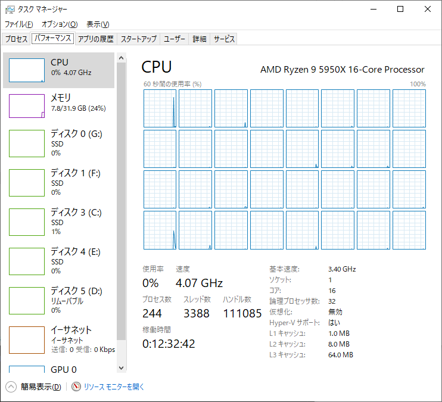
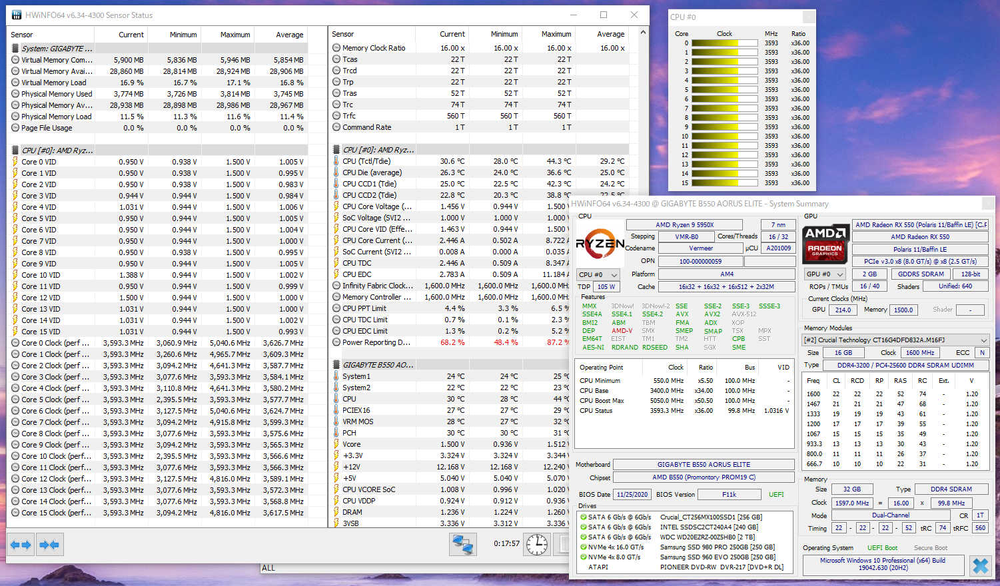
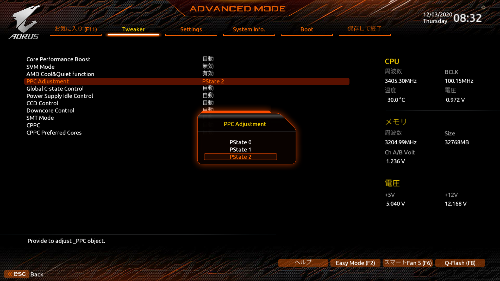
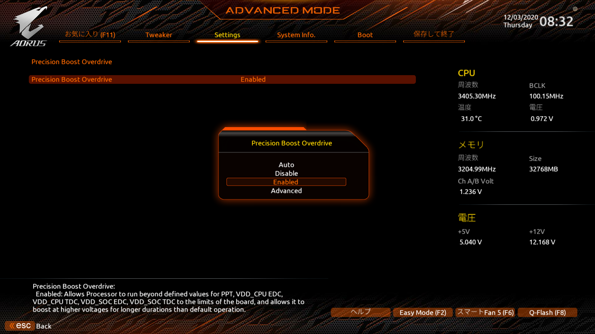
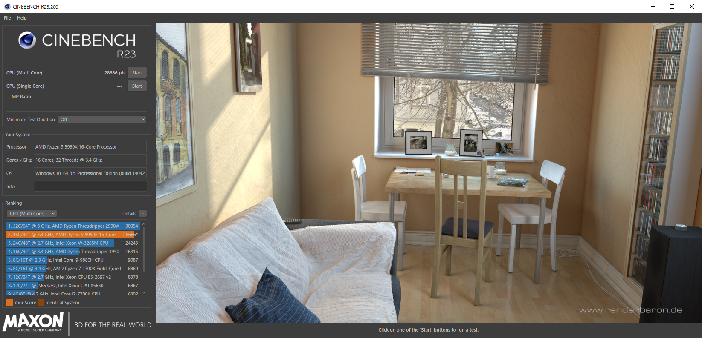
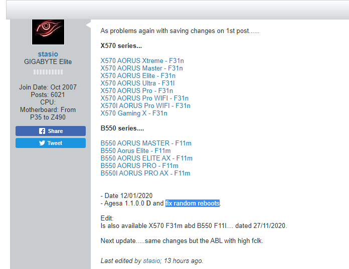

import { Link } from 'gatsby';

### KP41病が直った！多分

Ryzen 9 5950Xを手に入れて以来**アイドル時にKP41により再起動される現象**に悩まされてきましたが多分なおりました。

ここまでの奮闘は以前のエントリーを参照してください。

- <Link to="/blog/2020-11-15">2020-11-15 CPU交換してからKP41病が発生している</Link>
- <Link to="/blog/2020-11-18">2020-11-18 KP41直ってない</Link>
- <Link to="/blog/2020-11-23">2020-11-23 いつまで経ってもKP41が直らない</Link>
- <Link to="/blog/2020-12-02">2020-12-02 KP41病が解消しない</Link>

各所で相談した結果、アイドル時の電圧降下に耐えられないコアが存在する可能性が高いと推測してBIOS設定を変更しました。

最終的には`P-State` を**0**から**2**に変更することで解消しました。

これまで変更してうまくいかなかった設定は、改善が見られなかった時点で元に戻していたので`P-Stateの変更`だけでOKです。今回の症状とは無関係ですがPrecision Boost Overdriveを`Auto`から`Enable`に変更したらCinebenchのスコアが上がったのでPBOだけは`Enable`のままにしておきます。

BIOSに入り*PPC Adjustment*を`PState2`に変更

ついでに*Precision Boost Overdrive*を`Auto`から`Enable`に変更

これで一件落着かと思っていたのですが、某所からの通報によりGIGABYTEさんが今回の症状を修正するBIOSを準備中なことが判明しました。

[As problems again with saving changes on 1st post......](https://www.tweaktownforum.com/forum/tech-support-from-vendors/gigabyte/28656-gigabyte-latest-beta-bios/page808#post975657)

`Agesa 1.1.0.0 D and fix random reboots.`

とのことなのでやはりBIOSの問題だったようです。GIGABYTE公式ページで配布が始まったら入れようと思っています。

---