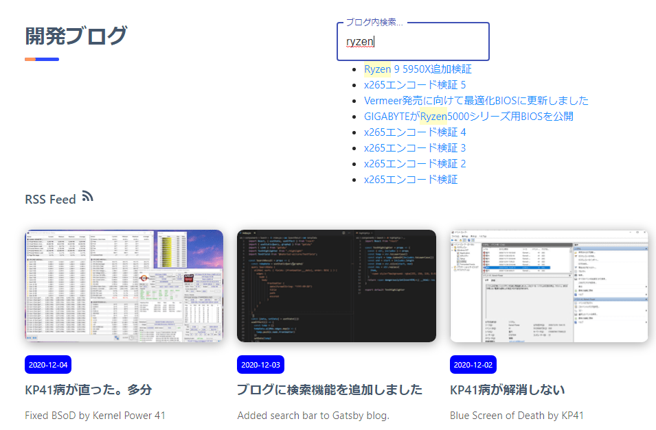
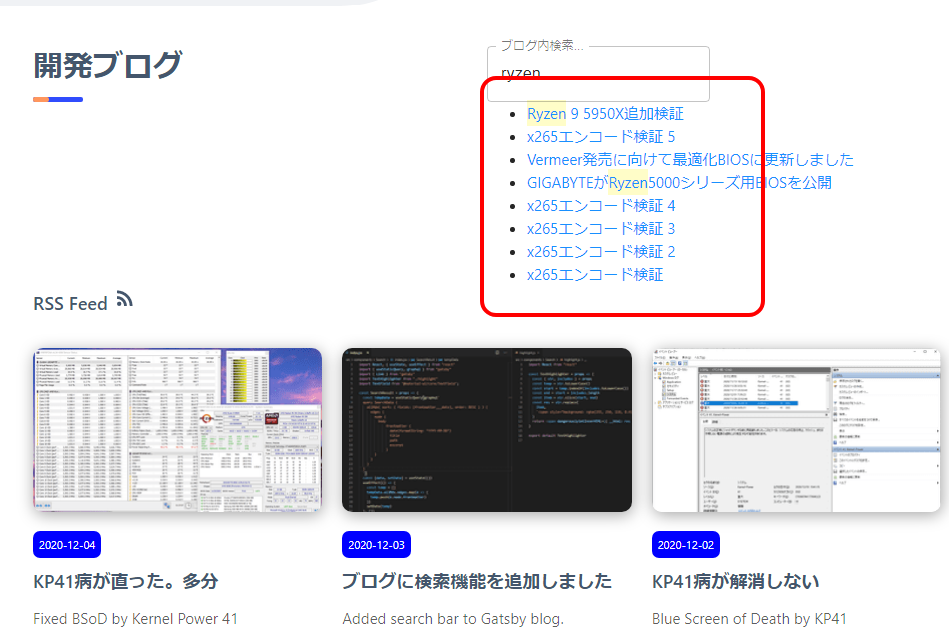

import { Link } from 'gatsby';

## 実装した検索機能の問題点

<Link to="/blog/2020-12-03">前回</Link>、ブログ内検索を実装しました。高速で検索結果が表示されるのが楽しいので時々触っています。ですが検索結果が表示されたままになってしまうので、ブログの見た目をそれっぽくしたいという目的はイマイチ達成できていませんでした。

<br/><br/>

### キーワードを入れると検索結果が表示される

ここまではいい



### テキストフィールドの外に出ても結果が表示されたままになる

これはあかん



### 画像だとわかりにくいので動画を用意しました

`youtube: UhsHNGMmyZ4`

## というわけで直しました

画像だとわからないので動画にしました。テキストフィールドから**フォーカスがはずれる**と検索結果が**非表示**になります。

`youtube: IjUNpuKZkO0`

## 追加したコード

**src\components\Search\index.jsx**

`変更前`

```javascript
const Search = props => {
  const [focus, setFocus] = useState(false)
  const [value, setValue] = useState("")
  const onFocus = () => {
    setFocus(true)
  }
  const onBlur = () => {
    setFocus(false)
  }
  const onChange = e => {
    setValue(e.target.value)
  }
  return (
    <div>
      <TextField 
        id="outlined-search"
        label="ブログ内検索..."
        type="search"
        variant="outlined"
        onFocus={onFocus}
        onBlur={onBlur}
        onChange={onChange}
      />
      <SearchResult focus={focus} value={value} /> {/*  この行を変更します */}
    </div>
  )
}
```

**onFocus**と**onBlur**を使って**フォーカスが当たった/はずれた**の判定は前回の時点で作成済みです。なので`focus`を三項演算子で評価して**true**なら検索結果を表示するようにしました。

`変更後`

```javascript
  return (
    <div>
      <TextField 
        id="outlined-search"
        label="ブログ内検索..."
        type="search"
        variant="outlined"
        onFocus={onFocus}
        onBlur={onBlur}
        onChange={onChange}
      />
      {focus ? <SearchResult focus={focus} value={value} />: null} {/*  この行を変更した */}
    </div>
  )
```

以上です。

---