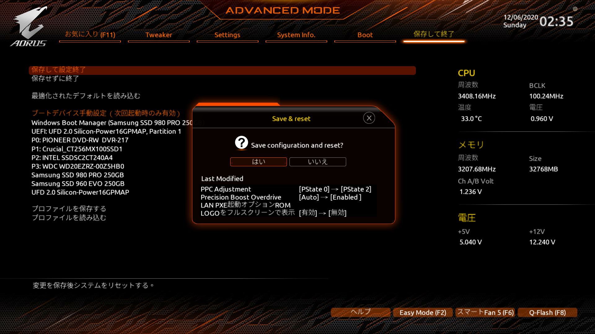
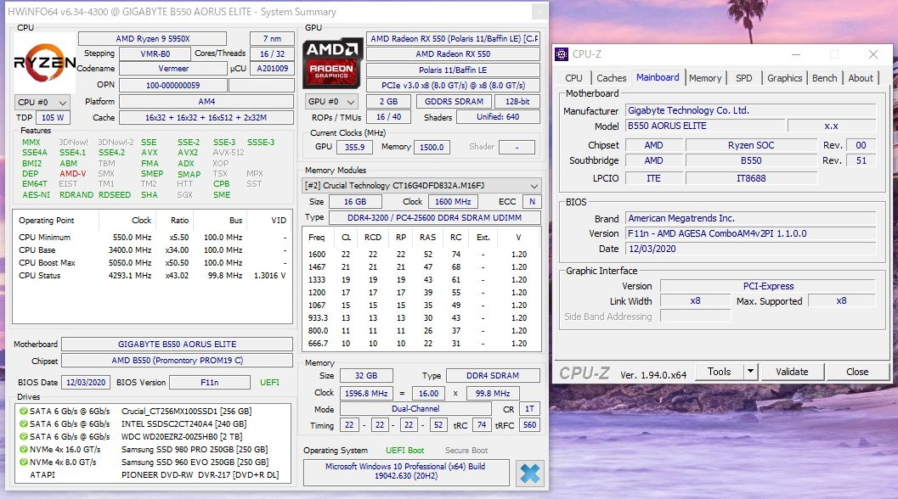
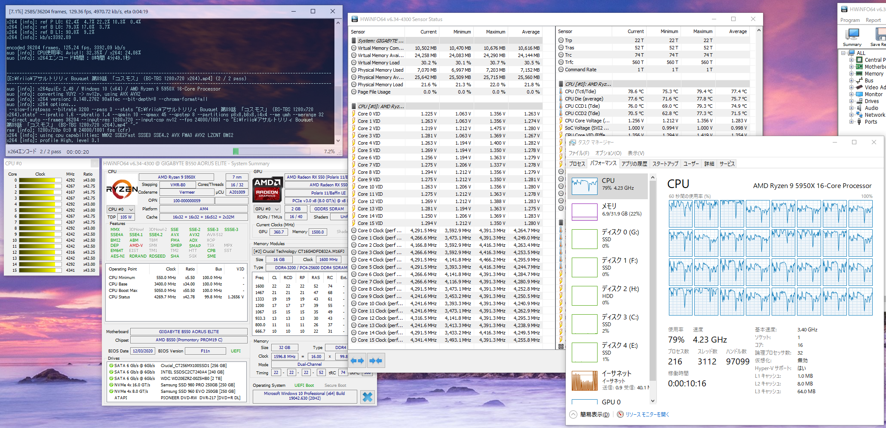

import { Link } from 'gatsby';

<Link to="/blog/2020-12-04">前回</Link>の続きです。

`P-State`を`2`に変更することで**VermeerがKernel Power 41でBSoDを起こす現象**を解消したと思っていたのですが、**なおってません**でした。

頻度は下がりましたが相変わらずアイドル時にKP41でクラッシュします。感覚としては**1日複数回**だったのが**1日1回起きるかどうか**といった頻度に減少しました。

[某所](https://www.tweaktownforum.com/forum/tech-support-from-vendors/gigabyte/28656-gigabyte-latest-beta-bios/page808#post975657)で手に入れた、GIGABYTEが用意している`Random reboots`を修正したBIOSを入れてみましたが直ってません。

#### 現在の構成と設定
- Ryzen 9 5950X
- GIGABYTE B550 AORUS ELITE
- Crucial CT2K16G4DFD832A
- 玄人志向 RD-RX550-E2GB/OC
- Corsair CP-9020194-JP
- BIOS `F11m`
- PPC Adjustment `P-State2`
- Precision Boost Overdrive `Enabled`

でも発生しました。

`Agesa 1.1.0.0 D and fix random reboots.`な`F11m`より新しい[F11n](https://download.gigabyte.com/FileList/BIOS/mb_bios_b550-aorus-elite_f11n.zip)がダウンロードできるようになっていたので試してみます。公式に掲載されてないですがURL直打ちでダウンロードできました。

### おまけ

パソコンの構成を伝えると、よく「**虎徹でRyzen 9 5950X使えるの？**」と聞かれますが、普通に使えます。バリバリにチューンして限界目指すんじゃなきゃ虎徹でも普通に使えます。

---