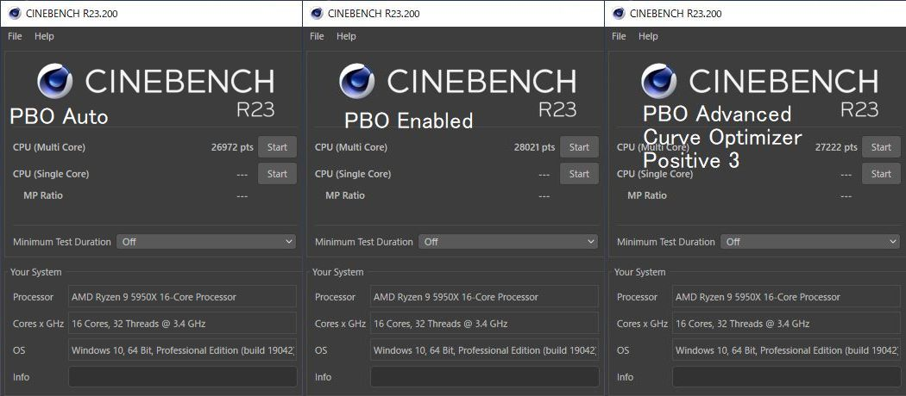

import { Link } from 'gatsby';

<Link to="/blog/2020-12-07">前回</Link>は、P-Stateの変更でもKP41によるBSoDが直らず、GIGABYTE公式には掲載されていないがURL直打ちでダウンロードした最新BIOS F11nを入れて様子を見ることにしました。

  

#### 頻度は減少しましたが相変わらずクラッシュします

1日数回クラッシュしていた最初の頃よりマシになりましたが、まだ1日1回発生するかどうかの頻度でクラッシュします。

### ここまでのまとめ

#### CPU交換前の構成

- Ryzen9 3950X
- GIGABYTE B550 AORUS ELITE
- Crucial W4U3200CM-16G
- 玄人志向 RD-RX550-E2GB/OC
- Antec EA-650

 

#### CPU交換後の構成

- Ryzen9 5950X
- GIGABYTE B550 AORUS ELITE
- Crucial W4U3200CM-16G
- 玄人志向 RD-RX550-E2GB/OC
- Antec EA-650

 

設定など
- BIOS設定の高速起動は`無効`(デフォルト)
- チップセットドライバは`2.10.13.408`

 

CPUがRyzen 9 3950Xから5950Xに変わっただけです。そしてこのことによりKP41によるBSoDが発生しました。

> <Link to="/blog/2020-11-15">CPU交換してからKP41病が発生している</Link>

### 症状

- アイドル時に**Kernel Power 41**による**BSoD**が発生し**PCが再起動**する
- ブルースクリーン画面のエラーメッセージは**WHEA_UNCORRECTABLE_ERROR**
- イベントビューアの**Bug Check Code**と**PowerButtonTimestamp**は`0`
- アイドル状態で放置していると数時間に1度発生する
- エンコード中など負荷がかかっているときは発生しない

 

いわゆる**Ryzen5000シリーズのランダムリブート**問題です。海外のフォーラムでも発生が報告されています。

- [*Replaced 3950X with 5950X = WHEA and reboots*](https://www.overclock.net/threads/replaced-3950x-with-5950x-whea-and-reboots.1774627/)
- [*MSI Tomahawk X570 + Ryzen 5900x + Latest Bios = Any error you like*](https://www.reddit.com/r/MSI_Gaming/comments/jr625r/msi_tomahawk_x570_ryzen_5900x_latest_bios_any/)

 

あと自作PC板のRyzenスレでもそこそこ報告されています。

### 対処(設定)

変更して効果がなかった設定は元に戻しています。

- GIGABYTE B550 AORUS ELITEのBIOSを`F11c`から`F11d`にアップデート
- Windows10 20H2を再インストール
- 電源オプションの高速スタートアップを`無効`に変更
- CPUクーラー(虎徹Mark2)のネジを締め直し
- メモリ(Crucial W4U3200CM-16G)、スロット入れ替えて差し直し
- グラボのドライバをアップデート(Adrenalin 2020 `20.9.2`→`20.11.1`)
- 電源オプションの詳細設定`プロセッサの電源管理`の`最小のプロセッサの状態`を**0%から1%**に変更
- 仮想メモリ無効
- superfetch無効

 

### メモリ交換

メモリ(Crucial W4U3200CM-16G)を新しく買った**Crucial CT2K16G4DFD832A**に交換

> <Link to="/blog/2020-11-16">KP41病解消のために発注したメモリと電源が届きました</Link>

#### 構成

- Ryzen9 5950X
- GIGABYTE B550 AORUS ELITE
- Crucial CT2K16G4DFD832A
- 玄人志向 RD-RX550-E2GB/OC
- Antec EA-650

 

まったく改善しませんでした。

> <Link to="/blog/2020-11-18">KP41直ってない</Link>

### 対処(設定)

- **設定**の**電源とスリープ**の**パフォーマンスとエネルギー**を`高パフォーマンス`から`最適なパフォーマンス`に変更

 

### 電源ユニットの交換

電源ユニット(Antec EA-650)を新しく買った**Corsair CP-9020194-JP**に交換

> <Link to="/blog/2020-11-20">続・KP41なおってない</Link>

#### 構成

- Ryzen9 5950X
- GIGABYTE B550 AORUS ELITE
- Crucial CT2K16G4DFD832A
- 玄人志向 RD-RX550-E2GB/OC
- Corsair CP-9020194-JP

 

これでも改善が見られない。

### 対処

- 電源ケーブルを交換
- 電源タップを交換

 

> <Link to="/blog/2020-11-23">いつまで経ってもKP41が直らない</Link>

 

### 対処(設定)

- メモリのクロックを`3200MHz`から`2933MHz`に変更
- BIOSアップデート`F11e`,`F11f`,`F11h`,`F11i`,`F11j`,`F11k`
- VRINロードラインキャリブレーションを`high`に変更
- SOC load-line Calibrationを`high`に変更
- Precision Boost Overdriveを`Auto`から`Enable`に変更
- Global C-state Controlを`Disable`に変更
- CPUコア電圧を`Auto`から`Normal`に変更
- Windows10の電源オプションを`高パフォーマンス`に変更
- GIGABYTEスレで推奨されている手順でBIOSアップデート

 

> <Link to="/blog/2020-12-02">KP41病が解消しない</Link>

 

### 対処(設定)

- `P-State`を**0**から**2**に変更

 

### P-Stateの変更で少しの改善が見られる

> <Link to="/blog/2020-12-04">KP41病が直った。多分</Link>

**1日数回発生**していた症状が**1日1回発生**するかどうかの頻度に減少しました。

以降、`P-State`は**2**に固定。Cinebenchのスコアが上がったため`Precision Boost Overdrive`は**Enable**に固定したまま設定を続けました。

まだ発生するので対処を続けます。

### 対処(設定)

- BIOSアップデート`F11m`

`F11m`は[某フォーラム](https://www.tweaktownforum.com/forum/tech-support-from-vendors/gigabyte/28656-gigabyte-latest-beta-bios/page808#post975657)で手に入れたもので、アップデート内容は`Agesa 1.1.0.0 D and fix random reboots.`とのことだったため期待大だったが改善せず。

- BIOSアップデート`F11n`

GIGABYTE公式には掲載されていないがURL直打ちでダウンロードできたので更新しました。翌日GIGABYTEのページに公式に掲載されました。

Descriptionには`Fix Random Reboots`は記載されていませんでしたが、AGESAコードが`1.1.0.0 C`から`1.1.0.0 D`に変わっていたため期待大。

**しかしクラッシュが発生**。ランダムリブートは改善されませんでした。

> <Link to="/blog/2020-12-07">KP41なおってない</Link>

### 対処(様子見中)

- Curve Optimizerを`All Core` `Positive` `3`に変更
- P-Stateをデフォルト**0**に戻す

 

おそらく**アイドル時の電圧降下に耐えられないコアがいる**という見解は変わっていないので**COの変更**で様子をみようと思っています。Cinebenchのスコアは`Enabled`より少し下がりますがランダムリブートよりはマシです。

### Precision Boost Overdrive オプションによるパフォーマンスの違い

|PBO option|CinebenchR23|
|--|--|
|Auto|26972|
|Enabled|28021|
|Advanced(CO Positive 3)|27222|

 

頼む。直ってくれぃ。

---