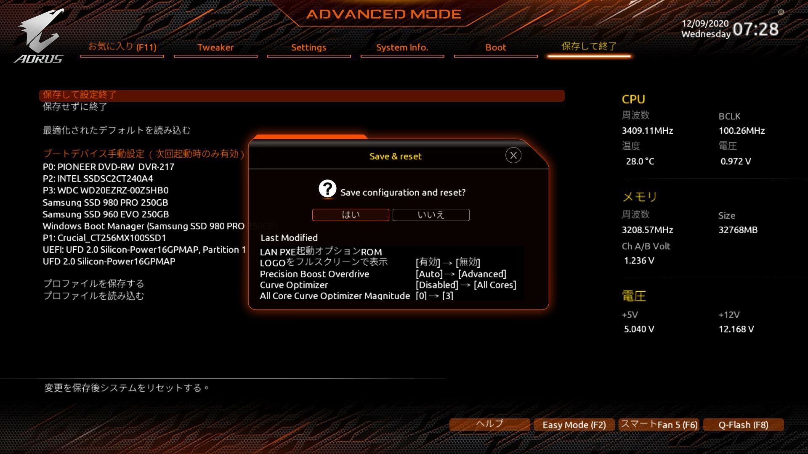
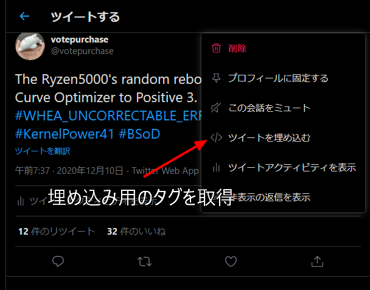

import { Link } from 'gatsby';

## KP41によるランダムリブート問題を解決した

CPUをRyzen 9 3950Xから5950Xに交換して以来続いていた**アイドル時にKernel Power 41によりランダムに再起動される症状**ですが、ついに修正しました。

ここまでの経緯は<Link to="/blog/2020-12-09">前の記事</Link>を参照してください。

9日の朝に設定して、11日の夜にこれを書いてるこのときまでランダムリブートは発生していません。以前は1日1回は発生していたので完全に克服したと判断していいと思います。

<blockquote class="twitter-tweet"><p lang="en" dir="ltr">The Ryzen5000&#39;s random reboot was solved by setting Curve Optimizer to Positive 3. <a href="https://twitter.com/hashtag/Ryzen?src=hash&amp;ref_src=twsrc%5Etfw">#Ryzen</a> <a href="https://twitter.com/hashtag/WHEA_UNCORRECTABLE_ERROR?src=hash&amp;ref_src=twsrc%5Etfw">#WHEA_UNCORRECTABLE_ERROR</a> <a href="https://twitter.com/hashtag/KP41?src=hash&amp;ref_src=twsrc%5Etfw">#KP41</a> <a href="https://twitter.com/hashtag/KernelPower41?src=hash&amp;ref_src=twsrc%5Etfw">#KernelPower41</a> <a href="https://twitter.com/hashtag/BSoD?src=hash&amp;ref_src=twsrc%5Etfw">#BSoD</a></p>&mdash; votepurchase (@votepurchase) <a href="https://twitter.com/votepurchase/status/1336802276392898562?ref_src=twsrc%5Etfw">December 9, 2020</a></blockquote>

正解は`P-State`の変更ではなく、`Curve Optimizer`を`Positive`に設定することでした。

- **Precision Boost Overdrive**を`Advanced`
- **Curve Optimizer**を`All Core`、`Positive`
- **Magnitude**を`3`

<br/>

この設定で完全に解決しました。



### まとめ

#### 症状

- アイドル時に**Kernel Power 41**による**BSoD**が発生し**PCが再起動**する
- ブルースクリーン画面のエラーメッセージは**WHEA_UNCORRECTABLE_ERROR**
- イベントビューアの**Bug Check Code**と**PowerButtonTimestamp**は`0`
- アイドル状態で放置していると数時間に1度発生する
- エンコード中など負荷がかかっているときは発生しない

<br/>

#### ランダムリブート問題発生時の構成

- Ryzen9 5950X
- GIGABYTE B550 AORUS ELITE
- Crucial W4U3200CM-16G
- 玄人志向 RD-RX550-E2GB/OC
- Antec EA-650
- Windows10 `20H1`
- BIOSバージョン `F11c`
- BIOS設定の高速起動は`無効`(デフォルト)
- チップセットドライバは`2.10.13.408`
- GPUドライバはAdrenalin 2020 `20.9.2`

<br/>

#### 解決時の最終的な構成

- Ryzen9 5950X
- GIGABYTE B550 AORUS ELITE
- **Crucial CT2K16G4DFD832A**
- 玄人志向 RD-RX550-E2GB/OC
- **ACorsair CP-9020194-JP**
- Windows10 `20H2`
- BIOSバージョン `F11n`
- BIOS設定の高速起動は`無効`(デフォルト)
- チップセットドライバは`2.10.13.408`
- GPUドライバはAdrenalin 2020 `20.11.1`

<br/>

#### 試したが効果がなかったこと

- BIOSアップデート`F11c`,`F11d`,`F11e`,`F11f`,`F11h`,`F11i`,`F11j`,`F11k`,`F11m`
- Windows10 `20H2`を再インストール
- 電源オプションの高速スタートアップを`無効`に変更
- CPUクーラー(虎徹Mark2)のネジを締め直し
- メモリ(Crucial W4U3200CM-16G)、スロット入れ替えて差し直し
- グラボのドライバをアップデート(Adrenalin 2020 `20.9.2`→`20.11.1`)
- 電源オプションの詳細設定`プロセッサの電源管理`の`最小のプロセッサの状態`を**0%から1%**に変更
- 仮想メモリ無効
- superfetch無効
- メモリ交換**Crucial W4U3200CM-16G** → **Crucial CT2K16G4DFD832A**
- 電源ユニット交換**Antec EA-650** → **Corsair CP-9020194-JP**
- 電源ケーブルを交換
- 電源タップを交換
- メモリのクロックを`3200MHz`から`2933MHz`に変更
- 設定アプリの**電源とスリープ**の**パフォーマンスとエネルギー**を`高パフォーマンス`から`最適なパフォーマンス`に変更
- VRINロードラインキャリブレーションを`high`に変更
- SOC load-line Calibrationを`high`に変更
- Precision Boost Overdriveを`Auto`から`Enable`に変更
- Global C-state Controlを`Disable`に変更
- CPUコア電圧を`Auto`から`Normal`に変更
- Windows10の電源オプションを`高パフォーマンス`に変更
- GIGABYTEスレで推奨されている手順でBIOSアップデート(CMOSクリア)

<br/>

#### 症状の緩和が見られた

- `P-State`を**0**から**2**に変更

<br/>

#### 解決した

- **Precision Boost Overdrive**を`Advanced`
- **Curve Optimizer**を`All Core`、`Positive`
- **Magnitude**を`3`

<br/>

1ヶ月以上に渡る格闘の末、ようやく解決しました。

<br/>

## GatsbyJSで記事にツイートを埋め込む

上に貼りましたが記事内にツイートを埋め込みたかったのでプラグイン[gatsby-plugin-twitter](https://www.gatsbyjs.com/plugins/gatsby-plugin-twitter/)を導入しました。

#### インストール

```shell
yarn add gatsby-plugin-twitter
```

**gatsby-config.plugins.js**

```javascript
resolve: `gatsby-plugin-mdx`,
    options: {
      plugins: [
        `gatsby-remark-images-medium-zoom`,
        `gatsby-plugin-twitter` // ここに追加
      ],
```

#### 使い方

埋め込みたいツイートの埋め込み用コードを取得します。



**取得したhtmlタグ**

```html
<blockquote class="twitter-tweet"><p lang="en" dir="ltr">
  The Ryzen5000&#39;s random reboot was solved by setting Curve Optimizer to Positive 3. 
  <a href="https://twitter.com/hashtag/Ryzen?src=hash&amp;ref_src=twsrc%5Etfw">#Ryzen</a> 
  <a href="https://twitter.com/hashtag/WHEA_UNCORRECTABLE_ERROR?src=hash&amp;ref_src=twsrc%5Etfw">#WHEA_UNCORRECTABLE_ERROR</a> 
  <a href="https://twitter.com/hashtag/KP41?src=hash&amp;ref_src=twsrc%5Etfw">#KP41</a> 
  <a href="https://twitter.com/hashtag/KernelPower41?src=hash&amp;ref_src=twsrc%5Etfw">#KernelPower41</a> 
  <a href="https://twitter.com/hashtag/BSoD?src=hash&amp;ref_src=twsrc%5Etfw">#BSoD</a></p>&mdash; votepurchase (@votepurchase) 
  <a href="https://twitter.com/votepurchase/status/1336802276392898562?ref_src=twsrc%5Etfw">December 9, 2020</a>
</blockquote>
<script async src="https://platform.twitter.com/widgets.js" charset="utf-8"></script>
```

最後の`<script async src="https://platform.twitter.com/widgets.js" charset="utf-8"></script>`**以外**をMDXに貼り付けます。

プラグインのインストールだけで、コードを書く必要がないので良いですね。

---