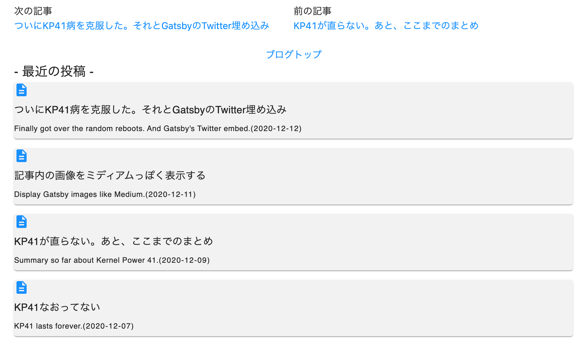

import { Link } from 'gatsby';

### ブログ記事の下に最新５件の記事へのリンクを追加しました



ブログっぽい見た目にしたかったので、記事の最後に別の記事へのリンクを追加しようと思い立ちました。

**関連する投稿**か**最新記事数件**かどちらにしようか迷ったのですが、ググっても出てこなかった**最新記事へのリンク**を追加することにしました。

### 追加したコード

#### 最新記事表示用のコンポーネントを新規作成

**src/components/Recent/index.jsx**

```javascript
import React from 'react'
import { Link, graphql, useStaticQuery } from 'gatsby'
import Card from '@material-ui/core/Card'
import Typography from '@material-ui/core/Typography'
import Grid from '@material-ui/core/Grid'
import DescriptionIcon from '@material-ui/icons/Description'

const RecentPosts = () => {
  const data = useStaticQuery(
    graphql`
      query {
        allMdx
          ( 
          sort: { fields: [frontmatter___date], order: DESC }
          limit: 5
          ) 
        {
        edges {
          node {
            frontmatter {
              title
              excerpt
              date(formatString: "YYYY-MM-DD")
              path
              }
            }
          }
        }
  }
  `)

  const posts = data.allMdx.edges
  return (
    <div>
      <Grid container>
        <Typography variant="h6" color='textPrimary'>- 最近の投稿 -</Typography>
      </Grid>
          {posts.map((post) => (
            <div>
              <Card style={{backgroundColor: "#F2F2F2"}}>
                <Link to={`/${post.node.frontmatter.path}`}>
                  <DescriptionIcon />
                  <Typography variant="subtitle1" color='textPrimary'>{post.node.frontmatter.title}</Typography>
                  <Typography variant="caption" color='textPrimary'>{post.node.frontmatter.excerpt}</Typography>
                  <Typography variant="overline" color='textPrimary'>({post.node.frontmatter.date})</Typography>
                </Link>
              </Card>
              <p />
            </div>
          ))}
    </div>
  )
}

export default RecentPosts
```

`useStaticQuery`を使って全MDXを取得します。日付でソートしてタイトルと日付と抜粋とパスを整形して表示します。

#### 作ったコンポーネントを記事のテンプレートに追加する

**src/templates/post/post.jsx**

```javascript
import RecentPosts from '../../components/Recent'
```

```javascript
<SidebarWrapper>
  <div className="marginTopTitle">
    <h1>{title}</h1>
    <div className={style.bannerImgContainer}>
      
    </div>
    <CalendarTodayIcon/><h3>{date}</h3>
    <p>{excerpt}</p>
    <MDXProvider components={style.blogArticle}>
      <MDXRenderer>{body}</MDXRenderer>
    </MDXProvider>
  </div>
  <PostNav prev={pageContext.prev} next={pageContext.next}/>
  <RecentPosts />
</SidebarWrapper>
```

以上です。

---