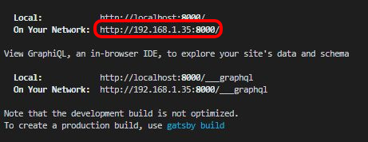
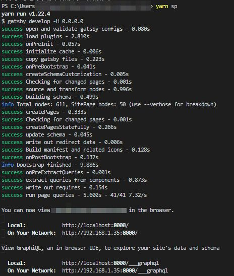
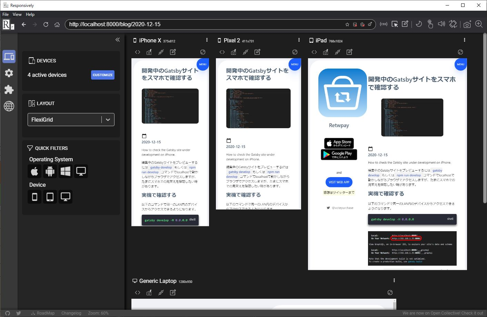

import { Link } from 'gatsby';

編集中のGatsbyサイトをプレビューするには`gatsby develop`もしくは`npm run develop`コマンドでlocalhostで動かしながらブラウザでアクセスしますが、たまにスマホでの見栄えを確認したい時があります。

## 実機で確認する

以下のコマンドで同一のLAN内のデバイスからアクセスできるようになります。

```shell
gatsby develop -H 0.0.0.0
```



スマホから`192.168.1.35:8000`にアクセスするとプレビューできます。


上記のコマンドだと長いし、覚えられないので**package.json**を編集しておきます。

**package.json**

```javascript
  "scripts": {
    "build": "gatsby build",
    "develop": "gatsby develop",
    "sp": "gatsby develop -H 0.0.0.0", // ここに追加
    "format": "prettier --write \"**/*.{js,jsx,json,md}\"",
    "start": "npm run develop",
    "serve": "gatsby serve",
    "clean": "gatsby clean",
    "test": "echo \"Write tests! -> https://gatsby.dev/unit-testing\" && exit 1"
  },
```

これで以下のコマンドで実行できるようになりました。

```shell
yarn sp
```



もちろん、ソースを編集するとデバイス側にも反映されます。

## Responsivelyを使う

複数の画面サイズでのプレビューを一度に確認したい場合は[Responsively](https://responsively.app/)を使用するのが便利です。



スマホに持ち替える必要がないので私はこちらを使うことが多いです。

---