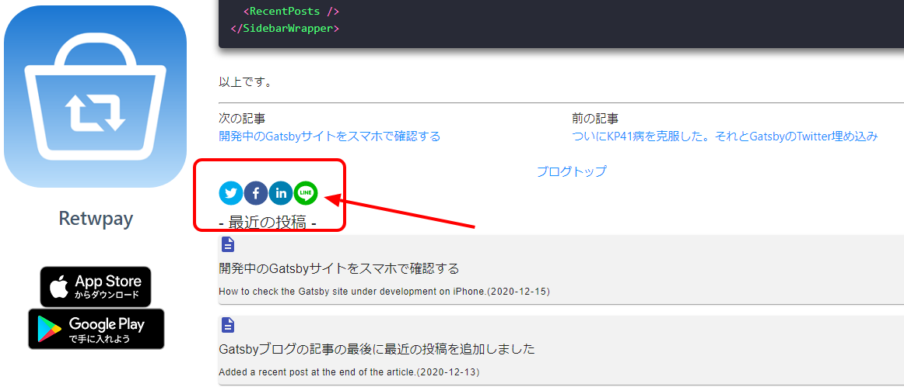

import { Link } from 'gatsby';

### ブログ記事の最後にSNSで共有するボタンを追加しました

さらにブログらしい見た目に近づけるために共有ボタンを追加しました。

プラグイン[react-share](https://github.com/nygardk/react-share)を使用しました。



### 追加したコード

#### インストール

```shell
yarn add react-share
```

#### 共有ボタン用のコンポーネントを新規作成

**src\components\share\index.jsx**

```javascript
import React from 'react'
import Config from '../../../config'

import {
    FacebookShareButton,
    FacebookIcon,
    TwitterShareButton,
    TwitterIcon,
    LinkedinShareButton,
    LinkedinIcon,
    LineShareButton,
    LineIcon,
} from 'react-share';

const Share = ({ title, path }) => (
    <div>
      <TwitterShareButton title={title} url={Config.siteUrl + path}>
        <TwitterIcon size={32} round />
      </TwitterShareButton>
      <FacebookShareButton quote={title} url={Config.siteUrl + path}>
        <FacebookIcon size={32} round />
      </FacebookShareButton>
      <LinkedinShareButton title={title} url={Config.siteUrl + path}>
        <LinkedinIcon size={32} round />
      </LinkedinShareButton>
      <LineShareButton title={title} url={Config.siteUrl + path}>
        <LineIcon size={32} round />
      </LineShareButton>
    </div>
);

export default Share;
```

#### 作ったコンポーネントを記事のテンプレートに追加する

**src/templates/post/post.jsx**

```javascript
import Share from '../../components/share'
```

```javascript
  <Share title={title} path={path} />
```

以上です。


---