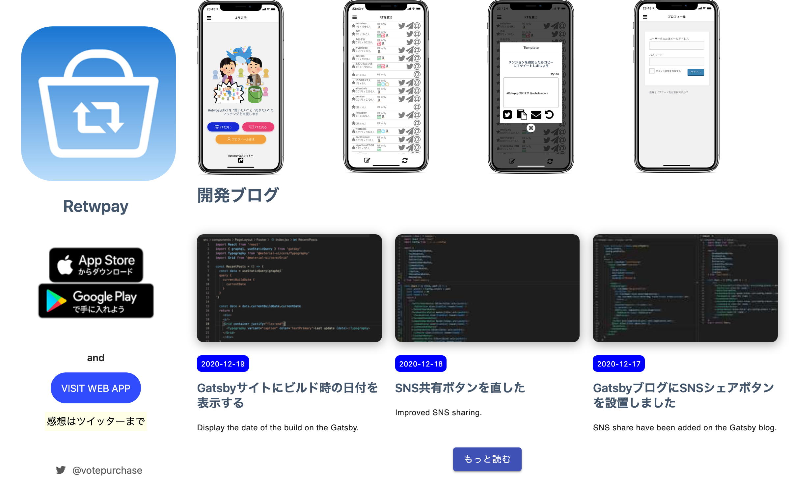

import { Link } from 'gatsby';

ブログ記事への導線を増やすためにトップページに最新ブログ記事3件を表示するようにしました。



### 追加したコード

#### 記事表示用のコンポーネントを新規作成

**src/components/PageFragments/HomePage/RecentBlog.jsx**

```javascript
import React from 'react'
import { Link, graphql, useStaticQuery } from 'gatsby'
import Grid from '@material-ui/core/Grid'
import Button from '@material-ui/core/Button'
import style from '../../PostCard/postCard.module.less'
import moment from 'moment'
import { Row, Col } from 'antd'
import Typography from '@material-ui/core/Typography'

const RecentBlog = () => {
  const data = useStaticQuery(
    graphql`
      query {
        allMdx
          ( 
            sort: { fields: [frontmatter___date], order: DESC }
            limit: 3
          )
        {
          edges {
            node {
            frontmatter {
            title
            excerpt
            date(formatString: "YYYY-MM-DD")
            path
            cover {
              childImageSharp {
                fluid(maxWidth: 288) {
                  ...GatsbyImageSharpFluid_tracedSVG
                  }
                }
              }
            }
          }
        }
      }
    }
`)

  const posts = data.allMdx.edges
    return (
      <div>
        <p/>
        <Grid container>
          <h2>開発ブログ</h2>
        </Grid>
        <Row gutter={[20, 20]}>
          {posts.map((post) => (
            <Col xs={24} sm={24} md={12} lg={8}>
              <div>
                <Link to={`/${post.node.frontmatter.path}`}>
                  <div className={style.postCard}>
                    <div
                      className={style.postCardImg}
                      style={{
                      backgroundImage: `url(${post.node.frontmatter ? post.node.frontmatter.cover.childImageSharp.fluid.src : ''})`,
                      }}
                    />
                    <div className={style.mrTp20}>
                      <p>
                        <span className={style.dateHolder}>{post.node.frontmatter ? moment(post.node.frontmatter.date).format('YYYY-MM-DD') : ''}</span>
                      </p>
                    </div>
                    <h3>{post.node.frontmatter ? post.node.frontmatter.title : ''}</h3>
                    <Typography variant="caption" color='textPrimary'>{post.node.frontmatter ? post.node.frontmatter.excerpt : ''}</Typography>
                  </div>
                </Link>
              </div>
            </Col>
          ))}
        </Row>
        <Grid container justify="center">
          <Link to="/blog">
            <Button variant="contained" color="primary">もっと読む</Button>
          </Link>
        </Grid>
      </div>
    )
}

export default RecentBlog
```

`useStaticQuery`を使って全MDXを取得、日付でソートして最新3件を取得します。

スタイルは既存の[記事一覧](/blog)から流用します。

#### 作ったコンポーネントをトップページに追加

**src/pages/index.jsx**

```javascript
import RecentBlog from '../components/PageFragments/HomePage/RecentBlog';
```

```html
<RecentBlog />
```

以上です。

---