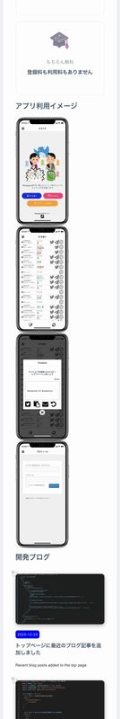

import { Link } from 'gatsby';

<Link to="/blog/2020-12-20">前回</Link>は、トップページに最新3件のブログ記事へのリンクを追加しました。

<br/><br/>

PCでの表示では問題ないですが、スマホで見たときに縦に長くなりすぎていたので**アプリ利用イメージ**で画像を並べてる部分を水平スクロールするように変更しました。



`youtube: OIgWdTHBYr0`

変更後、画像を横スクロールできるように変更。

## 変更前

単にGridで並べているだけです。

**src\components\PageFragments\HomePage\AppScreenShots.jsx**

```javascript
import React from 'react';
import Grid from '@material-ui/core/Grid';

const AppScreenShots = () => (
  <div>
    <h2>アプリ利用イメージ</h2>
    <Grid container>
      <Grid item sm={5} md={3}></Grid>
      <Grid item sm={5} md={3}></Grid>
      <Grid item sm={5} md={3}></Grid>
      <Grid item sm={5} md={3}></Grid>
    </Grid>
  </div>
);

export default AppScreenShots;
```

## 変更後

`GridList`を使用しました。

### 表示したいデータの中身を新規コンポーネントに切り出す

**src\components\PageFragments\HomePage\screenShots.jsx**

```javascript
const screennShots = [
    {
      img: '../ss1.png',
      title: '初期画面'
    },
    {
      img: '../ss2.png',
      title: 'リツイートを買う'
    },
    {
      img: '../ss3.png',
      title: 'リツイート買取テンプレート'
    },
    {
      img: '../ss4.png',
      title: 'プロフィール作成'
    }
];

export default screennShots;
```

### データ表示用のコンポーネントを編集

**src\components\PageFragments\HomePage\AppScreenShots.jsx**

```javascript
import React from 'react';
import { createStyles, makeStyles } from '@material-ui/core/styles';
import GridList from '@material-ui/core/GridList';
import GridListTile from '@material-ui/core/GridListTile';
import GridListTileBar from '@material-ui/core/GridListTileBar';
import screennShots from './screenShots';

const useStyles = makeStyles(() =>
  createStyles({
    root: {
      display: 'flex',
      flexWrap: 'wrap',
      justifyContent: 'space-around',
      overflow: 'hidden',
    },
    gridList: {
      flexWrap: 'nowrap',
    },
    titleBar: {
      background:
        'linear-gradient(to top, rgba(0,0,0,0.7) 0%, rgba(0,0,0,0.3) 70%, rgba(0,0,0,0) 100%)',
    },
  }),
);

export default function AppScreenShots() {
  const classes = useStyles();

  return (
    <div>
      <div>
        <h2>アプリ利用イメージ</h2>
      </div>
      <div className={classes.root}>
        <GridList className={classes.gridList} cols={2.5} cellHeight={350}>
          {screennShots.map((shot) => (
            <GridListTile key={shot.img} style={{width:"auto", height:"auto"}}>
              
              <GridListTileBar
                title={shot.title}
                classes={{
                root: classes.titleBar,
                title: classes.title,
                }}
              />
            </GridListTile>
          ))}
        </GridList>
      </div>
    </div>
  );
}
```

以上です。

---