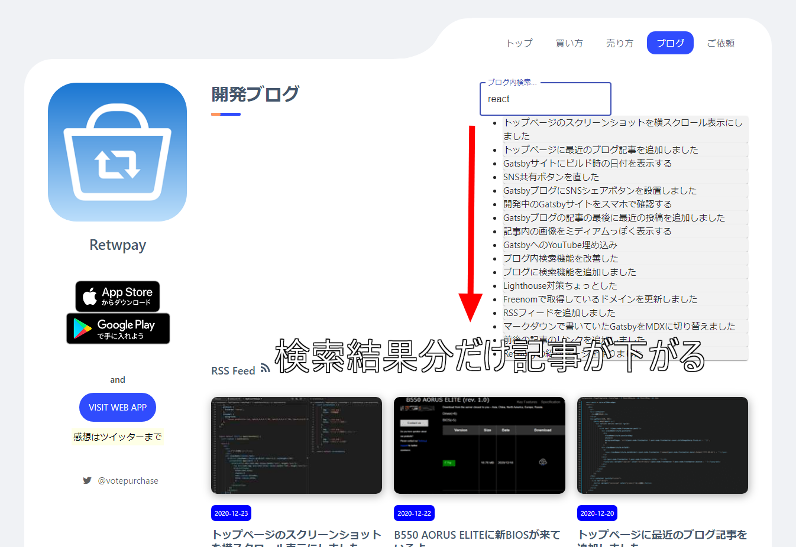
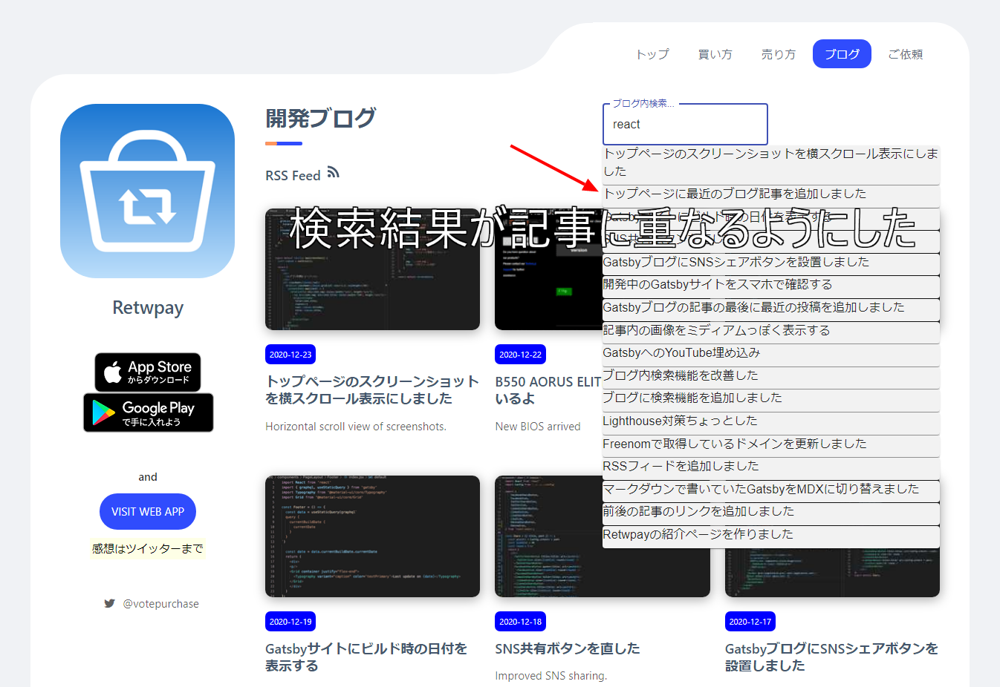

import { Link } from 'gatsby';

## 実装したブログ内検索機能の問題点

<Link to="/blog/2020-12-05">以前</Link>、ブログの見た目をそれっぽくする目的で検索機能を追加しましたが、問題がありました。

検索結果が表示されると、それに合わせて記事が**下に移動してしまう**ことです。



**それっぽい見た目にしたい**という目的をいまいち達成できていなかったので直しました。



## 変更したコード

検索結果用のクラスを追加します。今回の目的は`position`と`z-index`の指定だけで達成できますが、検索結果の表示も調整したかったのでついでに`ul`オプションも追記します。

**src\styles\global.less**

```css
.searchResult { 
  position: absolute;
  z-index: 99999;
  ul {
    list-style: none;
    padding-left: 0px;
  }
}
```

作ったクラスを検索コンポーネントに適用します。見た目を調整したいので**Material UI**から`Divider`と`Typography`もインポートします。

**src\components\Search\index.jsx**

```javascript
import Divider from '@material-ui/core/Divider';
import Typography from '@material-ui/core/Typography';
```

```javascript
  return (
      <div className="searchResult"> {/* ここに追加 */}
        <ul>
          {result.map(e => {
            return (
              <li key={e.slug}>
                <Link to={`/${e.path}`}>
                  <Card style={{backgroundColor: "#F2F2F2"}}>
                    <Typography variant="body1" gutterBottom="true"> {/* ここに追加 */}
                      <TextHighlighter str={e.title} includes={props.value} />
                    </Typography>
                  </Card>
                </Link>
                <Divider /> {/* ここに追加 */}
              </li>
            )
          })}
        </ul>
      </div>
  )
```

以上です。

---