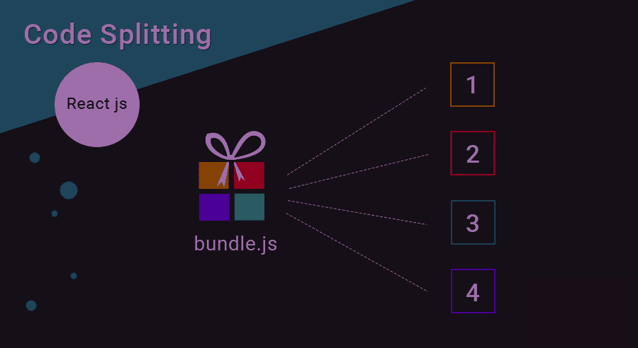

Code splitting is an awesome feature of webpack that can be used to split your code into smaller bundles and can be loaded when necessary or in parallel. If this feature is used properly it can have a very huge impact on the performance improvement of your application. You can look more about code splitting [here](https://webpack.js.org/guides/code-splitting/) in the official webpack documentation.

## Code splitting in React



Suppose you are loading a library we use an `import` statement on the top of your file telling our code that some dependency is needed. The example below shows how an import works.

```javascript
/**
* Before code splitting
*/
import { Average } from './mathLibrary.js'

console.log(Average([0,1,4,3,2]));

```

The sad part is all `import` statements have to be written on the top of your file. This creates a problem that all dependencies will be loaded at the beginning itself increasing the load time.

In React we can handle this a bit differently. We can load that code only when required. This is called as code splitting. The example above can be written with code splitting as follows.

```javascript
/**
* After code splitting
*/
import('./mathLibrary.js')
    .then(math => console.log( math.Average([0,1,4,3,2] )));

```

When webpack comes across this code it automatically starts code splitting.

## Lazy loading a component in React

Suppose we want to do a code splitting for a component in `React` we do it with `React.lazy` API.
The example below shows how to make a component Lazy loaded.

```javascript

/**
* Lazy load the component
*/
const AuthComponent = React.lazy(() => import('./auth'))

```

The component will be loaded only when it will be needed from the server.

## Using a Lazy Loaded component with React.Suspense

Suppose we are using a lazy-loaded component we need to wrap it with `React.Suspense`. 

React 16.6 added a `<Suspense>` component that lets you “wait” for some code to load and declaratively specify a loader or some skeleton while we’re waiting. `React.Suspense` is just like the Error boundaries which we use for our `React` apps.

```javascript
/**
* Lazy load the component
*/
const AuthComponent = React.lazy(() => import('./auth'))

function App () {
    <React.Suspense fallback={<div>loading...</div>}>
        <AuthComponent/>
    <React.Suspense>
}

```
When the `<AuthComponent/>` is loaded from the server `loading...` is displayed till it's finished loading the component.

## When to use React.lazy & React.Suspense to perform code splitting?

It can be very tricky to decide when to perform code splitting in an application. Some of the most common use cases I can think of is 

1. Code splitting for page Routes.
2. Opening a popup model

Let us see how to use Code splitting on page routes.

```javascript
/**
* Lazy load the component
*/
import React, { Component, Suspense } from 'react'
import Loading from './Loading'

import {
  BrowserRouter as Router,
  Route,
  Link,
} from 'react-router-dom'

const LazyHome = React.lazy(() => import('./Home'))
const LazyPage1 = React.lazy(() => import('./Page1'))
const LazyPage2 = React.lazy(() => import('./Page2'))

const App = (){
      return (
        <Router>
            <div>
            <Suspense fallback={<Loading />}>
                <Route exact path='/' component={LazyHome} />
                <Route path='/page1' component={LazyPage1} />
                <Route path='/pag2' component={LazyPage2} />
            </Suspense>
            </div>
        </Router>
    )
}

export default App;
```

The above code will split the bundle into smaller blocks and load the piece of code when necessary. For example `LazyPage1` will be loaded only when you navigate to `/page1`. This will effectively reduce the load time of the application.
