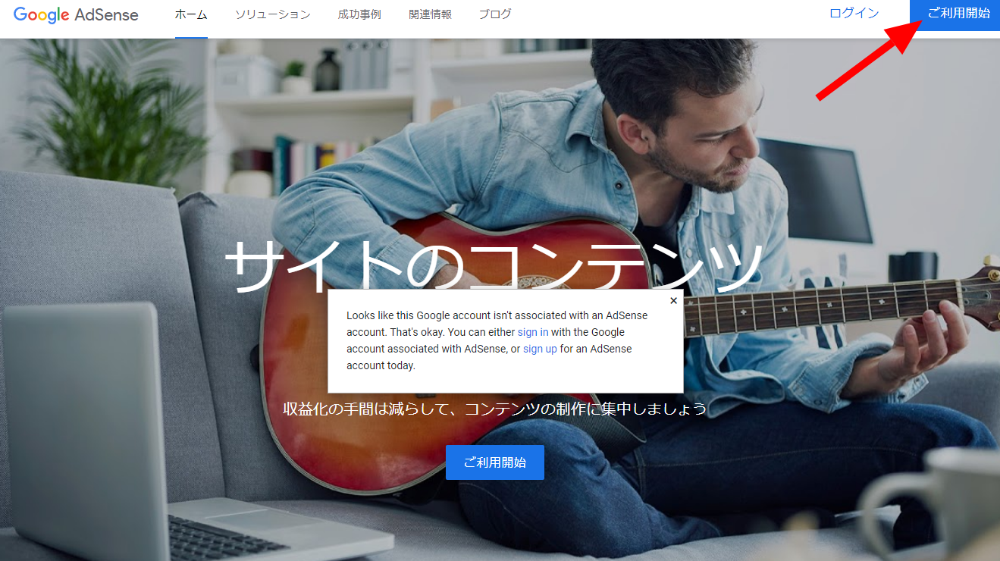
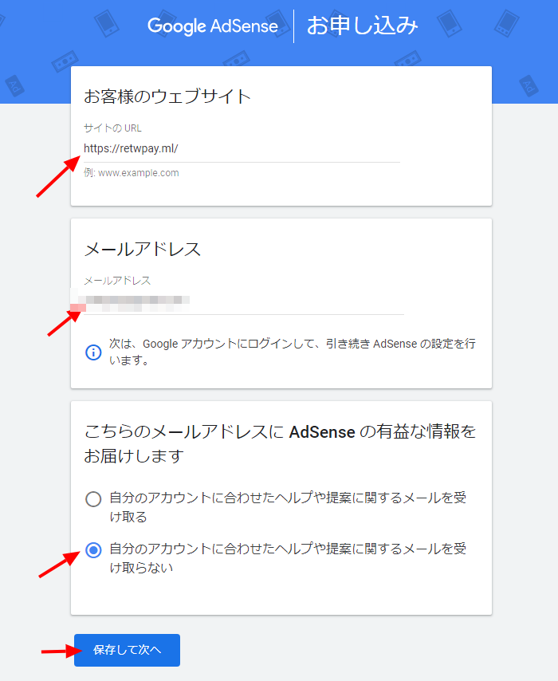
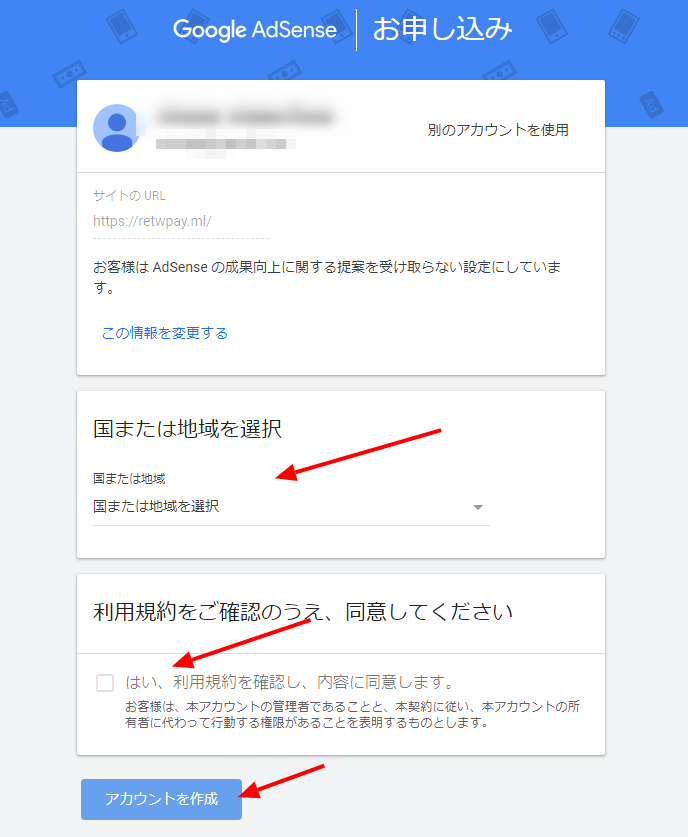
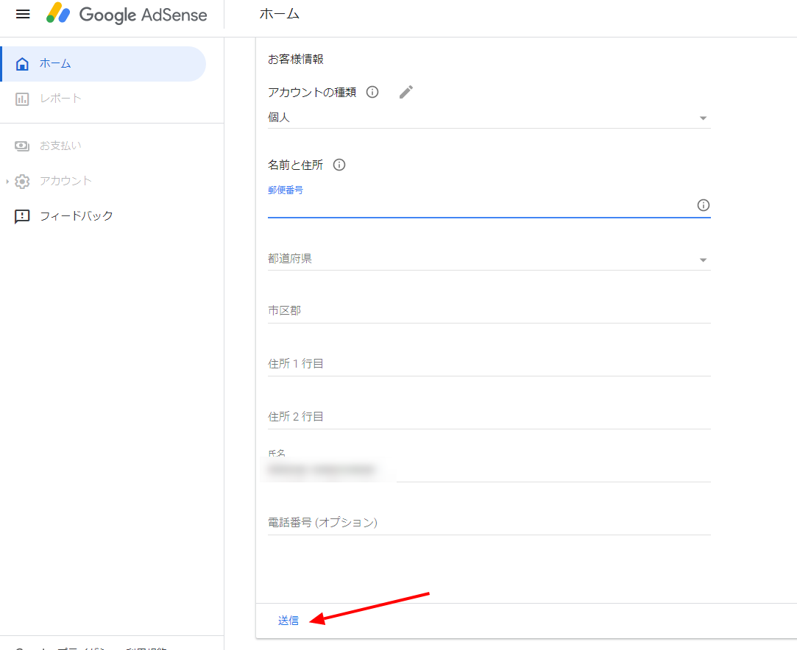
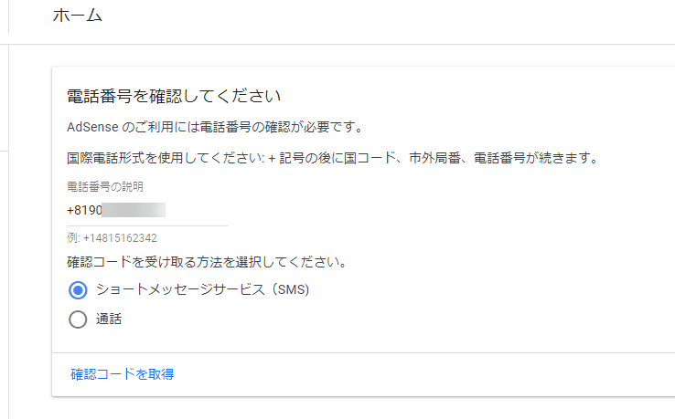
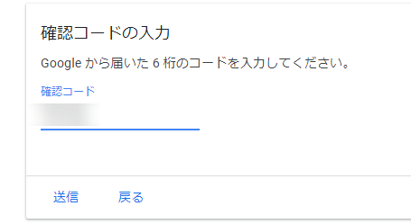
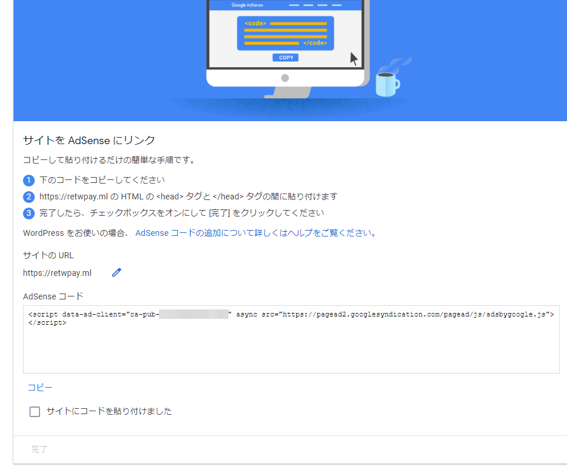
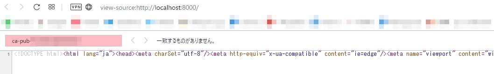
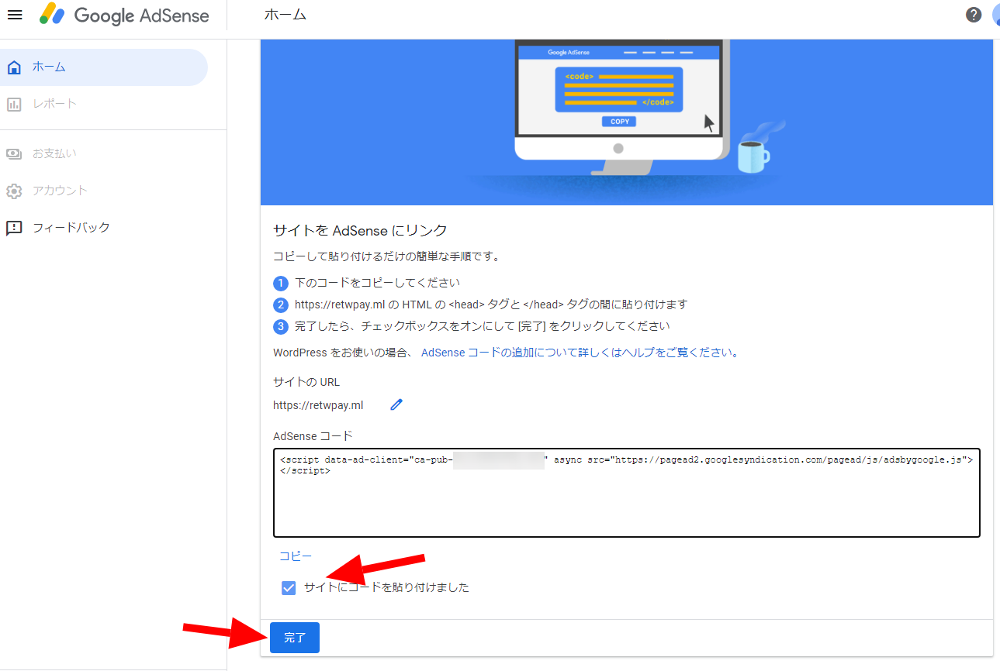
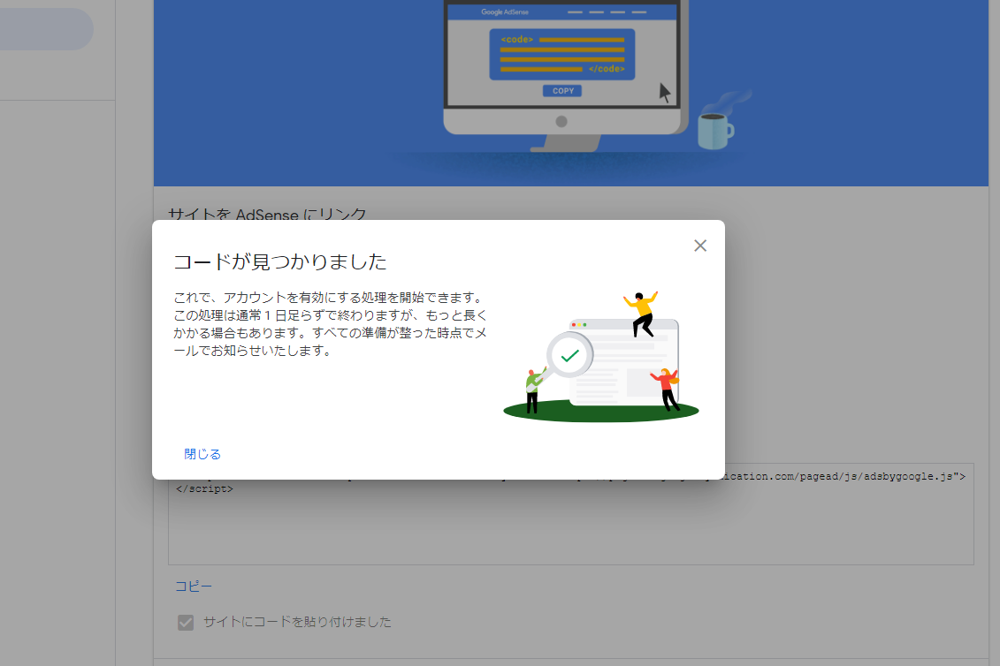

import { Link } from 'gatsby';

ブログ記事を書くために、このサイトのコードを書いてたのですが、やることがなくなってきたので**Google Adsense**を申し込んでみました。

## Google AdsenseにウェブサイトのURLを登録する

[Google Adsense](https://www.google.co.jp/adsense/start/)にアクセスして右上の`ご利用開始`をクリックします。



必要事項を入力します。

1. 自分のページのURL
1. メールアドレス
1. Google Adsenseからのお知らせメールを受け取る/受け取らない



引き続き必要事項を入力します。

1. 国または地域
1. 利用規約



支払い情報を入力します。

1. 住所
1. 名前



SMS認証が必要な場合もあるようです。





表示された**AdSense コード**を自分のサイトに埋め込みます。



## gatsby-plugin-google-adsenseを利用する

プラグイン[gatsby-plugin-google-adsense](https://www.gatsbyjs.com/plugins/gatsby-plugin-google-adsense/)を利用します。

```shell
yarn add gatsby-plugin-google-adsense
```

**gatsby-config.plugins.js**

```javascript
{
  resolve: `gatsby-plugin-google-adsense`,
  options: {
    publisherId: `ca-pub-0000000000000000`
  },
},
```

publisherIdは上記で表示された**AdSense コード**内にあります。

しかし、私の場合はこのプラグインは動作しませんでした。確認のため`http://localhost:8000/`にアクセスしましたが**AdSense コード**は反映されていませんでした。



## 手動でコードを追加する

プラグインが動作しなかったので手動で**AdSense コード**を挿入しました。

**src\html.jsx**

```javascript
import React from 'react';
import PropTypes from 'prop-types';

export default class HTML extends React.Component {
  render() {
    return (
      <html lang="ja" {...this.props.htmlAttributes}>
        <head>
          <meta charSet="utf-8" />
          <meta httpEquiv="x-ua-compatible" content="ie=edge" />
          <meta
            name="viewport"
            content="width=device-width, initial-scale=1, shrink-to-fit=no"
          />
          <script data-ad-client="ca-pub-0000000000000000" async src="https://pagead2.googlesyndication.com/pagead/js/adsbygoogle.js"></script> {/* ここに追加 */}
          {this.props.headComponents}
        </head>
        <body {...this.props.bodyAttributes} className="light">
          {this.props.preBodyComponents}
          <div
            key="body"
            id="___gatsby"
            dangerouslySetInnerHTML={{ __html: this.props.body }}
          />
          {this.props.postBodyComponents}
        </body>
      </html>
    );
  }
}

HTML.propTypes = {
  htmlAttributes: PropTypes.object,
  headComponents: PropTypes.array,
  bodyAttributes: PropTypes.object,
  preBodyComponents: PropTypes.array,
  body: PropTypes.string,
  postBodyComponents: PropTypes.array,
};
```

`http://localhost:8000/`にアクセスして確認したところ**AdSense コード**が入っていました。あとは通常通りビルドしてFirebaseにデプロイします。


## 審査結果を待つ

**Google Adsense**のページに戻ります。`サイトにコードを貼り付けました`のチェックボックスをオンにして`完了`をクリックします。



コードが見つかったので、あとは審査結果を待ちます。



---