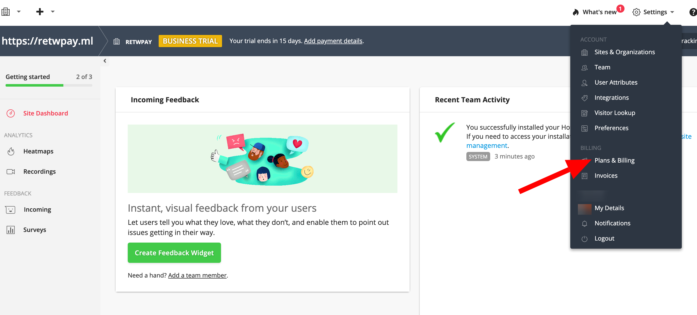
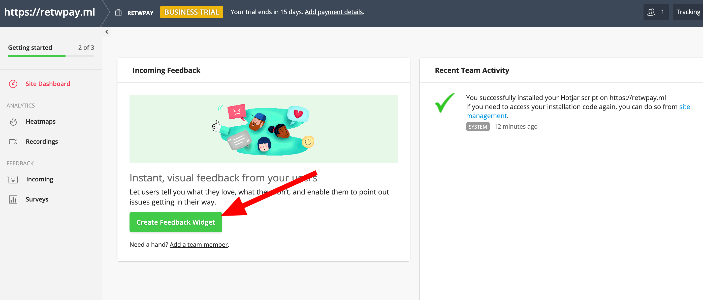
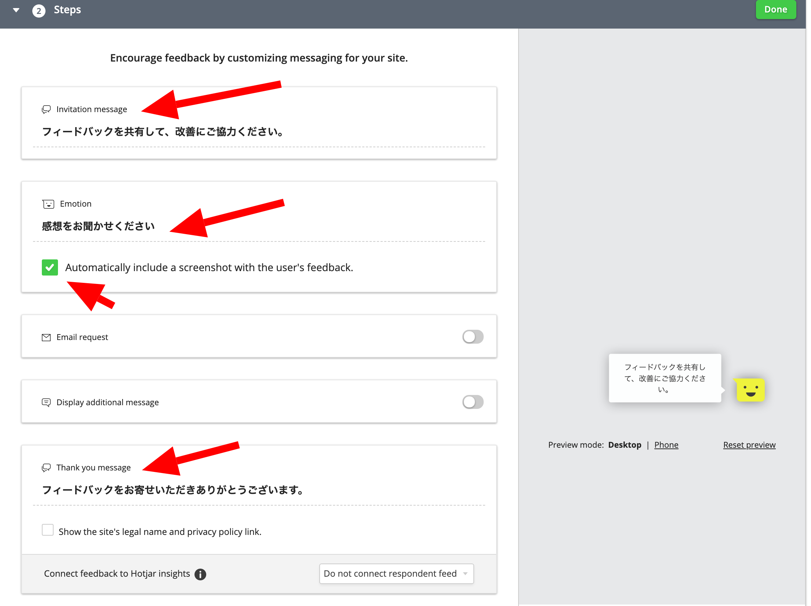
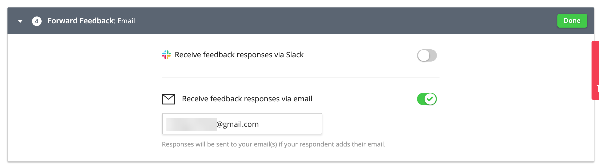

import { Link } from 'gatsby';

### フィードバックウィジェットを追加しました

今回はコードを書いていません。ノーコードです。

Gatsbyの公式ページを見ていたら[Hotjarが紹介](https://www.gatsbyjs.com/plugins)されていました。

[Hotjar](https://www.hotjar.com)とは、サイト訪問者のページ内の動きを、動画やヒートマップで確認できるサイト分析ツールです。アクセス解析にはGoogle Analiticsを利用しているので興味はないですが、[フィードバックウィジェット](https://www.hotjar.com/incoming-feedback/)が面白そうだったので、導入することにしました。

最終的にはこんな感じになります。


**5段階評価**と**メッセージ**、**該当箇所のスクリーンショット**が受け取れるようになります。


フィードバックをもらうと設定した**サンクスメッセージ**が表示されます。

### Hotjarにサインアップする

[Hotjar](https://www.hotjar.com)のアカウントを作ります。今回はグーグルアカウントで登録しました。


自分の情報を入力します。


入力が完了するとサイト埋め込み用のコードが表示されます。


必要なのは5行目の`h._hjSettings={hjid:1234567,hjsv:6};`の`hjid`と`hjsv`です。

まだ`Verify Installation`は押さずに、いったんこの画面でストップします。

### プラグインを設定する

プラグイン[gatsby-plugin-hotjar](https://www.gatsbyjs.com/plugins/gatsby-plugin-hotjar)をインストールします。

```shell
yarn add gatsby-plugin-hotjar
```

**gatsby-config.plugins.js**

```javascript
{
  resolve: `gatsby-plugin-hotjar`,
  options: {
    includeInDevelopment: true,
    id: 1234567,
    sv: 6,
  },
},
```

`id`には上で取得した**hjid**を、`sv`は**hjsv**を設定します。

プラグインを設定したら通常通りビルドしてデプロイします。

この時点でWappalyzerを見るとHotjarが追加されてることが確認できます。


デプロイできたらHotjarのページに戻り`Verify Installation`をクリックします。


HotjarのVerifyが成功しました。有料のビジネスプランのフリートライアルでスタートします。


とりあえず無料で使いたいのでプランを変更します。**Settings**→**Plans & Billing**にすすみます。



**Basic**プランに変更して**Update Plans**をクリックします。


無事、無料プランに変更できました。


### フィードバックウィジェットを設定する

ダッシュボードに戻って**Create Feedback Widget**に進みます。



ウィジェットの**言語**と**外観**と**表示位置**を設定します。プレビューが表示されるので、確認しながら調整します。


続いて`Invitation message`と`Emotion`と`Thank you message`でそれぞれのメッセージを設定します。デフォルトは英語になっているので日本語に書き換えます。フィードバックを送信したときのスクリーンショットも取得したいので`Automatically include a screenshot with the user's feedback.`はオンにします。



次にフィードバックウィジェットを表示するターゲットを設定します。すべての端末とすべてのページ、すべてのユーザーに表示するように設定しました。


フィードバックをもらったときにSlackやメールで通知するか設定します。



すべての設定が完了したのでウィジェットを`Active`に設定して**Start Incoming Feedback**を押して完了します。


以上で設定は完了です。

### 動作を確認する

これで自分のサイトにアクセスするとフィードバックウィジェットが追加されています。動作を確認します。


フィードバックを受け取るとほぼリアルタイムでHotjarのダッシュボードに追加されます。


フィードバックメッセージやスクリーンショットと、OSやブラウザなどと一緒に確認ができます。


以上です。

コードを書かずに簡単にフィードバックシステムが実装できました。

---