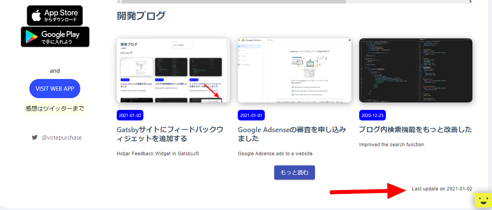
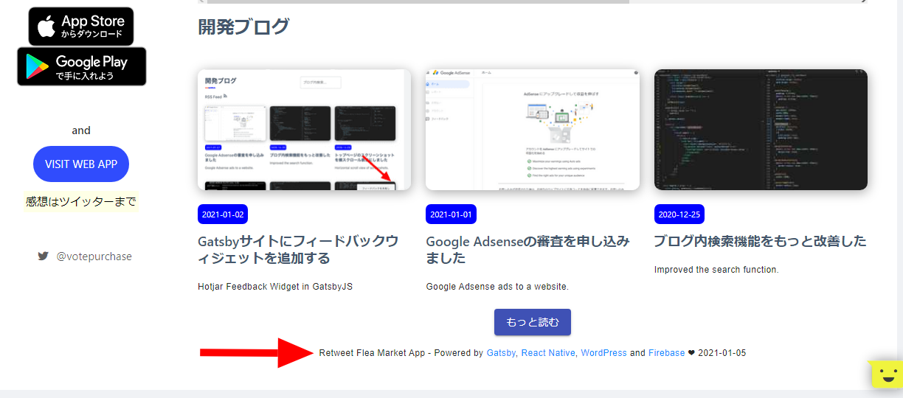

import { Link } from 'gatsby';

## トップページのフッターのデザインを少し変えました

<Link to="/blog/2020-12-19">前に</Link>ビルド時の日付をトップページに表示するようにしましたが、フィードバックウィジェットと微妙に被ってしまってたので表示位置を変えました。ついでに内容も少し変えました。

テック系のブログでよくありがちな、使用技術の公式ページへのリンクを追加しました。

<br/><br/>

### 変更前



### 変更後



### 変更後のコード

```javascript
import React from 'react'
import { graphql, useStaticQuery } from 'gatsby'
import Typography from '@material-ui/core/Typography'
import Grid from '@material-ui/core/Grid'

const Footer = () => {
  const data = useStaticQuery(graphql`
  query {
    currentBuildDate {
      currentDate
    }
  }
`)

  const date = data.currentBuildDate.currentDate
  const gatsby = <a href="https://www.gatsbyjs.com/" target="_blank">Gatsby</a>
  const firebase = <a href="https://firebase.google.com/" target="_blank">Firebase</a>
  const reactnative = <a href="https://reactnative.dev/" target="_blank">React Native</a>
  const wordpress = <a href="https://ja.wordpress.org/" target="_blank">WordPress</a>

  return (
    <div>
    <p/>
      <Grid container justify="center">
        <Typography variant="caption" color='textPrimary'>Retweet Flea Market App - Powered by {gatsby}, {reactnative}, {wordpress} and {firebase} ❤️ {date}</Typography>
      </Grid>
    </div>
  )
};

export default Footer
```

以上です。

---