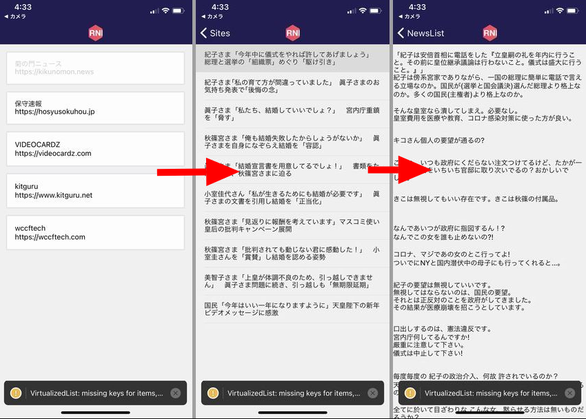
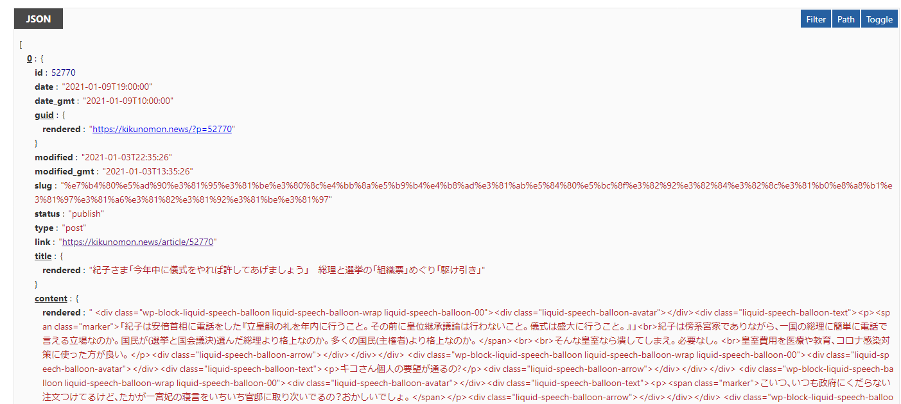
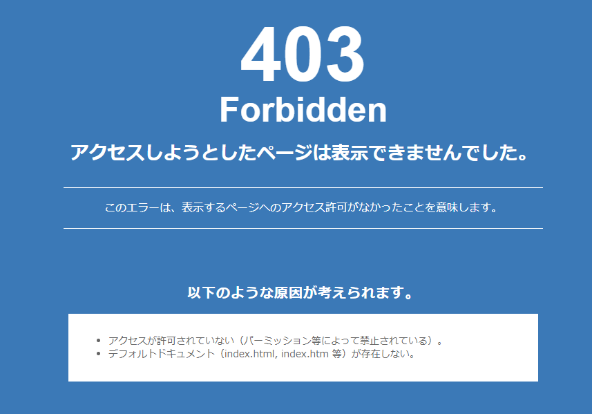
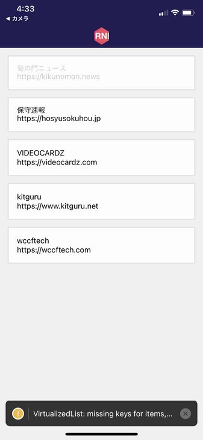
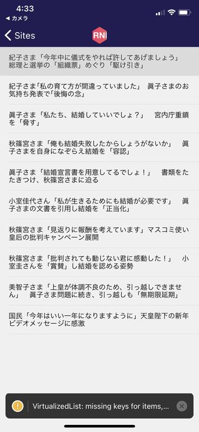
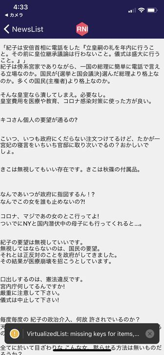
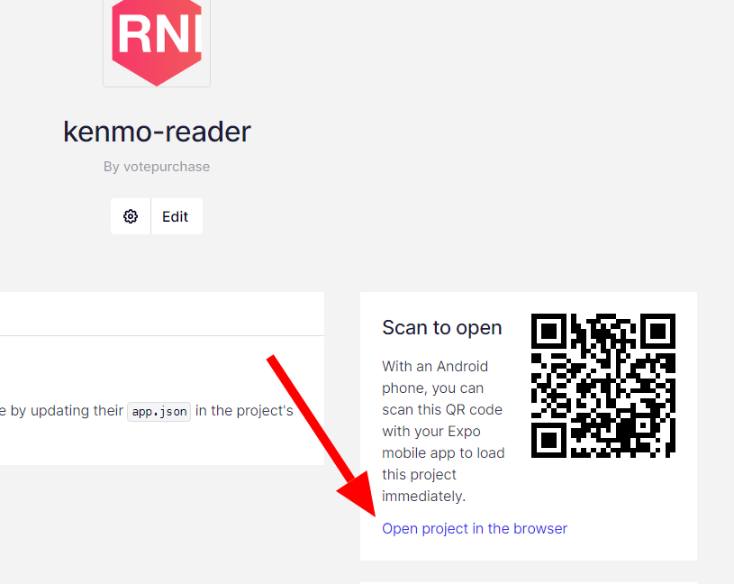
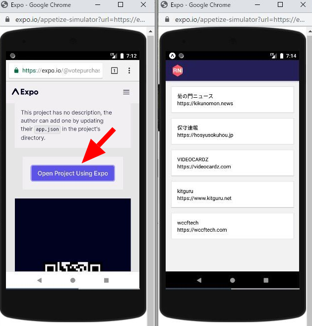

import { Link } from 'gatsby';

<Link to="/blog/2021-01-09">前回</Link>のReact Native開発環境構築の続きです。実際に動作するアプリを作成します。

## 作りたいアプリ

作るのはWordpress製のニュースサイトを**広告なし**で読むためのアプリです。

イメージ図はこんな感じになります。



ニュースサイト一覧 → 記事一覧 → 記事本文

このような画面遷移です。

動画だとこんな感じです。

`youtube: I_-P5w_uhow`

### ポイント

**WordPress API**

Wordpressでは、URLの最後に`/wp-json/wp/v2/posts?_embed`を付与することで管理者が禁止していない限り、様々な情報(記事のタイトルや本文、URLなど)をJSON形式で取得することができます。

- 菊ノ紋ニュース [https://kikunomon.news//wp-json/wp/v2/posts?_embed](https://kikunomon.news//wp-json/wp/v2/posts?_embed)

取得したJSONを整形するとこんな感じです。



管理者側で禁止している場合は403エラーが返ってきます。

- 皇室 菊のカーテン [https://imperialism.site/wp-json/wp/v2/posts?_embed](https://imperialism.site/wp-json/wp/v2/posts?_embed)



そのようなサイトは仕方ないので今回はあきらめます。

**react-native-render-htmlを利用する**

記事のURLが分かればWebViewで開くことが可能ですが、その場合大量の広告まで一緒にレンダリングされてしまいます。視認性を上げようと思っても、ページに独自のスタイルを当てることは不可能です。

そこで、取得したJSON内の記事本文を[react-native-render-html](https://github.com/archriss/react-native-render-html)を使ってレンダリングします。これはHTMLタグを含む文字列値をWebViewを介さず100％ネイティブビューにレンダリングするReact Nativeコンポーネントです。

以下の特徴があります。

- WebViewじゃない
- HTMLを100%ネイティブビューにする
- ネイティブビュー要素はあらかじめスタイルが適用されている
- スタイルをカスタマイズできる
- HTMLタグ個別にカスタマイズできる

<br/>

# アプリを構築する

ここからは実際のコードを紹介します。

## ボイラープレートの準備

<Link to="/blog/2021-01-09">前回</Link>の記事でもReact Nativeの動作確認のために使ったボイラープレートを使用します。

- [WataruMaeda/react-native-boilerplate](https://github.com/WataruMaeda/react-native-boilerplate)


ドロワー、スタック、ボトムタブがすでに実装されているので便利ですが、今回はスタックナビゲーションのみを使用します。

作成する画面は以下の3つです。

- ニュースサイト一覧(Sites)
- 記事一覧(NewsList)
- 記事本文(Article)

<br/>

## スタックナビゲーションの編集

スタックナビゲーションにこれから作る3つの画面を登録します。3つをまとめて`NewsListNavigator`とします。

### これから作る画面を登録

**src\routes\navigation\stacks\Stacks.js**

```javascript
import NewsList from 'scenes/newslist'
import Article from 'scenes/article'
import Sites from 'scenes/sites'
```

```javascript
export const NewsListNavigator = () => (
  <Stack.Navigator
    initialRouteName="Sites"
    headerMode="screen"
    screenOptions={navigationProps}
  >
    <Stack.Screen
      name="Sites"
      component={Sites}
      options={({ navigation }) => ({
        title: 'Sites',
        headerTitle: () => <HeaderTitle />,
      })}
    />
    <Stack.Screen
      name="NewsList"
      component={NewsList}
      options={({ navigation }) => ({
        title: 'NewsList',
        headerTitle: () => <HeaderTitle />,
      })}
    />
    <Stack.Screen
      name="Article"
      component={Article}
      options={({ navigation }) => ({
        title: 'NewsList',
        headerTitle: () => <HeaderTitle />,
      })}
    />
  </Stack.Navigator>
```

**src\routes\navigation\stacks\index.js**

```javascript
import { HomeNavigator, ProfileNavigator, NewsListNavigator } from './Stacks'

export { NewsListNavigator, HomeNavigator, ProfileNavigator,  }
```

### ナビゲーションの整理

ドロワーやタブを取り除きます。初期画面をデフォルトの`HomeNavigator`から`NewsListNavigator`に書き換えます。

**src\routes\navigation\Navigation.js**

```javascript
import React from 'react'
import { NavigationContainer } from '@react-navigation/native'
// import DrawerNavigator from './drawer'
import { HomeNavigator, ProfileNavigator, NewsListNavigator } from './stacks'

export default () => (
  <NavigationContainer>
    <NewsListNavigator />
  </NavigationContainer>
)
```

ページ遷移の設定は以上です。

## 実際の画面を作る

次は実際に画面を作っていきます。

- ニュースサイト一覧(Sites)
- 記事一覧(NewsList)
- 記事本文(Article)

<br/>

### ニュースサイト一覧(Sites)

ニュースサイトを一覧する画面を作ります。それぞれのサイトをタップすると記事一覧画面に遷移します。



**src\scenes\sites\index.js**

```javascript
import Sites from './sites'

export default Sites
```

**src\scenes\sites\sites.js**

```javascript
import React from 'react'
import { Text, StatusBar, ScrollView, TouchableOpacity } from 'react-native'
import { Card } from 'react-native-elements'

export default class Sites extends React.Component {

	render() {
    const sites = [
      {
        name: '菊の門ニュース',
        url: 'https://kikunomon.news'
      },
      {
        name: '保守速報',
        url: 'https://hosyusokuhou.jp'
      },
      {
        name: 'VIDEOCARDZ',
        url: 'https://videocardz.com'
      },
      {
        name: 'kitguru',
        url: 'https://www.kitguru.net'
      },
      {
        name: 'wccftech',
        url: 'https://wccftech.com'
      },
    ]


		return (
			<ScrollView>
				<StatusBar barStyle="light-content" />
          {
            sites.map((u, i) => {
              return (
                  <Card key={i}>
                    <TouchableOpacity
                      onPress={() => this.props.navigation.navigate('NewsList', { url: u.url })}
                    >
                      <Text>{u.name}</Text>
                      <Text>{u.url}</Text>
                    </TouchableOpacity>
                  </Card>
              );
            })
          }
			</ScrollView>
		);
	}
}
```

サイト名とURLを`sites`として定義して`<Card>`リストとして表示します。`onPress`イベントで記事一覧画面(NewsList)に遷移しますが、同時にURLを渡します。

### 記事一覧(NewsList)

記事一覧画面を作ります。ニュースサイト一覧(Sites)から受け取ったURLを元に、JSONを取得して記事一覧を表示します。



**src\scenes\newslist\index.js**

```javascript
import NewsList from './newslist'

export default NewsList
```

**src\scenes\newslist\newslist.js**

```javascript
import React from 'react'
import { Text, View, StatusBar } from 'react-native'
import { List, ListItem } from 'native-base'
import Spinner from 'react-native-loading-spinner-overlay'

class WPPost {
	constructor(post) {
		this.post = post;
		this.title = post.title.rendered;
		this.content = post.content.rendered;
		this.url = post.link;
	}
}

export default class NewsList extends React.Component {

	constructor(props) {
		super(props);
		this.state = { 
			items: [] ,
			spinner: true,
		};
	}


	componentDidMount() {
		fetch(this.props.route.params.url + '/wp-json/wp/v2/posts?_embed')
			.then((response) => response.json())
			.then((responseJson) => {
				for(var i in responseJson) {
					var p = new WPPost(responseJson[i]);
					this.setState({ items: this.state.items.concat([p]), spinner: false });
				}
			})
			.catch((error) => {
				console.error(error);
			});
	}

	render() {
		var items = this.state.items;
		return (
			<View>
				<StatusBar barStyle="light-content" />
					<Spinner
          	visible={this.state.spinner}
          	textContent="読込中..."
            textStyle={{ color: "#fff" }}
            overlayColor="rgba(0,0,0,0.5)"
        	/>
					<List
						dataArray={items}
						renderRow={
							(item) =>
							<ListItem
								onPress={() => this.props.navigation.navigate('Article', { url: item.url, content:item.content })}
							>
								<Text>{item.title}</Text>
							</ListItem>} >
					</List>
			</View>
		);
	}
}
```

ニュースサイト一覧(Sites)から受け取った**URL**と文字列`/wp-json/wp/v2/posts?_embed`を合体させてfetchメソッドでJSONを取得します。

JSONを取得するまで時間がかかるのでローディングスピナーを表示させます。

これで記事のタイトル(title)、本文(content)、URL(url)をJSON形式で取得できました。ただし、URLは今回使いません。

取得した記事一覧を`<List>`として表示します。`onPress`イベントで記事本文画面(Article)に遷移しますが、同時に本文(content)を渡します。

### 記事本文(Article)

本文表示用の画面を作ります。記事一覧(NewsList)から受け取った本文(content)を`react-native-render-html`を使ってレンダリングします。



**src\scenes\article\index.js**

```javascript
import Article from './article'

export default Article
```

**src\scenes\article\article.js**

```javascript
import React from 'react';
import { Text, View, StatusBar, ScrollView } from 'react-native';
import HTML from 'react-native-render-html';

export default class Article extends React.Component {

	render() {
		const content = this.props.route.params.content
		return (
			<ScrollView>
				<StatusBar barStyle="light-content" />
				<HTML source={{ html:content }} />
			</ScrollView>
		);
	}
}
```

今回はまだ独自のスタイルは定義していません。ひとまずネイティブビューで表示します。

# まとめ

WordPressからJSONを取得して記事本文だけを表示するアプリができました。あとは全体的なスタイルを調整すれば**広告なしニュースリーダーアプリ**が完成します。

### 次にやりたいこと

- アプリ全体の見た目を調整(アイコンやサムネイルなどを表示して見た目を派手にする)
- 記事本文のスタイルを切り替える機能の作成(ダークモードとライトモードの切り替えのようにする)

<br/>

## テスト配布をしています

ストアに公開するのはまだまだですが、とりあえず動くものを作ってExpoに公開しました。

### スマホの場合

Expo Clientアプリをインストールしたスマホで、[こちらのページ](https://expo.io/@votepurchase/projects/kenmo-reader)のQRコードを読み込むと使用できるようになっています。

- [Expo Client - App Store](https://apps.apple.com/jp/app/expo-client/id982107779)
- [Expo Client - Google Play](https://play.google.com/store/apps/details?id=host.exp.exponent)

<br/>

### PCの場合

PCの場合は、[配布ページ](https://expo.io/@votepurchase/projects/kenmo-reader)の`Open project in the browser`を開くとAndroidエミュレーターが立ち上がります。



エミュレーター内のChromeブラウザから改めて配布ページへ行き`Opne Project Using Expo`をクリックするとエミュレーター内で立ち上がります。



以上です。

---