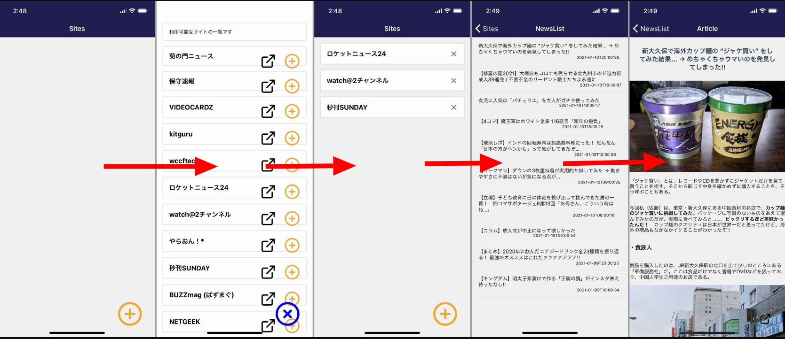
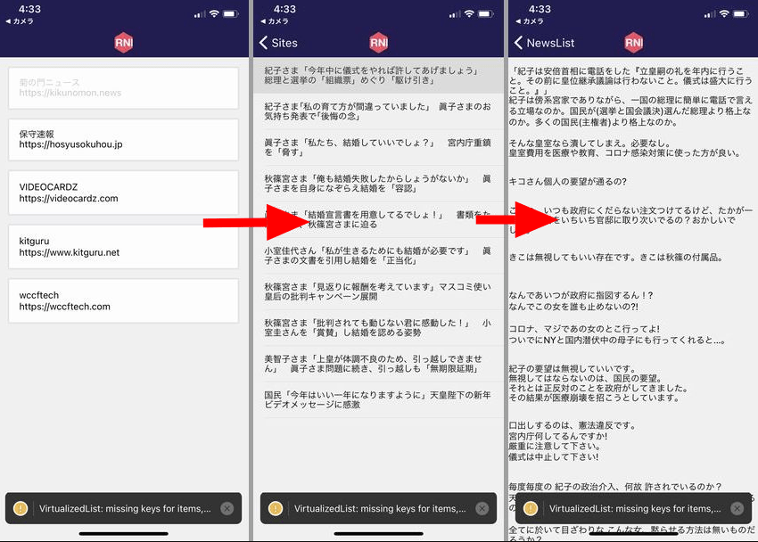
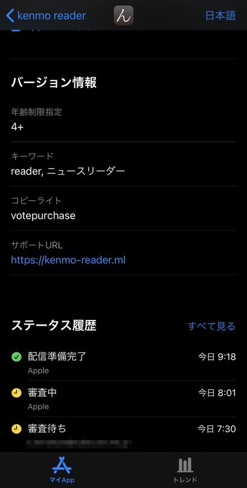

import { Link } from 'gatsby';

## アプリをリリースしました

<Link to="/blog/2021-01-10">前回</Link>作ったWordPressリーダーアプリをリリースしました。

<br/><br/>

- [App Store - kenmo reader](https://apps.apple.com/jp/app/kenmo-reader/id1548214464)
- [Google Play - kenmo reader](https://play.google.com/store/apps/details?id=net.votepurchase.kenmoreader)  (ストア審査中のためしばらくお待ちください)

<br/>

AppStoreではプライバシーポリシーを掲載したページへのリンクが必須なためアプリのランディングページを作成しました。アプリの紹介や各アプリストアへのリンク、後述するアイディア(次のブログ記事で書きます)の実現のため、いずれにしてもランディングページは必要なものです。

当サイトと同じく**GatsbyJS + Firebase Hosting + Freenom**の無料サービス三連コンボで作ったページです。

[kenmo readerランディングページ](https://kenmo-reader.ml/)

もちろん[プライバシーポリシー](https://kenmo-reader.ml/privacy)も用意しました。

## 出来上がったもの



アプリが対応しているウェブサイト一覧を用意しておき、初期画面に任意のサイトを追加して、過度な装飾や広告を排除したネイティブビューで記事を閲覧するというアプリです。

## アプリの解説

前回作ったものから仕組みは変わりません。WordPress製サイトのAPIから記事のJSONを取得してネイティブビューでレンダリングする仕組みです。



しかし、大きな問題がありました。ユーザーによって読みたいサイトは違うので、この手のリーダーアプリはユーザー自身がサイトを追加できるようにするべきだということです。

kenmo readerは

- WordPress製である
- サイトがJSONの取得を許可している

<br/>

という制約があるためサイトを自由に追加できるわけではないのです。

まず思いついた解決策は

1. 他のリーダーアプリのように追加したいページの入力フォームを用意
1. 入力されたサイトに前回紹介したURLを付与してアクセス
1. 404や403エラーが返ってきたら"追加できない"というメッセージを出す

というものです。この方法の問題は

1. スマホでURL入力するのは面倒である
1. 追加しようとしてエラーが出たら嫌な気分になる

という2点です。特に2つ目は回避したいと思いました。

折衷案として**対応サイト一覧を用意しておき、初期画面に追加してもらう**という方法を実装することにしました。アプリに対応するサイトを開発者がリストアップして、そこから好きなサイトを追加してもらうというやり方です。

対応サイト一覧のアップデートですが、やり方は色々あると思います。私が思いついたのは

- 対応サイト一覧をサーバーから配信してアプリがそれを読みに行く
- 対応サイト一覧をアプリ内に保持して、一覧が更新された場合はアプリごとアップデートする

<br/>

1つ目のやり方は配信サーバーを用意する必要があります。

2つ目のやり方ですが、通常のSwift/Kotlinアプリの更新ではストアに提出して審査を待つ必要があります。これには数日かかるためタイムラグが発生してしまいます。

しかし、kenmo readerはExpo環境で作成しているため**OTAアップデート**が可能です。OTAアップデートとはストアの審査を通さずアプリを書き換える機能です。開発者が更新したいタイミングでアプリをアップデートできるのです。

というわけで、**対応サイト一覧を用意しておき、初期画面に追加してもらう**機能を実装することにしました。

## 実際のコード

ここからは実際に書いたコードを解説します。ただ、スタイリングは変更箇所が多く冗長になるので省略します。それと、コードを全部載せても冗長になるので、要点になる箇所だけを記載します。

気になる方はGitHubに[ソースコード](https://github.com/kiyohken2000/kenmo-reader)を公開していますのでご覧ください。

### ニュースサイト一覧(Sites)

大きく変更したのはこの画面です。他の画面は前回からほとんど変わっていません。

サイト名とURLを`sites`として定義していたものを別ファイルに切り出しました。`name`と`url`の他に`ID`が追加されていますが、これは初期画面に追加したかどうかを管理するためです。

**src\scenes\sites\list.js**

```javascript
const sites = [
  {
    ID: 1,
    name: '菊の門ニュース',
    url: 'https://kikunomon.news'
  },
  {
    ID: 2,
    name: '保守速報',
    url: 'https://hosyusokuhou.jp'
  },
  // ~~~省略~~~ //
  {
    ID: 13,
    name: 'Temita-てみた',
    url: 'https://temita.jp'
  },
  {
    ID: 14,
    name: 'BUSHOO!JAPAN',
    url: 'https://bushoojapan.com'
  },
]

export default sites;
```

対応サイト一覧を表示する画面を作成しました。記事一覧や本文表示画面のように完全に別画面にするわけではなく、モーダルとして表現します。

**src\scenes\sites\sites.js**

```javascript
<Modal
  visible={this.state.isVisible}
  transparent={false}
  animationType={"slide" || "fade"}
  presentationStyle={"fullScreen" || "pageSheet" || "formSheet" || "overFullScreen"}
>
  <View style={styles.container}>
    <View style={styles.modaltitle}>
      <Card>
        <Text>利用可能なサイトの一覧です</Text>
      </Card>
    </View>
    <ScrollView contentContainerStyle={styles.scrollContentContainer}>
      {
        sites.map((u, i) => {
          return (
          <Card key={i}>
            <View style={{ flexDirection: 'row'}}>
              <Text style={styles.name}>{u.name}</Text>
                  <View style={{ position: 'absolute', right: 60 }}>
                    <TouchableOpacity
                      onPress={ ()=>{ Linking.openURL(u.url)}}
                    >
                      <Icon name="external-link" size={40} color="black"/>
                    </TouchableOpacity>
                  </View>
                  <View style={{ position: 'absolute', right: 0 }}>
                    <TouchableOpacity
                      onPress={() => {
                        var siteData = {
                          siteid: u.ID,
                          name: u.name,
                          url: u.url,
                        }
                        global.storage.save({
                          key: 'site',
                          id: u.ID,
                          data: siteData,
                        });
                        this.loadStrage()
                      }}
                    >
                      <Icon name="plus-circle" size={40} color="orange"/>
                    </TouchableOpacity>
                </View>
            </View>
          </Card>
          );
        })
      }
    </ScrollView>
  </View>
  <View style={styles.Overlay}>
    <TouchableOpacity onPress={() => this.closeModal()}> 
      <Icon name="x-circle" size={65} color="blue"/>
    </TouchableOpacity>
  </View>
</Modal>
```

このアプリでは`初期画面に追加したサイト`のデータをデバイス内に配列として保管しています。

これには[react-native-storage](https://github.com/sunnylqm/react-native-storage)を使っています。

まずローカルストレージを定義します。

```javascript
const storage = new Storage({
  storageBackend: AsyncStorage,
  defaultExpires: null,
  enableCache: false,
});
global.storage = storage;
```

ストレージをロードする関数を定義します。

```javascript
loadStrage() {
  global.storage.getAllDataForKey('site')
    .then(res => {
      this.setState({data: res})
    });
}
```

画面を開いたときにロードするようにしておきます。

```javascript
componentDidMount() {
  this.loadStrage();
}
```

初期画面にサイトを追加するボタン(プラスマーク)を作ります。

`siteData`としてサイト情報を定義して`key`と`id`を与えて管理します。`save`直後にロードが走って画面が更新されるようにしておきます。

```javascript
<TouchableOpacity
  onPress={() => {
    var siteData = {
      siteid: u.ID,
      name: u.name,
      url: u.url,
    }
    global.storage.save({
      key: 'site',
      id: u.ID,
      data: siteData,
    });
    this.loadStrage()
  }}
>
  <Icon name="plus-circle" size={40} color="orange"/>
</TouchableOpacity>
```

デバイス内に保存した配列はこんな感じになっています

```javascript
Array [
  Object {
    "name": "NETGEEK",
    "siteid": 11,
    "url": "http://netgeek.biz",
  },
  Object {
    "name": "Temita-てみた",
    "siteid": 13,
    "url": "https://temita.jp",
  },
  Object {
    "name": "BUSHOO!JAPAN",
    "siteid": 14,
    "url": "https://bushoojapan.com",
  },
]
```

モーダル(対応サイト一覧)は以上です。

初期画面の編集をします。追加したサイトを削除するボタンも作ります。

```javascript
<ScrollView contentContainerStyle={styles.scrollContentContainer}>
  {
    viewSites.map((u, i) => {
      return (
        <Card key={i}>
          <TouchableOpacity
            onPress={() => this.props.navigation.navigate('NewsList', { url: u.url })}
          >
            <View style={{ flexDirection: 'row'}}>
              <View>
                <Text style={styles.name}>{u.name}</Text>
              </View>
              <View style={{ position: 'absolute', right: 0 }}>
                <TouchableOpacity
                  onPress={() => {
                    global.storage.remove({
                      key: 'site',
                      id: u.siteid,
                    });
                    this.loadStrage()
                  }}
                >
                  <Icon name="x" size={20} color="green"/>
                </TouchableOpacity>
              </View>
            </View>
          </TouchableOpacity>
        </Card>
      );
    })
  }
</ScrollView>
```

削除ボタンです。管理している`key`と`id`で削除します。ここでも削除直後にロードが走るようにして画面も同時に更新されるようにします。

```javascript
<TouchableOpacity
  onPress={() => {
    global.storage.remove({
      key: 'site',
      id: u.siteid,
    });
    this.loadStrage()
  }}
>
  <Icon name="x" size={20} color="green"/>
</TouchableOpacity>
```

ニュースサイト一覧(Sites)は以上です。

### 記事一覧(NewsList)

ここは前回と大きく変えていません。日付を追加しました。

**src\scenes\newslist\newslist.js**

```javascript
class WPPost {
	constructor(post) {
		this.post = post;
		this.title = post.title.rendered;
		this.content = post.content.rendered;
		this.date = post.date; // 日付を追加
		this.url = post.link;
  }
```

```javascript
<View style={styles.content}>
  <List
    dataArray={items}
    renderRow={
      (item) =>
      <ListItem
        onPress={() => this.props.navigation.navigate('Article', { url: item.url, content:item.content, title:item.title })}
      >
        <View>
          <Text style={styles.title}>{item.title}</Text>
          <Text style={styles.date}>{item.date}</Text> {/* 日付を追加 */}
        </View>
      </ListItem>} >
  </List>
</View>
```

記事本文表示時に記事のタイトルと、ブラウザでその記事を開く機能も欲しかったので記事のタイトル`title:item.title`とURL`url: item.url`も`Article`に渡すようにしました。

記事一覧(NewsList)は以上です。

### 記事本文(Article)

これも前回からほとんど変更ありません。

**src\scenes\article\article.js**

```javascript
render() {
  const content = this.props.route.params.content
  const url = this.props.route.params.url
  const title = this.props.route.params.title
  return (
    <View style={styles.container}>
      <StatusBar barStyle="light-content" />
      <View style={styles.content}>
        <ScrollView contentContainerStyle={styles.scrollContentContainer}>
          <Text style={styles.paragraph}>
            {title}
          </Text>
          <HTML source={{ html:content }} />
        </ScrollView>
      </View>
      <View style={styles.Overlay}>
        <TouchableOpacity 
          onPress={ ()=>{ Linking.openURL(url)}}
        >
          <Icon name="external-link" size={30} color="black"/>
        </TouchableOpacity>
      </View>
    </View>
  );
}
```

記事のタイトルを表示するようしたのと、ブラウザで開くボタンを追加しました。

```javascript
<Text style={styles.paragraph}>
  {title}
</Text>
```

```javascript
<TouchableOpacity 
  onPress={ ()=>{ Linking.openURL(url)}}
>
  <Icon name="external-link" size={30} color="black"/>
</TouchableOpacity>
```

記事本文(Article)は以上です。

## まとめ

コードの解説は以上です。

苦労した点は対応サイトを初期画面に追加したり削除したりする機能の実装でした。

楽しかったのは[react-native-vector-icons](https://oblador.github.io/react-native-vector-icons/)で使うアイコンを選んでるときでした。

実際にコードを書き始めてから3日でAppStoreでのリリースまでいけたのは良かったと思います。アプリのアイコン制作やランディングページの作成もその間に行いました。3日といっても寝ようとしてもアイディアが浮かんできてコードを書いてたので36時間は起きてました。体はつらいですが、良い経験になったと思います。

## おまけ

今回はAppStoreの審査が猛烈に速かったです。提出してから実際にリリースされるまで2時間かかりませんでした。反対にGoogle Playはいつもより時間がかかっているようです。



以上です。

---