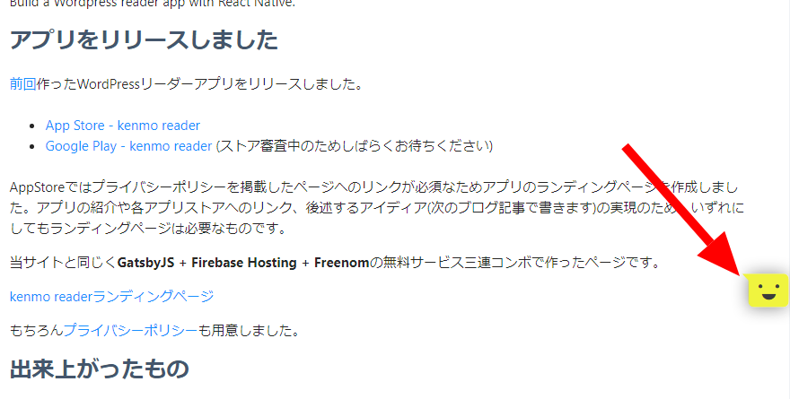
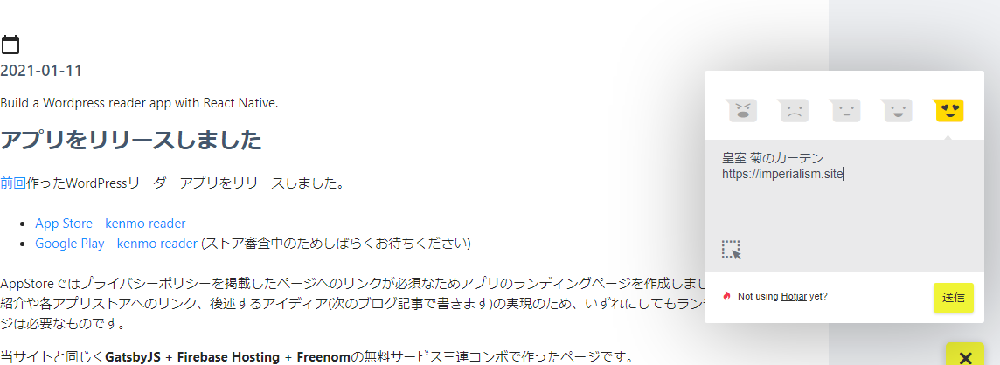
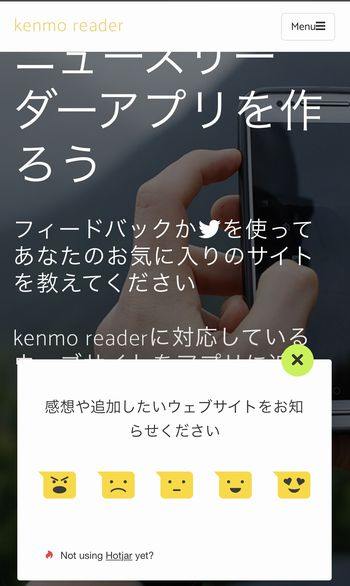
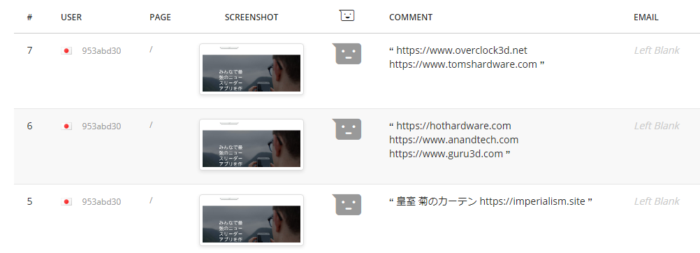

import { Link } from 'gatsby';

<Link to="/blog/2021-01-11">前回</Link>の続きと次にやりたいことを書きます。

  

## 前回の続き

「kenmo readerにランディングページが必要な理由はプライバシーポリシーやアプリの紹介だけではない。理由は次のブログ記事で書く」と書きました。

#### ランディングページが必要な理由は**アプリに追加してほしいサイト**のリクエストをユーザーから受け取るためです。

アプリ内にフォームを用意して、そこに追加してほしいサイトを記入して送ってもらうというのがベストだと思いますが、実装のハードルが高いのでウェブを使うことにしました。

[ランディングページ](https://kenmo-reader.ml)に<Link to="/blog/2021-01-02">以前紹介した</Link>Hotjarのフィードバックウィジェットを設置して、フィードバックメッセージとして追加リクエストを受け取ろうというアイディアです。

この他に

- Twitterで教えてもらう
- [Getform.io](https://getform.io)を使ってコンタクトフォームを設置
- [DISQUS](https://disqus.com)を使ってコメント形式で書いてもらう

 

というのも思いつきましたが、実装がものすごく簡単だった[Hotjarのフィードバックウィジェット](https://www.hotjar.com)を利用することにしました。

今も画面に見えてると思います。これです。

フィードバックメッセージとして追加してほしいサイトを送ってもらうのです。

実際に設置しました。

受け取ったリクエストはHotjarのダッシュボードで確認できます。

これならユーザーはSNSのアカウントは必要なく、フォームにサイト名かURLを入れて送れば良いだけなのですごく簡単です。開発者(私)もユーザーの情報を受け取らなくて済むのですごく良いアイディアだと思っています。手ごたえがあれば、フィードバックウィジェットだけを置いたページをアプリ内のウェブビューで開くようにしても良いかもしれません。

## 次にやりたいこと

初期画面にサイトを追加したり削除したりする機能の実装で、自分の中ではひと段落ついてしまってました。

さっそく使ってくれたユーザーからもらった感想で気づかされたのですが、そもそもkenmo readerはウェブを読むためのアプリです。閲覧体験をもっと快適にする必要があります。

記事表示画面をもっと改善したいです。

- TwitterとInstagramの埋め込みを見やすく表示する
- 文字のサイズやカラースキームなどを変更できるようにする
- 画像が表示されないサイトがある

 

これをまずは直していきたいと思っています。

以上です。

---