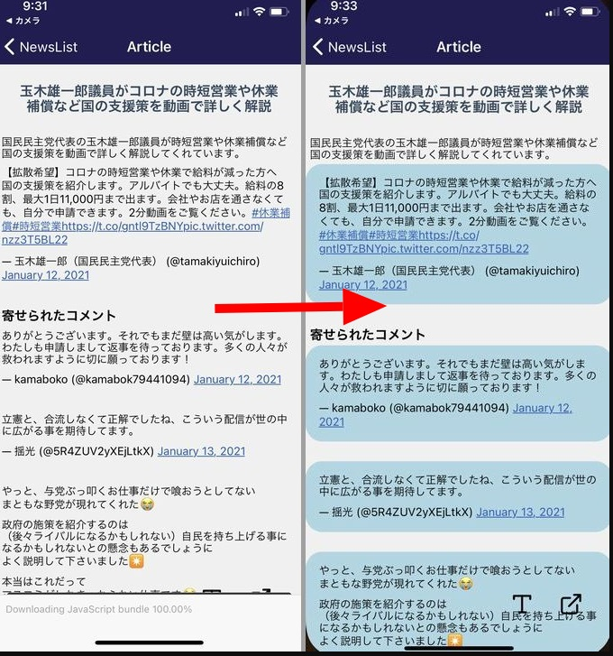
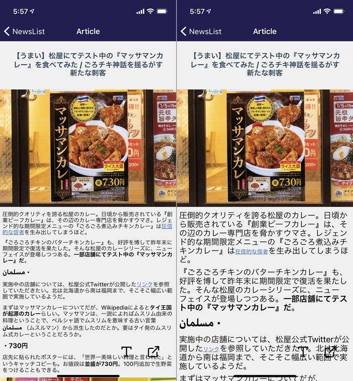

import { Link } from 'gatsby';

WordPressリーダーアプリの作成の続きです。

## やったこと

<Link to="/blog/2021-01-13">前回予告</Link>した通り、記事本文の表示を改善しました。

今回修正した箇所は2つです。

- Twitter埋め込みの表現を改善
- フォントサイズ切り替え機能を実装

<br/>

## Twitter埋め込みを改善

ブラウザで見るとこんな感じになっています。


改善前と改善後です。



完璧な再現にはほど遠いですが、ツイートごとの区切りができて見やすくなりました。

これには[react-native-render-html](https://github.com/meliorence/react-native-render-html)の`classesStyles`を使用します。

取得したHTML内のツイート埋め込み箇所はこのようになっています。

```html
<blockquote class="twitter-tweet">
  <p lang="ja" dir="ltr">
    【拡散希望】コロナの時短営業や休業で給料が減った方へ　国の支援策を紹介します。アルバイトでも大丈夫。給料の8割、最大1日11,000円まで出ます。会社やお店を通さなくても、自分で申請できます。2分動画をご覧ください。<a
      href="https://twitter.com/hashtag/%E4%BC%91%E6%A5%AD%E8%A3%9C%E5%84%9F?src=hash&amp;ref_src=twsrc%5Etfw">#休業補償</a>
    <a
      href="https://twitter.com/hashtag/%E6%99%82%E7%9F%AD%E5%96%B6%E6%A5%AD?src=hash&amp;ref_src=twsrc%5Etfw">#時短営業</a>
    <a href="https://t.co/gntl9TzBNY">https://t.co/gntl9TzBNY</a> <a
      href="https://t.co/nzz3T5BL22">pic.twitter.com/nzz3T5BL22</a></p>
  <p>&mdash; 玉木雄一郎（国民民主党代表） (@tamakiyuichiro) <a
      href="https://twitter.com/tamakiyuichiro/status/1348912973587255297?ref_src=twsrc%5Etfw">January 12, 2021</a></p>
</blockquote>
```

`<blockquote>`にclass`twitter-tweet`が与えられているので、これにスタイルを当てます。

記事表示用コンポーネントにスタイルを書いていくと見づらいので、まずはスタイルの定義を別ファイルに切り出します。

**src\scenes\article\styale.js**

```javascript
export const classesStyles = {
	'twitter-tweet': {
    backgroundColor: "lightblue",
    padding: 10,
    borderRadius: 20,
    borderWidth: 1,
    borderColor: "lightblue",
    overflow: "hidden"
  },
};
```

これを記事表示コンポーネントにインポートします。

**src\scenes\article\article.js**

```javascript
import { classesStyles } from './styale';
```

HTMLレンダリングコンポーネントに適用します。

```javascript
<ScrollView contentContainerStyle={styles.scrollContentContainer}>
    <Text style={styles.paragraph}>
        {title}
    </Text>
    <HTML
        source={{ html:content }}
        classesStyles={classesStyles} {/* ここに追加 */}
    />
</ScrollView>
```

埋め込みツイートの表現は以上です。ただ、ツイートに添付されてる画像が表示されないので改善の余地があります。難しそうです。

## フォントサイズ切り替え

画像だと見づらいですが右下の**Tアイコン**をタップすることでフォントサイズの`largeモード`と`middleモード`を切り替えるようにしました。



これには[react-native-render-html](https://github.com/meliorence/react-native-render-html)の`tagsStyles`を使用します。

まずは先ほど新しく作ったスタイル定義ファイルに`largeモード`と`middleモード`それぞれのスタイリングを作ります。

**src\scenes\article\styale.js**

```javascript
const margin = 5

export const middleTagsStyles = {
	h1: {
        fontSize: 20,
        margin: margin,
	},
	h2: {
        fontSize: 17,
        margin: margin,
    },
    h3: {
        fontSize: 16,
        margin: margin,
	},
	p: {
        fontSize: 14,
        margin: margin,
	},
};

export const largeTagsStyles = {
	h1: {
        fontSize: 35,
        margin: margin,
	},
	h2: {
        fontSize: 30,
        margin: margin,
    },
    h3: {
        fontSize: 25,
        margin: margin,
	},
	p: {
        fontSize: 20,
        margin: margin,
	},
};
```

`margin`も直書きしても問題ないですが、簡単に変更できるようにしました。

作ったスタイリングを本文表示コンポーネントにインポートします。

**src\scenes\article\article.js**

```javascript
import { classesStyles, middleTagsStyles, largeTagsStyles } from './styale';
```

**Tアイコン**タップでモードのオンオフを切り替えたいので、そのための`state`と`toggle`を定義します。

```javascript
constructor() {
    super();
    this.state = {
      largeFont: false,
    }
}

toggleFont = () => {
		this.setState({ largeFont: !this.state.largeFont });
}
```

モード切り替えボタン(**Tアイコン**)を作ります。`onPress`イベントで`toggle`が切り替わるようにします。

```javascript
<TouchableOpacity onPress={() => this.toggleFont()}> 
    <Icon name="type" size={30} color="black"/>
</TouchableOpacity>
```

`tagsStyles`を使ってそれぞれのタグにスタイルが適用されるようにします。

```javascript
const defaultStyle = this.state.largeFont // ここに追加
const content = this.props.route.params.content
const url = this.props.route.params.url
const title = this.props.route.params.title
return (
    <View style={styles.container}>
        <StatusBar barStyle="light-content" />
        <View style={styles.content}>
            <ScrollView contentContainerStyle={styles.scrollContentContainer}>
                <Text style={styles.paragraph}>
                    {title}
                </Text>
                <HTML
                    source={{ html:content }}
                    classesStyles={classesStyles}
                    tagsStyles={defaultStyle ? largeTagsStyles : middleTagsStyles} {/* ここに追加 */}
                />
            </ScrollView>
        </View>
```

`this.state.largeFont`に入ってる真偽値を`defaultStyle`に代入します。

```javascript
const defaultStyle = this.state.largeFont
```

`defaultStyle`を三項演算子で評価して、真なら`largeTagsStyles`を、偽なら`middleTagsStyles`を当てるようにします。

```javascript
tagsStyles={defaultStyle ? largeTagsStyles : middleTagsStyles}
```

これで**Tアイコン**タップでフォントの大小が切り替わるようになりました。

ただ、画面を移動すると`state`が初期値に戻るので、ローカルストレージに設定を保存できるようにしたいです。

あと、`<a>`タグのサイズを切り替えられないところも改善が必要な箇所です。

## まとめ

本文表示の改善はまだまだ道半ばです。InstagramやYouTubeの埋め込みや画像付きツイートもまだ表現できていませんし、一部のサイトでは画像が表示されない(画像は取得されてるが画面の外に出て行ってしまってる)ままです。

スタイルの調整が必要なclassやタグがたくさんあるので表示に問題がある箇所があればぜひ教えていただきたいです。URLと該当箇所も教えてもらえれば幸いです。該当箇所のHTMLを教えていただけるとベストです。

以上です。

---