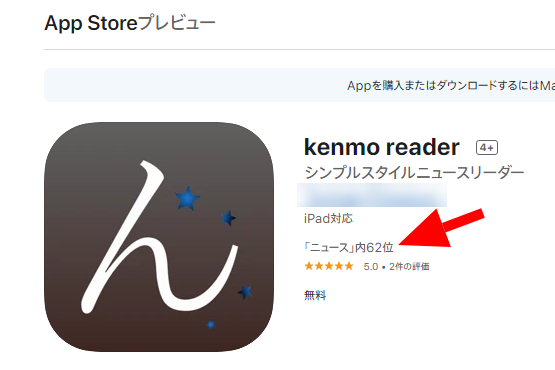
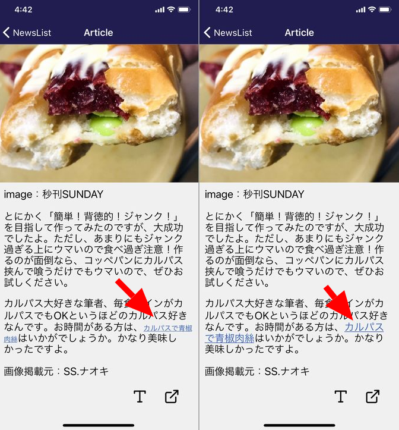
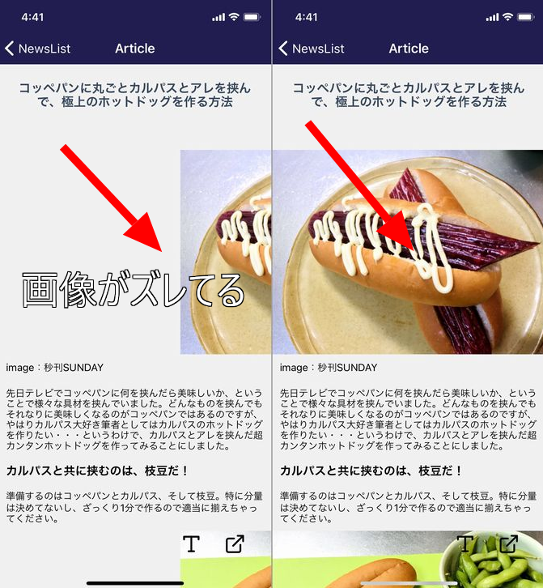

import { Link } from 'gatsby';

kenmo readerをダウンロードしてくれた方々へのメッセージと、コードの修正点を書きます。

## Google Playでもkenmo readerの配信が始まりました

- [App Store - kenmo reader](https://apps.apple.com/jp/app/kenmo-reader/id1548214464)
- [Google Play - kenmo reader](https://play.google.com/store/apps/details?id=net.votepurchase.kenmoreader) 

<br/>

提出から2時間かからず配信が開始されたAppStoreとはうってかわって、Google Playでは月曜の朝に提出してずっと審査中から変わらずでした。金曜昼間に配信が開始されたのでご報告します。

## kenmo readerのユーザーさんありがとう

まずはお礼を書きます。インストールしてくれた方々ありがとう。

### kenmo readerがAppStoreのカテゴリ内ランキングに入りました



カテゴリ内で62位というのがすごいのかすごくないのかわかりませんが一人以上のかたにダウンロードしていただいたことは事実なのでお礼を言います。ありがとうございました。

ペースは遅いかもしれませんが、記事表示の改善や実装したい機能もありますので、長い目で見守ってくれるとありがたいです。インストールしていただきありがとうございます。

### いただいた意見について

Googleでの配信が始まる前だったのですが、嫌儲でスレを立ててAppStoreでリリースされたことを報告しました。アプリに登録してるサイトにまとめやネトウヨサイトが入っているため賛否両論、色々な意見を頂きました。

kenmo readerのそもそもの目的はクリーンな画面でシンプルにウェブを読むことです。

- **ページに自動的に挿入される広告を排除する**
- **シンプルな装飾でレンダリングする**

<br/>

この2点がメインの機能です。まとめやネトウヨサイトを読むことがメインの機能ではありません。

ただ、**広告を排除**することによる副産物として

**まとめやネトウヨサイトなどの好ましくない方法でアフィ収入を得ているサイトの収益を断つことができる**

という効果をスレで説明したところ

**広告を排除したとしてもそのサイトを見ていることには変わりないのでPVが増えて、ページランクが上がり、結果として検索結果に表示されやすくなりサイトへのアクセスが増える**

と指摘されました。これは正しくありません。kenmo readerはAPIを使ってアクセスしているのでPVにはカウントされず、検索エンジンの評価にも影響を与えません。

それと

- **アプリ内の利用可能サイト一覧が充実してない**
- **俺の読みたいサイトがない**

<br/>

という指摘がありました。これは事実です。ググって見つけた、アプリで利用できるサイトを登録しているだけなので、読みたいサイトは含まれてないと思います。

アプリを充実させるために、ぜひみなさんには追加したいサイトを私に教えて欲しいです。追加リクエストは[ランディングページ](https://kenmo-reader.ml/)のフィードバックウィジェットでいつでも受け付けています。

みんなで最強のニュースリーダーアプリをつくりましょう。

## コードの修正箇所

今回は2か所修正しました。

### フォントを拡大したときにリンク文字が変わっていなかったのを修正



前回、文字の大きさを拡大する機能を追加しましたが、リンク文字の大きさはかわってないままでしたので直しました。

これは非常に単純です。

**src\scenes\article\styale.js**

```javascript
export const middleTagsStyles = {
	h1: {
    fontSize: 20,
    margin: margin,
    padding : padding
	},
	h2: {
    fontSize: 17,
    margin: margin,
    padding : padding
  },
  h3: {
    fontSize: 16,
    margin: margin,
    padding : padding
	},
	p: {
    fontSize: 14,
    margin: margin,
    padding : padding
  },
  /* ここを追加 */
  a: {
    fontSize: 14
  },
};

export const largeTagsStyles = {
	h1: {
    fontSize: 35,
    margin: margin,
    padding : padding
	},
	h2: {
    fontSize: 30,
    margin: margin,
    padding : padding
  },
  h3: {
    fontSize: 25,
    margin: margin,
    padding : padding
	},
	p: {
    fontSize: 20,
    margin: margin,
    padding : padding
  },
  /* ここを追加 */
  a: {
    fontSize: 20
  }
};
```

largeモードとmiddleモードそれぞれのスタイルに`<a>`タグの`fontSize`を指定します。これだけです。

### 一部のサイトで画像が画面外に飛び出ているのを修正



普通に画像が表示されるサイトもあったのですが、一部のページで画像が正しく表示されていなかったので直しました。

該当のページのHTMLがこちらです。

URLは貼りますがリンクにはしません(理由、わかるね？)

- コッペパンに丸ごとカルパスとアレを挟んで、極上のホットドッグを作る方法 `https://yukawanet.com/archives/koppe20210115.html`

```html
<p>&nbsp;</p>
<div id="attachment_129089" style="width: 875px" class="wp-caption alignnone">

  <p class="wp-caption-text">image：秒刊SUNDAY</p>
</div>
```

- サーティワンでオリジナルポーチプレゼント、出来るだけ安くゲットする方法 `https://yukawanet.com/archives/3120210114.html`

```html
<div id="attachment_129059" style="width: 951px" class="wp-caption alignnone">

  <p class="wp-caption-text">image：秒刊SUNDAY</p>
</div>
```

``タグを見ると共通してクラス`size-full`が設定されてますので、これに対してスタイルを設定します。

**src\scenes\article\styale.js**

```javascript
export const classesStyles = {
	'twitter-tweet': {
    backgroundColor: "lightblue",
    padding: 10,
    borderRadius: 20,
    borderWidth: 1,
    borderColor: "lightblue",
    overflow: "hidden"
  },
  'liquid-speech-balloon-text': {
    backgroundColor: "lightblue",
    padding: 10,
    borderRadius: 20,
    borderWidth: 1,
    borderColor: "lightblue",
    overflow: "hidden",
    margin: 5,
  },
  /* ここに追加 */
  'size-full': {
    alignSelf: "flex-start",
  }
};
```

コードの修正は以上です。

## まとめ

表示がおかしい箇所があれば、このように該当箇所のHTMLを調べてスタイルを修正していくという形になります。なので、表示がおかしいところを見つけたら該当のページを教えていただけると幸いです。


---