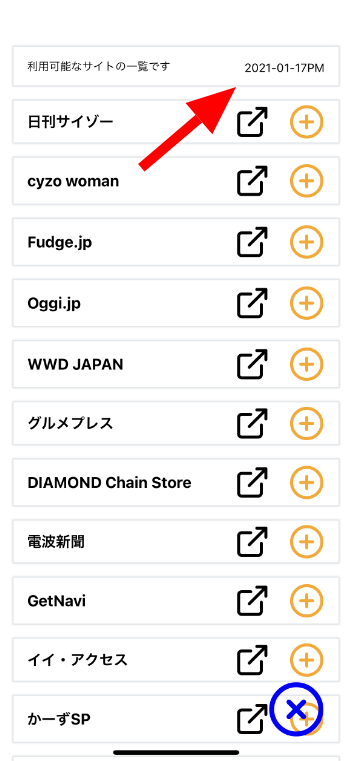
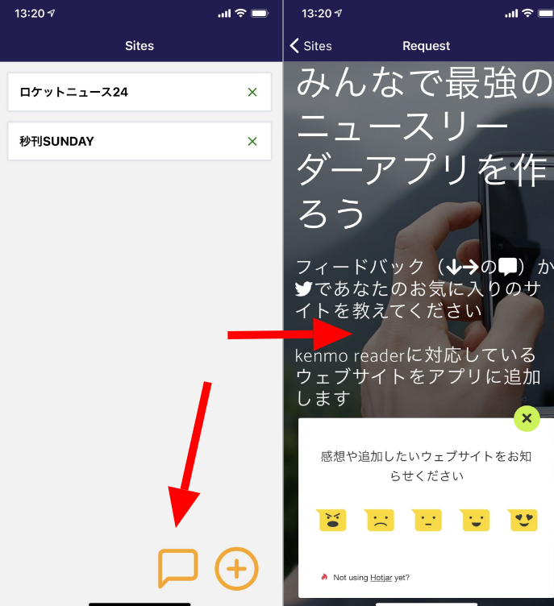
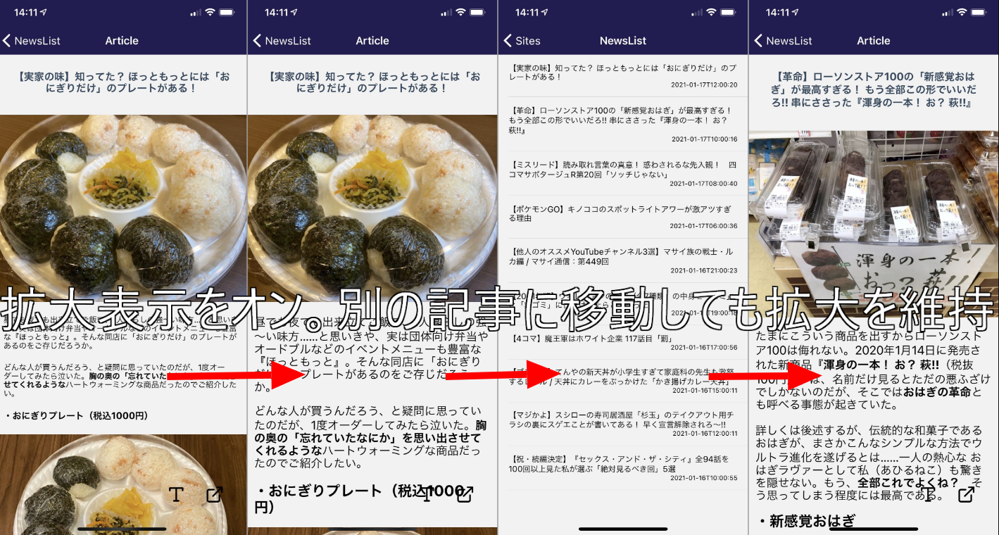

import { Link } from 'gatsby';

今日もkenmo readerを更新しました。

- 更新日をアプリ内に表示するように変更
- サイトの追加リクエストをアプリ内から送れるようにスクリーンを追加
- フォントの拡大状態を保存するように変更

<br/>

## 更新日をアプリ内に表示

kenmo readerは開発にReact Native(Expo)を利用しているため、アプリストアの審査を通さずにOTAでアップデートを行えます。アプリの起動と終了(タスクキル)を何度か繰り返すとその時点での最新版がExpoサーバーからダウンロードされます。

アップデートされたことがユーザーに通知されるわけではないので、せめてもとしてアプリの更新日を表示するようにしました。

これは結構前からやってたのですが、コードを記載します。手動です。



以前、別ファイルに切り出したサイト一覧にアップデート日も定義しました。

**src\scenes\sites\list.js**

```javascript
export const lastUpdate = '2021-01-17PM'

export const sites = [
  {
    ID: 69,
    name: '日刊サイゾー',
    url: 'https://www.cyzo.com'
  },
  {
    ID: 68,
    name: 'cyzo woman',
    url: 'https://www.cyzowoman.com'
  },
  {
    ID: 67,
    name: 'Fudge.jp',
    url: 'https://fudge.jp'
  },
  /* 以降は省略 */
]
```

`lastUpdate`を手動で入力してるのでたまに更新し忘れています。

**src\scenes\sites\sites.js**

```javascript
import { sites, lastUpdate} from './list'
```

```javascript
<Card>
  <View style={{ flexDirection: 'row'}}>
    <View>
      <Text>利用可能なサイトの一覧です</Text>
    </View>
    <View style={{ position: 'absolute', right: 0 }}>
      <Text>{lastUpdate}</Text> {/* ここを変数に変更 */}
    </View>
  </View>
</Card>
```

## サイトの追加リクエストをアプリ内から送れるようにスクリーンを追加

ランディングページをWebViewで開くようにしました。



### アプリで開く用のページをランディングページに設置

WebViewで[ランディングページ](https://kenmo-reader.ml)を直接開くと色々とリンクが設置されておりややこしくなるので、フィードバックウィジェットだけを置いたページを新しく作りました。

- [https://kenmo-reader.ml/request/](https://kenmo-reader.ml/request/)

<br/>

### アプリにWebViewスクリーンを作成

ページ遷移が楽なので、WebViewスクリーンをスタックナビゲーションに追加します。

これから作るスクリーンをまずはルーティングに追加。

**src\routes\navigation\stacks\Stacks.js**

```javascript
import Request from 'scenes/request'
```

```javascript
export const NewsListNavigator = () => (
  <Stack.Navigator
    initialRouteName="Sites"
    headerMode="screen"
    screenOptions={navigationProps}
  >
    <Stack.Screen
      name="Sites"
      component={Sites}
      options={({ navigation }) => ({
        title: 'Sites',
      })}
    />
    <Stack.Screen
      name="NewsList"
      component={NewsList}
      options={({ navigation }) => ({
        title: 'NewsList',
      })}
    />
    <Stack.Screen
      name="Article"
      component={Article}
      options={({ navigation }) => ({
        title: 'Article',
      })}
    />
    {/* ここから */}
    <Stack.Screen
      name="Request"
      component={Request}
      options={({ navigation }) => ({
        title: 'Request',
      })}
    />
    {/* ここまで追加 */}
  </Stack.Navigator>
)
```

WebView用スクリーンを新規作成。

**src\scenes\request\index.js**

```javascript
import Request from './request'

export default Request
```

何の変哲もない、ただ単に決まったページをWebViewで開くだけのスクリーンです。読み込みの待ち時間が発生するのでローディングスピナーも設置します。

**src\scenes\request\request.js**

```javascript
import React from 'react'
import { View, StyleSheet, StatusBar } from 'react-native'
import { WebView } from 'react-native-webview';
import Spinner from 'react-native-loading-spinner-overlay'

export default class Request extends React.Component {

  constructor(props) {
		super(props);
		this.state = { 
			spinner: true,
		};
  }
  
  hideSpinner() {
    this.setState({ spinner: false });
  }

	render() {
		return (
      <View style={styles.container}>
        <StatusBar barStyle="light-content" />
					<Spinner
          	visible={this.state.spinner}
          	textContent="読込中..."
            textStyle={{ color: "#fff" }}
            overlayColor="rgba(0,0,0,0.5)"
        	/>
          <WebView
            onLoad={() => this.hideSpinner()}
            source={{uri: "https://kenmo-reader.ml/request/"}} 
          />
      </View>
		);
	}
}

const styles = StyleSheet.create({
  container: {
    flex: 1,
  },
});
```

あとは今作ったスクリーンを開くボタンを設置します。

**src\scenes\sites\sites.js**

```javascript
<View style={{ position: 'absolute', right: 80, alignSelf:'center' }}>
  <TouchableOpacity onPress={() => this.props.navigation.navigate('Request', { from: 'home' })}>
    <Icon name="message-square" size={65} color="orange"/>
  </TouchableOpacity>
</View>
```

`from: 'home'`で値を渡していますが特に意味はありません。

## フォントの拡大状態を維持するように変更

<Link to="/blog/2021-01-14">以前</Link>書いた通り、フォントサイズの拡大は真偽値で実装しています。それをローカルストレージに保存して、記事表示画面を開いたときにロードするようにしました。



初期画面では[react-native-storage](https://github.com/sunnylqm/react-native-storage)利用してサイトの追加削除を実装しましたが、今回はReact Native標準の[AsyncStorage](https://reactnative.dev/docs/asyncstorage)のみを使いました。

`largeFont`が`true`のとき拡大するようにしてあります。

**src\scenes\article\article.js**

```javascript
import AsyncStorage from '@react-native-community/async-storage';
```

トグル関数に現在の状態を保存するメソッドを追加しました。順番逆のほうがいいかもしれないけど動いてるから良し。

```javascript
toggleFont = () => {
  AsyncStorage.setItem('fontSize',JSON.stringify(this.state.largeFont)); // ここに追加
  this.setState({ largeFont: !this.state.largeFont });
}
```

スクリーンを開いたときにストレージからロードするように変更しました。

```javascript
componentDidMount() {
  AsyncStorage.getItem('fontSize').then((value) => {
    const fontsize = JSON.parse(value)
    this.setState({largeFont: !fontsize})
    });
}
```

実装したコードは以上です。

## 次回予告

次はInstagramとTwitterの埋め込みの再現を実装したいのですが、手こずっています。

---