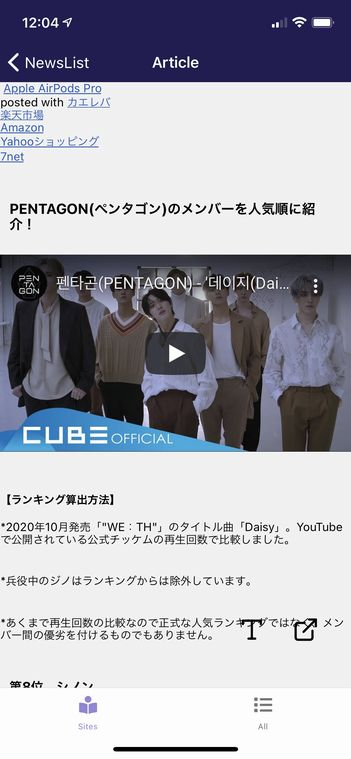
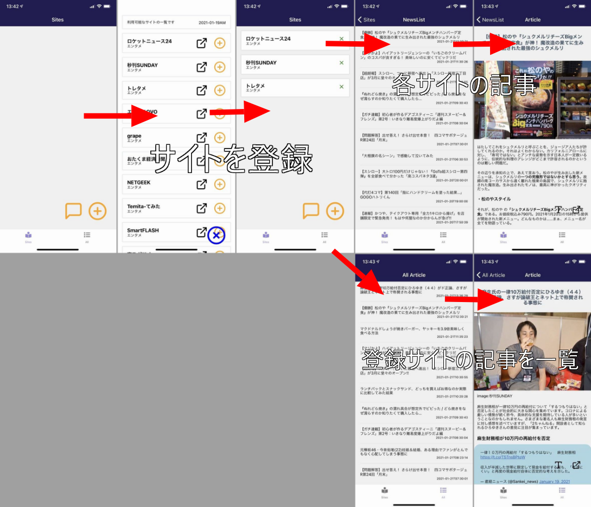
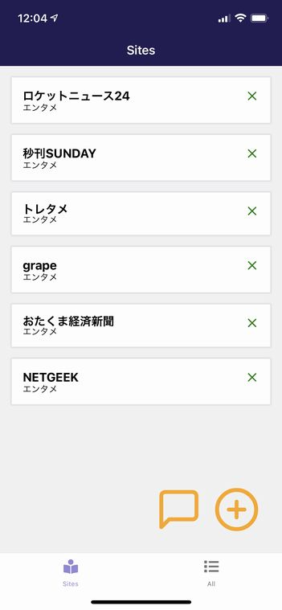
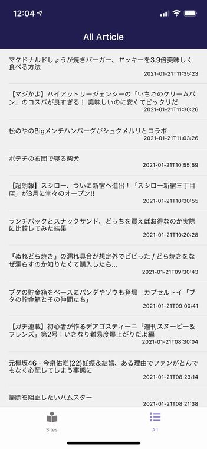
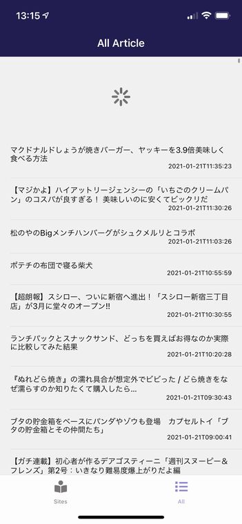

import { Link } from 'gatsby';

kenmo readerを更新しました。

- YouTube埋め込みの改善
- 各サイトの記事を一覧できる画面を追加

<br/>

## YouTubeの埋め込みをサポートしました

<Link to="/blog/2021-01-16">以前</Link>の投稿でプラグインを使ってYouTubeの埋め込みを再現したつもりでしたが、ちゃんと動いてませんでした。

というわけで直しました。YouTubeは`iframe`で埋め込まれてるので、WebViewを使って`iframe`内の`src`を開くようにしました。



**src\scenes\article\article.js**

```javascript
<HTML
  source={{ html:content }}
  classesStyles={defaultClass ? largeClassesStyles : middleClassesStyles}
  tagsStyles={defaultStyle ? largeTagsStyles : middleTagsStyles}
  renderers={{
    iframe: (htmlAttribs, passProps) => {
      return (
        <View
          key={passProps.key}
          style={{
            width: "100%",
            aspectRatio: 16.0 / 9.0,
            marginTop: 16,
            marginBottom: 16,
          }}>
          <WebView
            scrollEnabled={false}
            source={{ uri: htmlAttribs.src }}
            style={{ flex: 1, width: "100%", aspectRatio: 16.0 / 9.0 }}
          />
        </View>
      );
    },
  }}
/>
```

react-native-render-htmlの`renderers`を使って実装しました。

あとはTwitterとInstagramの埋め込みを再現したいのですがなかなかうまくいかないです。

## 追加したサイトの記事を一覧できるようにしました



これまでkenmo readerでは初期画面にサイトを追加して、追加したサイトごとにしか記事を読むことができませんでした。



これだけだとちょっと不便なので、**初期画面に追加したサイト**の記事をまとめて取得する機能を追加しました。



ボトムタブの**All**を開くと初期画面に追加したサイトの記事をまとめて一覧できるようになっています。

## 実際のコード

### 全記事一覧画面をルーティングに追加

全記事一覧画面→記事表示画面、というように遷移させたいのでこの二つを`AllNewsNavigator`としてスタックにまとめます。これから作る全記事一覧画面は`All`という名前にします。

**src\routes\navigation\stacks\Stacks.js**

```javascript
import All from 'scenes/all'
```

```javascript
export const AllNewsNavigator = () => (
  <Stack.Navigator
    initialRouteName="All"
    headerMode="screen"
    screenOptions={navigationProps}
  >
    <Stack.Screen
      name="All"
      component={All}
      options={({ navigation }) => ({
        title: 'All Article',
      })}
    />
    <Stack.Screen
      name="Article"
      component={Article}
      options={({ navigation }) => ({
        title: 'Article',
      })}
    />
  </Stack.Navigator>
)
```

**src\routes\navigation\stacks\index.js**

```javascript
import { HomeNavigator, ProfileNavigator, NewsListNavigator, AllNewsNavigator } from './Stacks'

export { NewsListNavigator, HomeNavigator, ProfileNavigator, AllNewsNavigator  }
```

#### ボトムタブを追加

<Link to="/blog/2021-01-10">前に書いた</Link>ようにkenmo readerはドロワー、スタック、ボトムタブを実装済みのボイラープレートを改造する形で開発しています。

初めはボトムタブ以外不要だったので削除していましたが、今回の機能はボトムタブで実装したいので復活させます。

もともと用意されている`HomeNavigator`と`ProfileNavigator`を`NewsListNavigator`と`AllNewsNavigator`に置き換える形に書き換えます。

**src\routes\navigation\tabs\Tabs.js**

```javascript
import React from 'react'
import { View } from 'react-native'
import { createBottomTabNavigator } from '@react-navigation/bottom-tabs'
import FontIcon from 'react-native-vector-icons/FontAwesome5'
import { colors } from 'theme'

// stack navigators
import { HomeNavigator, ProfileNavigator, NewsListNavigator, AllNewsNavigator } from '../stacks'

const Tab = createBottomTabNavigator()

const TabNavigator = () => (
  <Tab.Navigator
    screenOptions={({ route }) => ({
      // eslint-disable-next-line react/prop-types
      tabBarIcon: ({ focused }) => {
        switch (route.name) {
          case 'Sites':
            return (
              <FontIcon
                name="book-reader"
                color={focused ? colors.lightPurple : colors.gray}
                size={20}
                solid
              />
            )
          case 'All':
            return (
              <FontIcon
                name="list"
                color={focused ? colors.lightPurple : colors.gray}
                size={20}
                solid
              />
            )
          default:
            return <View />
        }
      },
    })}
    tabBarOptions={{
      activeTintColor: colors.lightPurple,
      inactiveTintColor: colors.gray,
      style: {
        // backgroundColor: 'white',
        // borderTopColor: 'gray',
        // borderTopWidth: 1,
        // paddingBottom: 5,
        // paddingTop: 5,
      },
    }}
    initialRouteName="Sites"
    swipeEnabled={false}
  >
    <Tab.Screen name="Sites" component={NewsListNavigator} />
    <Tab.Screen name="All" component={AllNewsNavigator} />
  </Tab.Navigator>
)

export default TabNavigator
```

起動時に`TabNavigator`が開くようにします。

**src\routes\navigation\Navigation.js**

```javascript
import React from 'react'
import { NavigationContainer } from '@react-navigation/native'
// import DrawerNavigator from './drawer'
import { HomeNavigator, ProfileNavigator, NewsListNavigator, AllNewsNavigator } from './stacks'
import TabNavigator from './tabs'


export default () => (
  <NavigationContainer>
    <TabNavigator />
  </NavigationContainer>
)
```

ルーティングの設定は以上です。

### 全記事一覧画面の作成

初期画面に追加したサイトはローカルストレージに保存済みです。なので、この画面ではローカルストレージからサイトをロードして、各サイトからJSONを取得して見出しを一覧できるようにします。

<Link to="/blog/2021-01-10">前に書いた</Link>ニュースサイト一覧(Sites)と記事一覧(NewsList)画面の合わせ技です。

スタイリングは省略します。

**src\scenes\all\index.js**

```javascript
import All from './all'

export default All
```

**src\scenes\all\all.js**

```javascript
import React from 'react'
import { Text, View, ScrollView, StatusBar, StyleSheet, RefreshControl } from 'react-native'
import { Card, List, ListItem, Thumbnail, Container, Content } from 'native-base'
import Spinner from 'react-native-loading-spinner-overlay'
import Button from 'components/Button'
import Storage from 'react-native-storage'
import AsyncStorage from '@react-native-community/async-storage'

const storage = new Storage({
  storageBackend: AsyncStorage,
  defaultExpires: null,
  enableCache: false,
});
global.storage = storage;

class WPPost {
	constructor(post) {
		this.post = post;
		this.title = post.title.rendered;
		this.content = post.content.rendered;
		this.date = post.date;
		this.url = post.link;
	}
}

export default class All extends React.Component {

	constructor(props) {
		super(props);
		this.state = { 
			items: [] ,
			spinner: true,
			data: [],
		};
	}
	
componentDidMount() {
	this.getNews();
}

getNews() {
	global.storage.getAllDataForKey('site')
		.then(res => {
			const urls = res.map(site => site.url);
			for (const url of urls) {
				fetch(url + '/wp-json/wp/v2/posts?_embed')
					.then((response) => response.json())
					.then((responseJson) => {
						for(var i in responseJson) {
							var p = new WPPost(responseJson[i]);
							this.setState({ items: this.state.items.concat([p]), spinner: false });
						}
					})
					.catch((error) => {
						console.error(error);
					});
			}
		});
}

clearData() {
	this.setState({items: []})
}

render() {
	var items = this.state.items;
	items.sort(function(a, b) {
		if (a.date > b.date) {
				return -1;
		} else {
				return 1;
		}
 });
	return (
		<View style={styles.container}>
			<StatusBar barStyle="light-content" />
				<Spinner
					visible={this.state.spinner}
					textContent="読込中..."
					textStyle={{ color: "#fff" }}
					overlayColor="rgba(0,0,0,0.5)"
				/>
				<View style={styles.content}>
					<List
						refreshControl={
							<RefreshControl
								onRefresh={() => {this.getNews(), this.clearData()}}
							/>
						}
						dataArray={items}
						renderRow={
							(item) =>
							<ListItem
								onPress={() => this.props.navigation.navigate('Article', { url: item.url, content:item.content, title:item.title })}
							>
								<View style={styles.list}>
									<Text style={styles.title}>{item.title}</Text>
									<Text style={styles.date}>{item.date}</Text>
								</View>
							</ListItem>} >
					</List>
				</View>
		</View>
	);
}
}
```

ストレージからサイトをロードして各サイトにJSONを取得する関数です。

```javascript
getNews() {
	global.storage.getAllDataForKey('site')
		.then(res => {
			const urls = res.map(site => site.url);
			for (const url of urls) {
				fetch(url + '/wp-json/wp/v2/posts?_embed')
					.then((response) => response.json())
					.then((responseJson) => {
						for(var i in responseJson) {
							var p = new WPPost(responseJson[i]);
							this.setState({ items: this.state.items.concat([p]), spinner: false });
						}
					})
					.catch((error) => {
						console.error(error);
					});
			}
		});
}
```

`global.storage.getAllDataForKey('site')`でロードすると初期画面に追加したサイトがこんな感じで取得できます。

```javascript
Array [
  Object {
    "caption": "エンタメ",
    "name": "ロケットニュース24",
    "siteid": 6,
    "url": "https://rocketnews24.com",
  },
  Object {
    "caption": "エンタメ",
    "name": "秒刊SUNDAY",
    "siteid": 9,
    "url": "https://yukawanet.com",
  },
]
```

あとはここからURLを取り出して、`fetch`を繰り返します。ここまでで全記事一覧の取得はできました。

```javascript
.then(res => {
  const urls = res.map(site => site.url);
  for (const url of urls) {
    fetch(url + '/wp-json/wp/v2/posts?_embed')
      .then((response) => response.json())
      .then((responseJson) => {
        for(var i in responseJson) {
          var p = new WPPost(responseJson[i]);
          this.setState({ items: this.state.items.concat([p]), spinner: false });
        }
      })
      .catch((error) => {
        console.error(error);
      });
  }
});
```

日付順にソートしてからレンダリングします。

```javascript
render() {
var items = this.state.items;
items.sort(function(a, b) {
  if (a.date > b.date) {
      return -1;
  } else {
      return 1;
  }
});
return (
```

これだけだと最初にこの画面を開いた時にしか`getNews`関数が動かないので、よくある**引っ張って更新**ができるようにします。



`RefreshControl`を使います。

```javascript
<List
  refreshControl={
    <RefreshControl
      onRefresh={() => {this.getNews(), this.clearData()}}
    />
```

`getNews`を動かすだけだと、取得した記事が重複してたまっていくので`clearData`で一旦クリアしてから記事を取得します。

```javascript
clearData() {
	this.setState({items: []})
}
```

取得した記事の構造はこれまでと同じなので、これまでと同じく**記事本文(Article)**に遷移するときにタイトルと本文とURLを渡します。

ここは変更ありません。

```javascript
<ListItem
  onPress={() => this.props.navigation.navigate('Article', { url: item.url, content:item.content, title:item.title })}
>
```

実装したコードは以上です。

## まとめ

全記事一覧機能はスレでリクエストもあったので実装したいと思っていました。難しそうだからと後回しにしていました。

TwitterとInstagramの埋め込みの再現が難航しており、気分転換のためにやってみたら案外あっさり実装できて良かったです。


---