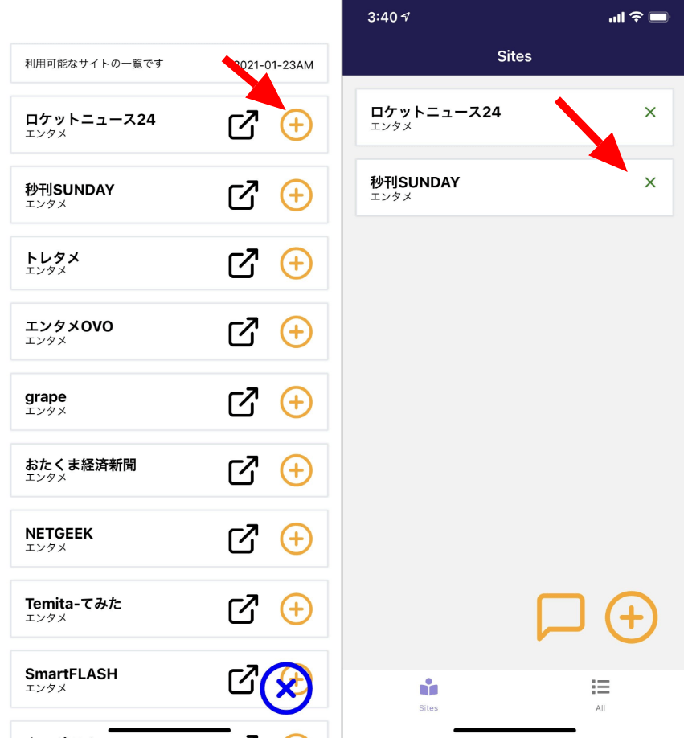

import { Link } from 'gatsby';

## kenmo readerを更新しました。

対応サイト一覧から初期画面に登録する+ボタンを押したときに、追加できてるかわからないので反応が欲しいとの意見があったので触覚フィードバックを追加しました。



## 実装したコード

今回は非常に簡単です。[expo-haptics](https://docs.expo.io/versions/latest/sdk/haptics/)を使用します。ドキュメントの通りに実装します。

### インストール

```shell
expo install expo-haptics
```

### パーミッションの追加

Androidでは振動を制御するためのパーミッションが必要です。`VIBRATE`を追記します

**app.json**

```javascript
"android": {
  "package": "net.votepurchase.kenmoreader",
  "versionCode": 3,
  /* ここから */
  "permissions": [
    "VIBRATE"
  ]
  /* ここまで */
},
```

### 振動の種類

expo-hapticsでは3つのメソッドが用意されています。振動の種類を設定できます。

- Haptics.selectionAsync()
- Haptics.notificationAsync(Haptics.NotificationFeedbackType.Success)
- Haptics.impactAsync(Haptics.ImpactFeedbackStyle.Light)

<br/>

**Haptics.notificationAsync(Haptics.NotificationFeedbackType.Success)**では`Success` `Warning` `Error`が設定できます。

**Haptics.impactAsync(Haptics.ImpactFeedbackStyle.Light)**では`Light` `Medium` `Heavy`が設定できます。

それぞれ振動の仕方が違います。

### 触覚フィードバックを発生させたい箇所にコードを追加

**src\scenes\sites\sites.js**

プラグインをインポート

```javascript
import * as Haptics from 'expo-haptics'
```

削除ボタンの`onPress`イベントに追加

```javascript
<TouchableOpacity
  onPress={() => {
    global.storage.remove({
      key: 'site',
      id: u.siteid,
    });
    this.loadStrage()
    Haptics.impactAsync(Haptics.ImpactFeedbackStyle.Medium) // ここに追加
  }}
>
  <Icon name="x" size={20} color="green"/>
</TouchableOpacity>
```

追加ボタンの`onPress`イベントに追加

```javascript
<TouchableOpacity
  onPress={() => {
    var siteData = {
      siteid: u.ID,
      name: u.name,
      url: u.url,
      caption: u.caption,
    }
    global.storage.save({
      key: 'site',
      id: u.ID,
      data: siteData,
    });
    this.loadStrage()
    Haptics.notificationAsync(Haptics.NotificationFeedbackType.Success) // ここに追加
  }}
>
  <Icon name="plus-circle" size={40} color="orange"/>
</TouchableOpacity>
```

実装したコードは以上です。振動の種類は実機で確認しながら良いと思うものを設定しました。

---