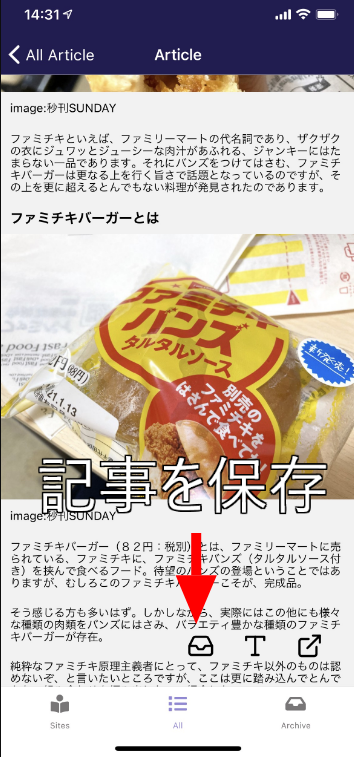
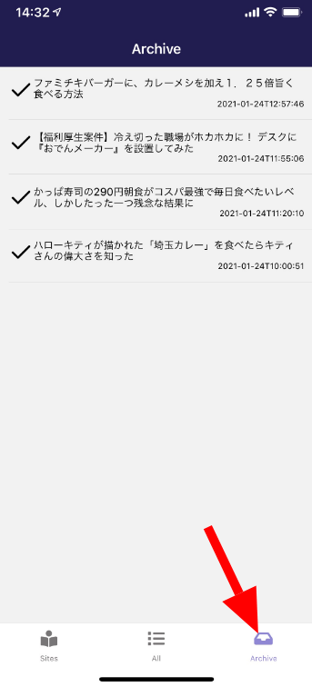
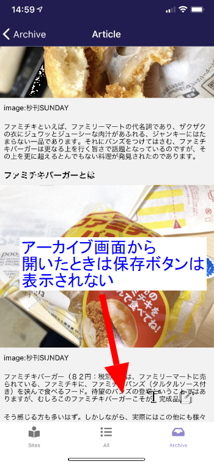

import { Link } from 'gatsby';

前に嫌儲に立てたスレの中でもらったリクエストの中に**記事を保存して、あとから見れるようにしたい**というのがあったので実装しました。

## 実装した機能

記事表示画面で**保存ボタン**をタップします。



ボトムタブの**Archive**画面に移動すると保存した記事が一覧できます。チェックマークをタップすることで削除できます。



もちろん保存した記事は読むことができます。このときは**保存ボタン**は表示されません。



## 機能の仕組み

kenmo readerではWP APIをたたいてサイトから記事10件の情報をまとめて取得します。この中には記事のタイトルや日付の他に記事本文のHTMLも含まれています。本文ごとデバイス内に保存して表示する仕組みにしました。

## 実装したコード

### 記事をストレージに保存するボタンを作成

記事表示画面に保存ボタンを設置します。ただ、このボタンは**アーカイブした記事の一覧画面**から遷移したときには表示させたくありません。

逆に言うと**サイトごと記事一覧**と**登録サイト記事一覧**から遷移したときにだけ表示したいわけです。

というわけで、記事表示画面に**どの画面から遷移してきたのか**を識別する機能も追加します。

まずは**サイトごと記事一覧**と**登録サイト記事一覧**から**記事表示画面**に遷移するときに識別用の値を渡すように変更します。あと、**保存した記事一覧画面**で必要なので日付も渡すようにします。

**src\scenes\newslist\newslist.js**、**src\scenes\all\all.js**

```javascript
<ListItem
  onPress={() => this.props.navigation.navigate('Article', { url: item.url, content:item.content, title:item.title, from: 'arrival', date:item.date })}
>
  <View style={styles.list}>
    <Text style={styles.title}>{item.title}</Text>
    <Text style={styles.date}>{item.date}</Text>
  </View>
</ListItem>} >
```

`from: 'arrival'`と`date:item.date`を渡すように追加しました。

**src\scenes\article\article.js**

そして今回の本題である**記事を保存するボタン**を設置します。

<Link to="/blog/2021-01-23">前回</Link>覚えた触覚フィードバックも付けます。ストレージ管理にはreact-native-storageを使用します。

ライブラリをインポートします。

```javascript
import Storage from 'react-native-storage'
import * as Haptics from 'expo-haptics'
```

受け取った値を代入します。

```javascript
const arrival = this.props.route.params.from
const date = this.props.route.params.date
```

保存ボタンを設置します。

```javascript
{arrival ?
  <View style={{ position: 'absolute', right: 120 }}>
    <TouchableOpacity
      onPress={() => {
        var archiveData = {
          title: title,
          url: url,
          date: date,
          content: content
        }
        global.storage.save({
          key: 'archive',
          id: title,
          data: archiveData,
        });
        Haptics.notificationAsync(Haptics.NotificationFeedbackType.Success)
      }}
    > 
      <Icon name="inbox" size={30} color="black"/>
    </TouchableOpacity>
  </View> : null
}
```

ボタン全体を三項演算子で囲んで`arrival`が真のときに表示、偽のときには何もしません。

タイトルとURLと日付と本文を`archiveData`として定義してストレージに保存します。

保存するときのIDはタイトルをそのまま使います。まったく同じタイトルの記事というのはほぼありえないのでOKという判断です。

### 保存した記事を一覧する画面を作成

保存した記事の画面はボトムタブに追加します。記事一覧→記事表示画面、というように遷移させたいので`ArchiveNavigator`としてスタックにまとめます。これから作る全記事一覧画面は`Archive`という名前にします。

**src\routes\navigation\stacks\Stacks.js**

```javascript
import Archive from 'scenes/archive'
```

```javascript
export const ArchiveNavigator = () => (
  <Stack.Navigator
    initialRouteName="Archive"
    headerMode="screen"
    screenOptions={navigationProps}
  >
    <Stack.Screen
      name="Archive"
      component={Archive}
      options={({ navigation }) => ({
        title: 'Archive',
      })}
    />
    <Stack.Screen
      name="Article"
      component={Article}
      options={({ navigation }) => ({
        title: 'Article',
      })}
    />
  </Stack.Navigator>
)
```

**src\routes\navigation\stacks\index.js**

```javascript
import { HomeNavigator, ProfileNavigator, NewsListNavigator, AllNewsNavigator, ArchiveNavigator } from './Stacks'

export { NewsListNavigator, HomeNavigator, ProfileNavigator, AllNewsNavigator, ArchiveNavigator  }
```

作った`ArchiveNavigator`をボトムタブナビゲーションに追加します。

**src\routes\navigation\tabs\Tabs.js**

```javascript
import { HomeNavigator, ProfileNavigator, NewsListNavigator, AllNewsNavigator, ArchiveNavigator } from '../stacks'
```

```javascript
case 'Sites':
  return (
    <FontIcon
      name="book-reader"
      color={focused ? colors.lightPurple : colors.gray}
      size={20}
      solid
    />
  )
case 'All':
  return (
    <FontIcon
      name="list"
      color={focused ? colors.lightPurple : colors.gray}
      size={20}
      solid
    />
  )
  /* ここから */
  case 'Archive':
  return (
    <FontIcon
      name="inbox"
      color={focused ? colors.lightPurple : colors.gray}
      size={20}
      solid
    />
  )
  /* ここまで追加 */
```

```javascript
<Tab.Screen name="Sites" component={NewsListNavigator} />
<Tab.Screen name="All" component={AllNewsNavigator} />
<Tab.Screen name="Archive" component={ArchiveNavigator} /> // ここに追加
```

ルーティングの設定は以上です。

### 保存した記事一覧画面を作成

**src\scenes\archive\index.js**

```javascript
import Archive from './archive'

export default Archive
```

スタイリングは省略します。

**src\scenes\archive\archive.js**

```javascript
import React from 'react'
import { Text, View, StatusBar, StyleSheet, TouchableOpacity } from 'react-native'
import { List, ListItem } from 'native-base'
import Icon from 'react-native-vector-icons/Feather'
import * as Haptics from 'expo-haptics'

class WPPost {
	constructor(post) {
		this.post = post;
		this.title = post.title;
		this.content = post.content;
		this.date = post.date;
		this.url = post.url;
	}
}

export default class Archive extends React.Component {

	constructor(props) {
		super(props);
		this.state = { 
			items: [] ,
		};
	}
	
	componentDidMount() {
		const { navigation } = this.props;
		this._unsubscribe = navigation.addListener('focus', () => {
			this.clearData()
			this.loadStorage()
		});
	}

	componentWillUnmount() {
    this._unsubscribe();
  }

	loadStorage() {
		global.storage.getAllDataForKey('archive')
		.then((responseJson) => {
			for(var i in responseJson) {
				var p = new WPPost(responseJson[i]);
				this.setState({ items: this.state.items.concat([p]) });
			}
		})
	}
	
	clearData() {
		this.setState({items: []})
	}

	render() {
		var items = this.state.items;
			items.sort(function(a, b) {
				if (a.date > b.date) {
						return -1;
				} else {
						return 1;
				}
		});
		return (
			<View style={styles.container}>
			<StatusBar barStyle="light-content" />
				<View style={styles.content}>
					<List
						dataArray={items}
						renderRow={
							(item) =>
							<ListItem
								onPress={() => this.props.navigation.navigate('Article', { url: item.url, content:item.content, title:item.title })}
							>
								<View style={{ flexDirection: 'row'}}>
									<TouchableOpacity
										onPress={() => {
											global.storage.remove({
												key: 'archive',
												id: item.title,
											});
											Haptics.impactAsync(Haptics.ImpactFeedbackStyle.Medium) 
											this.clearData()
											this.loadStorage()
										}}
									> 
										<Icon name="check" size={30} color="black"/>
									</TouchableOpacity>
									<View style={styles.list}>
										<Text style={styles.title}>{item.title}</Text>
										<Text style={styles.date}>{item.date}</Text>
									</View>
								</View>
							</ListItem>} >
					</List>
				</View>
		</View>
		);
	}
}
```

保存した記事をロードする関数です。保存するときにkeyを`archive`と名付けていたのでそれを呼び出して格納します。今回は`fetch`ではなくローカルストレージを読んでいるのでローディングスピナーは不要です。

```javascript
loadStorage() {
  global.storage.getAllDataForKey('archive')
  .then((responseJson) => {
    for(var i in responseJson) {
      var p = new WPPost(responseJson[i]);
      this.setState({ items: this.state.items.concat([p]) });
    }
  })
}
```

この関数を`componentDidMount`で呼び出すことで保存した記事がロードされて一覧が表示されます。

しかし`componentDidMount`は最初に画面を開いたときに1回だけしか動作しません。

なので、保存した記事一覧画面→別画面で記事を保存→保存した記事一覧画面に戻ってくる、というように画面を行ったり来たりしたときに、新しく保存した記事が表示されないのです。

そこでReact Navigationの[navigation.addListener](https://reactnavigation.org/docs/navigation-events/)メソッドを使用します。これで画面を開いたときに`loadStorage`関数を動かします。

```javascript
componentDidMount() {
  const { navigation } = this.props;
  this._unsubscribe = navigation.addListener('focus', () => {
    this.clearData()
    this.loadStorage()
  });
}

componentWillUnmount() {
  this._unsubscribe();
}
```

単にストレージをロードするだけだと記事が重複してたまっていくので、stateを一旦空にする関数も定義して同時に動かします。

これで画面を行ったり来たりするたびにストレージがロードされて最新の状態が表示されるようになります。

```javascript
clearData() {
  this.setState({items: []})
}
```

保存しておいた日付順にソートします。

```javascript
var items = this.state.items;
  items.sort(function(a, b) {
    if (a.date > b.date) {
        return -1;
    } else {
        return 1;
    }
});
```

保存した記事一覧を表示します。

```javascript
<ListItem
  onPress={() => this.props.navigation.navigate('Article', { url: item.url, content:item.content, title:item.title })}
>
  <View style={{ flexDirection: 'row'}}>
    <TouchableOpacity
      onPress={() => {
        global.storage.remove({
          key: 'archive',
          id: item.title,
        });
        Haptics.impactAsync(Haptics.ImpactFeedbackStyle.Medium) 
        this.clearData()
        this.loadStorage()
      }}
    > 
      <Icon name="check" size={30} color="black"/>
    </TouchableOpacity>
    <View style={styles.list}>
      <Text style={styles.title}>{item.title}</Text>
      <Text style={styles.date}>{item.date}</Text>
    </View>
  </View>
</ListItem>} >
```

この画面から記事表示画面に遷移するときは**保存ボタン**を表示したくないので`from`を渡しません。上で書いたように三項演算子で表示する/しないを決めているので、偽にしたいからです。

```javascript
<ListItem
  onPress={() => this.props.navigation.navigate('Article', { url: item.url, content:item.content, title:item.title })}
>
```

記事を削除するボタンも設置します。

```javascript
<TouchableOpacity
  onPress={() => {
    global.storage.remove({
      key: 'archive',
      id: item.title,
    });
    Haptics.impactAsync(Haptics.ImpactFeedbackStyle.Medium) 
    this.clearData()
    this.loadStorage()
  }}
> 
  <Icon name="check" size={30} color="black"/>
</TouchableOpacity>
```
key(archive)とid(title)を使ってレコードを削除します。リアルタイムに画面に反映させる必要があるので`clearData`と`loadStorage`も同時に発動してstateが更新されるようにします。

実装したコードは以上です。

## まとめ

今回のアーカイブ機能はこれまでの応用で実装できました。やはり一番楽しいのは[react-native-vector-icons](https://oblador.github.io/react-native-vector-icons/)でアイコンを選んでるときです。

あとは、カラースキームの切り替え機能とTwitter/Instagramの埋め込みの再現をしたいと思っています。

---