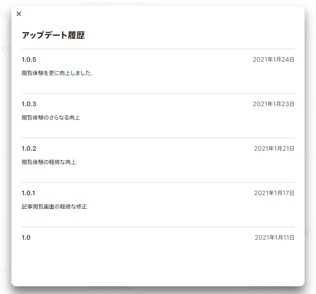
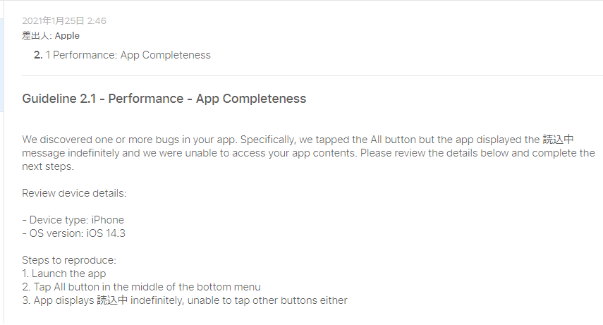
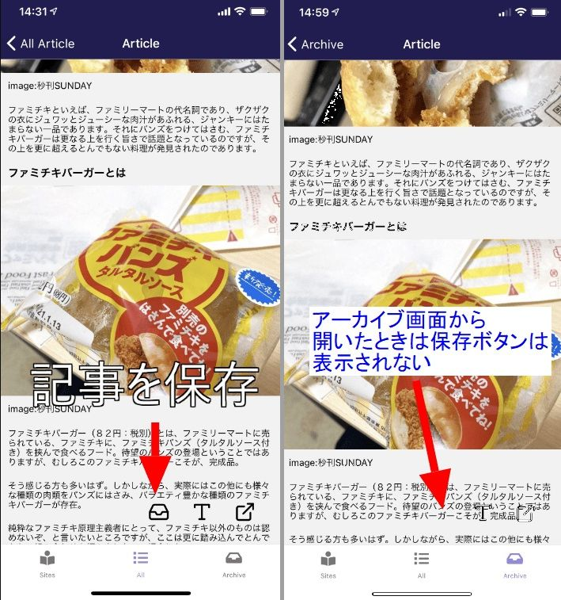
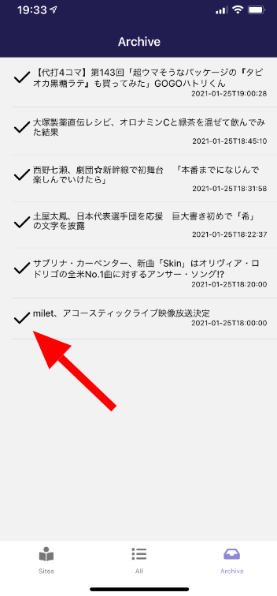
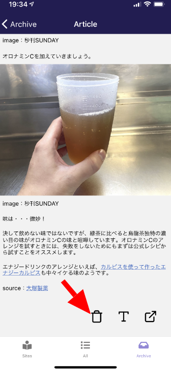
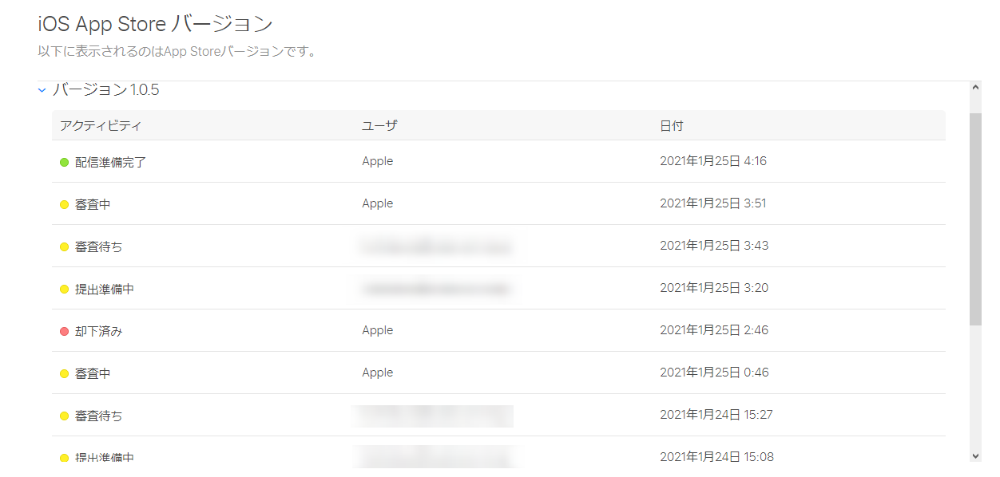

import { Link } from 'gatsby';

AppStoreにkenmo readerのアップデートを提出したら却下された話と、アーカイブ機能を少し変更した話を書きます。

## kenmo readerがAppStoreで初めて却下されました

kenmo readerはReact Native(Expo)で開発しているのでOTAアップデートが利用できます。これはアプリストアの審査を通さずにアプリをアップデートできる機能です。

ただ、ストアで表示したときに更新履歴が何もないと印象が悪いので機能追加したときには新しいバイナリをストアに提出して審査してもらっています。



ここのところ**登録したサイトの記事をまとめて取得**とか**アーカイブ機能**とか追加しているので頻繁にストアに提出しています。

お気づきだと思いますがバージョン**1.0.4**が上の画像では抜けています。これはApp Storeで却下されたためです。

**アーカイブ機能**を追加したバージョンを審査に提出したときに却下されました。

レビュワーから届いたメッセージがこちらです。



どうやら**Allボタンをタップしたときに読込中から変わらずアプリが操作不能になった**ということのようです。

スクリーンショットも添付されていました。


今回追加したアーカイブ機能とは関係ないみたいです。

登録したサイトの記事をまとめて取得する機能は1個前のバージョン(1.0.3)で追加してそのときは承認されたんですが、今回の審査ではうまく動かなかったみたいです。

まとめて取得機能は、「登録したサイトのURLをストレージからロードして`fetch`を繰り返す」という実装になっています。

該当部分のコードです。

```javascript
getNews() {
	global.storage.getAllDataForKey('site')
		.then(res => {
			const urls = res.map(site => site.url);
			for (const url of urls) {
				fetch(url + '/wp-json/wp/v2/posts?_embed')
					.then((response) => response.json())
					.then((responseJson) => {
						for(var i in responseJson) {
							var p = new WPPost(responseJson[i]);
							this.setState({ items: this.state.items.concat([p]) });
						}
					})
					.catch((error) => {
						console.error(error);
					});
			}
		});
}
```

エラーの場合の処理とかタイムアウトを設定してないので、**レビュワーが登録したサイトが多すぎた**か**レビュー中にどこかのサイトが落ちていた**んだろうと想像できます。

確かに、読み込み中が延々と表示され続けるのは印象が悪いのでローディングスピナーが表示されないようにしました。

**読込中**の表示が出ないので画面は地味になりますが、代わりに`fetch`が完了した記事から次々に表示されていくので体験は良くなるだろうという判断です。

ローディングスピナーを撤去しただけのバージョンを再提出しても良かったのですが、アーカイブ機能で修正したい箇所があったのでバージョン**1.0.5**としてビルドしなおすことにしました。

## アーカイブ機能の改善

<Link to="/blog/2021-01-24">前回</Link>実装した、記事をアーカイブする機能ですが、アーカイブ記事の一覧画面から記事表示画面に遷移したときは保存ボタンが表示されないという動きにしていました。



記事の削除は一覧画面でチェックマークをタップすることで行います。



記事を読み終わったら、一覧画面に戻ってチェックマークをタップするという使い方になるため操作の手数が多いのが気になりました。

そこで、アーカイブした記事の表示画面に**記事を削除**して**一覧に戻るボタン**を設置することにしました。



### 実装したコード

前回書いた通り、記事の保存ボタンは**どの画面から遷移してきたか**を三項演算子で評価して真の場合に表示する仕組みになっています。偽のときは`null`を返すようにしていました。

今回は偽の時に`記事削除&前に戻る`ボタンを表示することにします。

**src\scenes\article\article.js**

```javascript
{arrival ?
<View style={{ position: 'absolute', right: 120 }}>
  <TouchableOpacity
    onPress={() => {
      var archiveData = {
        title: title,
        url: url,
        date: date,
        content: content
      }
      global.storage.save({
        key: 'archive',
        id: title,
        data: archiveData,
      });
      Haptics.notificationAsync(Haptics.NotificationFeedbackType.Success)
    }}
  > 
    <Icon name="inbox" size={30} color="black"/>
  </TouchableOpacity>
</View>
: /* ここから */
<View style={{ position: 'absolute', right: 120 }}>
  <TouchableOpacity
    onPress={() => {
      global.storage.remove({
        key: 'archive',
        id: title,
      });
      Haptics.notificationAsync(Haptics.NotificationFeedbackType.Success)
      this.props.navigation.goBack()
    }}
  > 
    <Icon name="trash" size={30} color="black"/>
  </TouchableOpacity>
</View>
  /* ここまで追加 */
}
```

`onPress`イベントに**レコードの削除**と**ハプティックフィードバック**とReact Navigationの**goBack**メソッドを与えて実装しました。

これで、記事を読み終わったときに`trash`アイコンをタップすることで記事を削除しつつ前の画面(アーカイブ記事一覧)に戻ることができます。

## まとめ

このバージョンで再提出したところ、無事に承認されてストアで配信されました。



以上です。

---