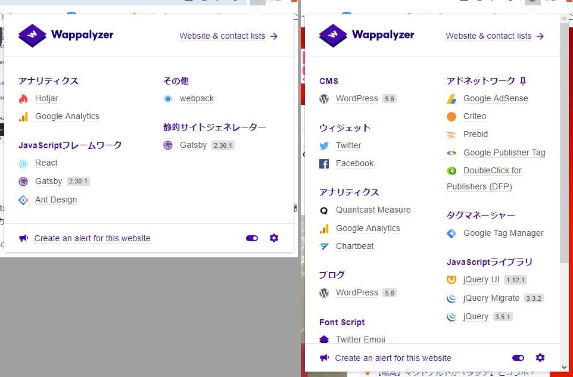
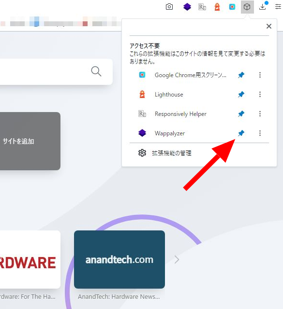
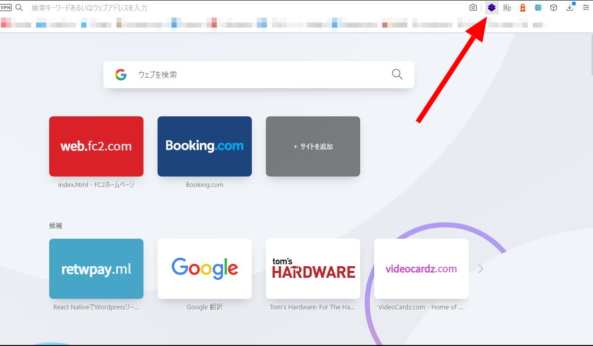
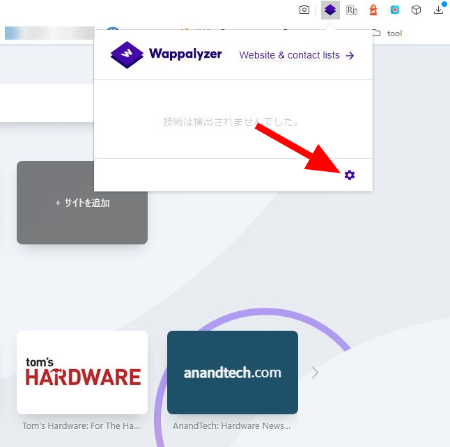
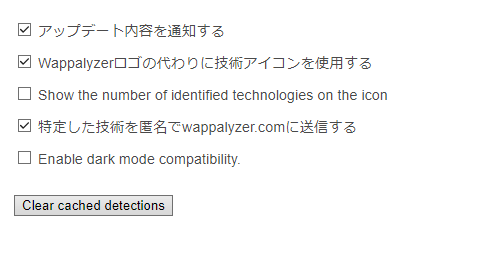
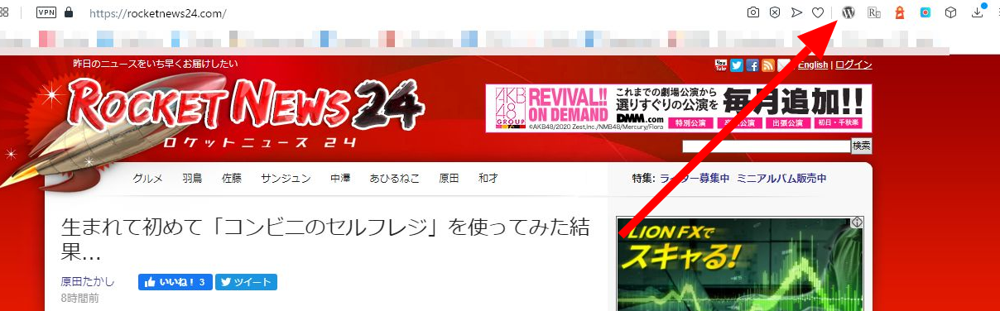
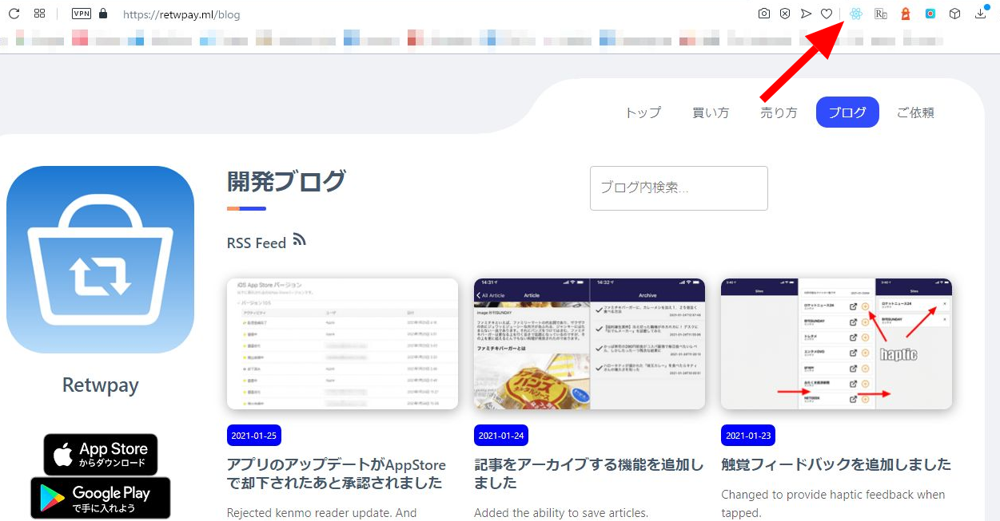
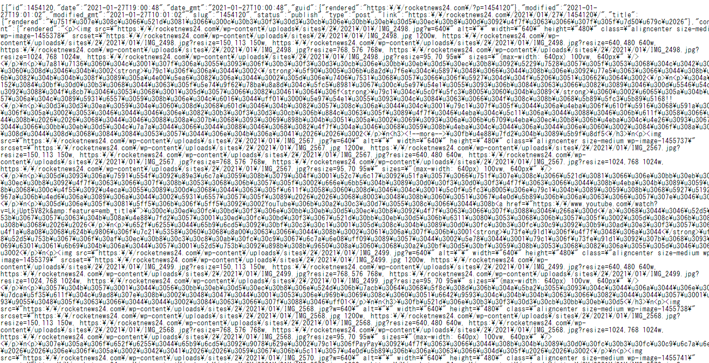
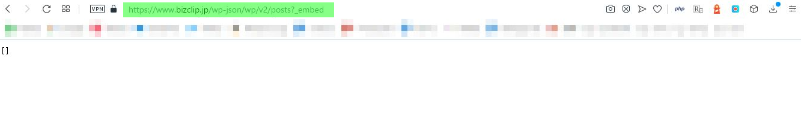

import { Link } from 'gatsby';

## Wappalyzerの使い方

<Link to="/blog/2021-01-10">以前の投稿</Link>でkenmo readerがウェブサイトからコンテンツを取得する仕組みを書きました。

  

要は、ウェブサイトのURLの最後に`/wp-json/wp/v2/posts?_embed`を付与してアクセスすることによって、WodrPress APIを叩くという仕組みです。

つまりkenmo readerで対応できるウェブサイトは

- WordPress製であること
- APIでのアクセスを許可していること

 

の2点をクリアしている必要があります。

ただウェブサイトがWordPressかどうか見た目で判断するのは難しいです。

そこで、ウェブサイトで使われている技術(ソフトウェアやサービス、フレームワーク)を一覧できるChrome拡張[Wappalyzer](https://chrome.google.com/webstore/detail/wappalyzer/gppongmhjkpfnbhagpmjfkannfbllamg?hl=ja)を使います。

インストールすると閲覧中のウェブサイトで使われている技術を調べることができます。

普通のChrome拡張と同じようにインストールするだけでも使えますが、初期状態ではアイコンを出してくれないので設定を変えます。

Wappalyzerの設定は以上です。

上の設定にすることで、今開いているウェブページで使用されているフレームワークが画面上に常に表示されるようになります。

開いてるサイトがWordPressであることがわかったらURLに`/wp-json/wp/v2/posts?_embed`を加えてアクセスしてみることでkenmo readerに対応しているかがわかります。

[https://rocketnews24.com/wp-json/wp/v2/posts?_embed](https://rocketnews24.com/wp-json/wp/v2/posts?_embed)

対応してない場合は404や403エラーが表示されます。

あるいは下のように何も表示されなかったり、極端に少ない情報しか表示されなかったりします

Wappalyzerの使い方は以上です。

見ているサイトでkenmo readerに追加したいものがあればTwitterや[ランディングページ](https://kenmo-reader.ml/)のフィードバックウィジェットで教えてもらえると助かります。

---