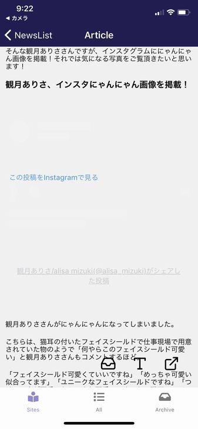
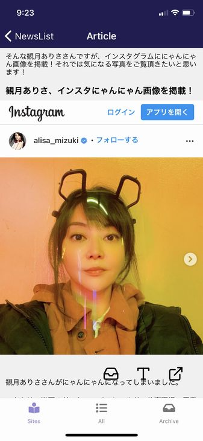
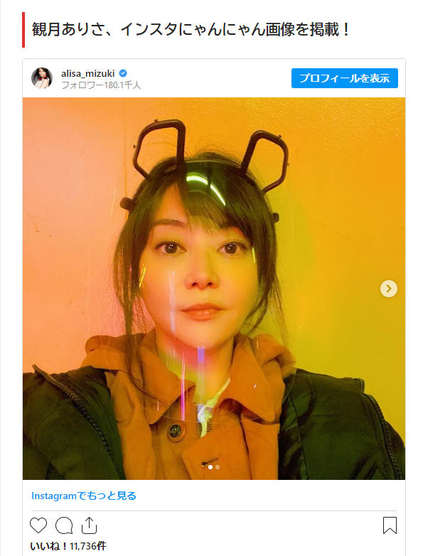
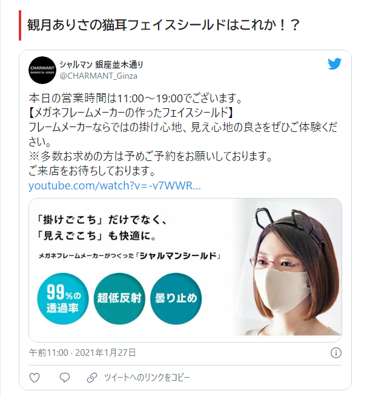
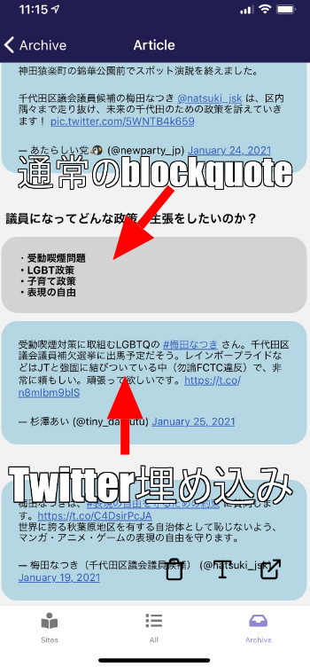

import { Link } from 'gatsby';

## kenmo readerがInstagram埋め込みに対応しました

これまでkenmo readerでは記事の中に埋め込まれたInstagramの投稿の表示ができていませんでした。




長い試行錯誤の末にようやく記事の中に含まれるInstagramの埋め込みの再現に成功しました。



途中で別の機能も実装したので、つきっきりというわけではありませんが2週間くらいかかったでしょうか。ようやく再現できました。

## 実装したコード

考え方は<Link to="/blog/2021-01-21">YouTubeの埋め込み</Link>と変わりません。

[react-native-render-html](https://github.com/meliorence/react-native-render-html)のcustom renderersを使ってInstagram埋め込みのタグに含まれているURLをWebViewで開きます。



### 埋め込み部分のHTML

Instagramの投稿が埋め込まれているHTMLはこんな感じになっています。

`観月ありさ（44）にゃんにゃん画像をインスタにアップ、ファンがざわつく事態に`

`https://yukawanet.com/archives/miduki20210128.html`

```html
<blockquote class="instagram-media"
  style="background: #FFF; border: 0; border-radius: 3px; box-shadow: 0 0 1px 0 rgba(0,0,0,0.5),0 1px 10px 0 rgba(0,0,0,0.15); margin: 1px; max-width: 540px; min-width: 326px; padding: 0; width: calc(100% - 2px);"
  data-instgrm-captioned=""
  data-instgrm-permalink="https://www.instagram.com/p/CKiPEzBnsWM/?utm_source=ig_embed&amp;utm_campaign=loading"
  data-instgrm-version="13">
  <div style="padding: 16px;">
    <p>&nbsp;</p>
    <!-- 長いので省略 -->
    <p
      style="color: #c9c8cd; font-family: Arial,sans-serif; font-size: 14px; line-height: 17px; margin-bottom: 0; margin-top: 8px; overflow: hidden; padding: 8px 0 7px; text-align: center; text-overflow: ellipsis; white-space: nowrap;">
      <a style="color: #c9c8cd; font-family: Arial,sans-serif; font-size: 14px; font-style: normal; font-weight: normal; line-height: 17px; text-decoration: none;"
        href="https://www.instagram.com/p/CKiPEzBnsWM/?utm_source=ig_embed&amp;utm_campaign=loading" target="_blank"
        rel="noopener">観月ありさ/alisa mizuki(@alisa_mizuki)がシェアした投稿</a></p>
  </div>
</blockquote>
<p>
  <script async src="//www.instagram.com/embed.js"></script>
</p>
```

`blockquote`タグにclass`instagram-media`が割り当てられており、`data-instgrm-permalink`属性でURLが割り振られています。

なので、class`instagram-media`の`blockquote`タグの中の`data-instgrm-permalink`のURLをWebViewで開くように設定します。

### 書いたコード

**src\scenes\article\article.js**

```javascript
<HTML
  source={{ html:content }}
  classesStyles={defaultClass ? largeClassesStyles : middleClassesStyles}
  tagsStyles={defaultStyle ? largeTagsStyles : middleTagsStyles}
  baseFontStyle={{ fontFamily: "Roboto" }}
  ignoredStyles={["font-family", "letter-spacing"]}
  renderers={{
    iframe: (htmlAttribs, passProps) => {
      return (
        <View
          key={passProps.key}
          style={{
            width: "100%",
            aspectRatio: 16.0 / 9.0,
            marginTop: 16,
            marginBottom: 16,
          }}>
          <WebView
            scrollEnabled={false}
            source={{ uri: htmlAttribs.src }}
            style={{ flex: 1, width: "100%", aspectRatio: 16.0 / 9.0 }}
          />
        </View>
      );
    },
    /* ここから */
    blockquote: (htmlAttribs, children, passProps, renderersProps) => {
      if (htmlAttribs.class == 'instagram-media') {
        const instagramLink = htmlAttribs['data-instgrm-permalink']
        return (
          <View
            key={passProps.key}
            style={{
              width: "100%",
              aspectRatio: 16.0 / 20.0,
            }}>
            <WebView
              scrollEnabled={false}
              source={{ uri: instagramLink}}
            />
          </View>
        )
      } else if (htmlAttribs.class == 'twitter-tweet') {
        return (
          <View style={styles.tweet}>{children}</View>
        )
      } else {
        return (
          <View style={styles.blockquote}>{children}</View>
        )
      }
    }
    /* ここまで追加 */
  }}
/>
```

上記の**class`instagram-media`の`blockquote`タグの中の`data-instgrm-permalink`のURLをWebViewで開くように**している部分です。

```javascript
blockquote: (htmlAttribs, children, passProps, renderersProps) => {
if (htmlAttribs.class == 'instagram-media') {
  const instagramLink = htmlAttribs['data-instgrm-permalink']
  return (
    <View
      key={passProps.key}
      style={{
        width: "100%",
        aspectRatio: 16.0 / 20.0,
      }}>
      <WebView
        scrollEnabled={false}
        source={{ uri: instagramLink}}
      />
    </View>
  )
}
```

これだけだと、他の`blockquote`で埋め込まれているコンテンツが表示されなくなるので`if`で`instagram-media`以外のときの処理を分けます。

例えばTwitterの埋め込みは`blockquote`です。



```html
<blockquote class="twitter-tweet" data-width="550" data-dnt="true">
  <p lang="ja" dir="ltr">
    本日の営業時間は11:00～19:00でございます。<br />【メガネフレームメーカーの作ったフェイスシールド】<br />フレームメーカーならではの掛け心地、見え心地の良さをぜひご体験ください。<br />※多数お求めの方は予めご予約をお願いしております。<br />ご来店をお待ちしております。<a
      href="https://t.co/hei7HfyS3B">https://t.co/hei7HfyS3B</a> <a
      href="https://t.co/k3AVcjhXmU">pic.twitter.com/k3AVcjhXmU</a></p>
  <p>&mdash; シャルマン 銀座並木通り (@CHARMANT_Ginza) <a
      href="https://twitter.com/CHARMANT_Ginza/status/1354247761223430147?ref_src=twsrc%5Etfw">January 27, 2021</a></p>
</blockquote>
<p>
  <script async src="https://platform.twitter.com/widgets.js" charset="utf-8"></script>
</p>
```

Twitterの場合は`blockquote`タグにclass`twitter-tweet`が割り当てられており、URLが`a`タグの属性に入っています。そのため今回のInstagramとまったく同じやり方は通用しないようです。

分け方は**Instagramとそれ以外**でもできなくはないですが

- 今後Twitterの埋め込みを改善したい
- Instagram、Twitter、それ以外のblockquoteで別のスタイルを当てたい

<br/>

という理由で3パターンに分けました。

```javascript
else if (htmlAttribs.class == 'twitter-tweet') {
  return (
    <View style={styles.tweet}>{children}</View>
  )
} else {
  return (
    <View style={styles.blockquote}>{children}</View>
  )
}
```

これで

- Instagram埋め込み
- Twitter埋め込み
- それ以外のblockquote

<br/>

で処理を分けることができました。

これだけだと前に<Link to="/blog/2021-01-14">Twitter埋め込みに当てた独自のスタイル</Link>が適用されなくなりました。

なので、スタイリング用に分けた別ファイルからTwitter部分だけ戻します。さらにInstagramでもTwitterでもない`blockquote`用にスタイルを定義します。

```javascript
const styles = StyleSheet.create({
  container: {
    flex: 1,
  },
  /* 省略 */
	tweet: {
      backgroundColor: "lightblue",
      padding: 10,
      borderRadius: 20,
      borderWidth: 1,
      borderColor: "lightblue",
      overflow: "hidden",
      margin: 5,
	},
	blockquote: {
      backgroundColor: 'lightgray',
      padding: 10,
      borderRadius: 20,
      overflow: "hidden",
      margin: 5,
  }
});
```

これで、Instagramの場合、Twitterの場合、それ以外の`blockquote`で表示を分けることができました。



## まとめ

実装したコードは以上です。

あとはTwitterの埋め込みを今回と同じWebViewで開くやり方を模索中です。


---