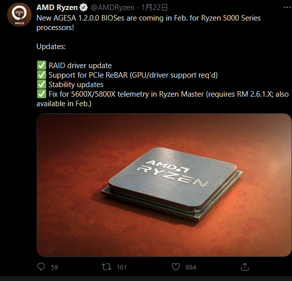
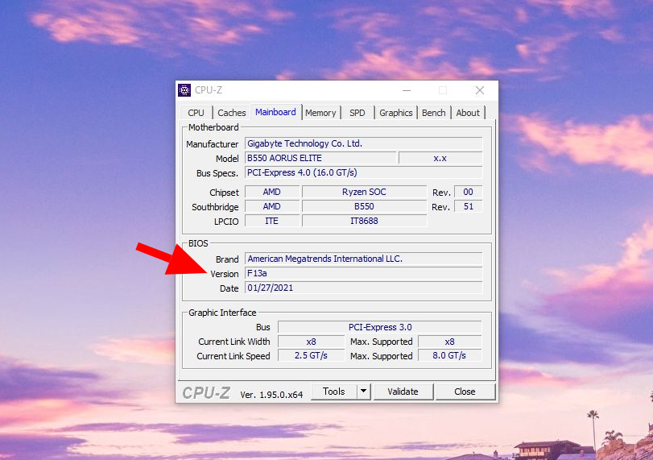
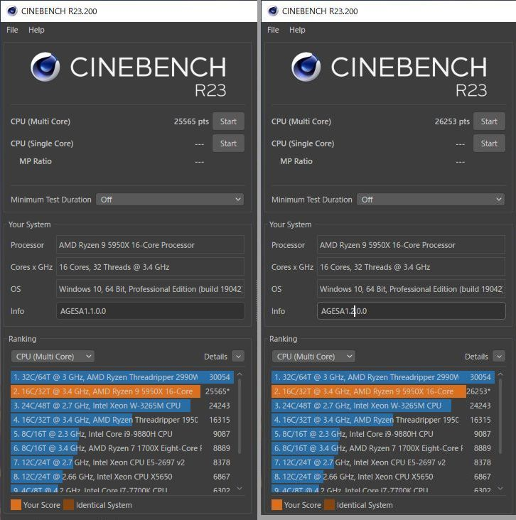
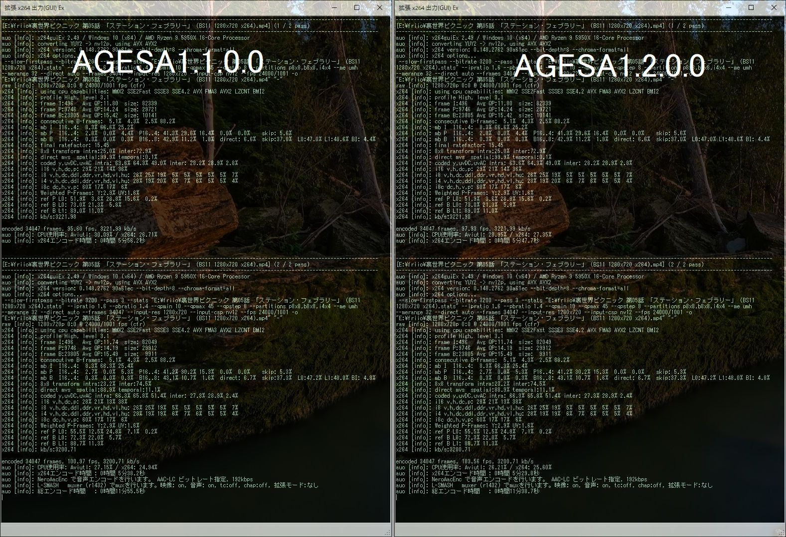
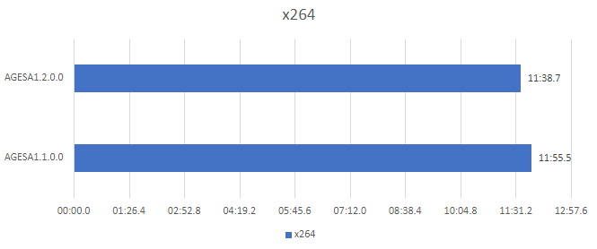

import { Link } from 'gatsby';

## 今日はアプリ開発の話ではない

kenmo readerのツイッター埋め込み再現が思った以上に難航してアプリ開発の進捗がほぼないので久々の自作PC話です。

広告なしニュース/ブログリーダーアプリ[kenmo reader](https://kenmo-reader.ml)をよろしくお願いします。

## B550 AORUS ELITEに新BIOSが来ているよ

AMDが以前予告していた通り`AGESA1.2.0.0`を適用した新BIOSが公開されました。

[B550 AORUS ELITE (rev. 1.0)](https://www.gigabyte.com/jp/Motherboard/B550-AORUS-ELITE-rev-10/support#support-dl-bios)

 

主な変更点は

- Re-Size BARのサポート
- RAIDドライバの更新
- 安定性の向上
- Ryzen 5 5600XとRyzen 7 5800X使用時のRyzen Masternのバグ修正

 

となっておりパフォーマンスの向上を期待できるものではなさそうです。

ただ、B550 AORUS ELITEの場合は1つ前の`AGESA1.1.8.0`適用BIOSが出ませんでした。

`AGESA1.1.8.0`ではRyzen 5000シリーズのパフォーマンスを引き上げる**Precision Boost Overdrive 2**が追加されました。

そのため、`AGESA1.1.0.0`止まりだったB550 AORUS ELITEは`AGESA1.2.0.0`適用の新BIOSでパフォーマンスが向上する可能性が高いです。

私の場合は、Ryzen5000シリーズの<Link to="/blog/2020-12-12">ランダムリブート問題と1ヶ月格闘してやっと解決した</Link>という経緯があります。

苦労して手に入れた安定稼働する環境を変更するのは躊躇しましたが、パフォーマンス向上が見込めるということで新BIOSに更新しました。AMD直々に**安定性の向上**を謳っているというのも理由です。

## 新BIOSに更新しました

というわけで早速新BIOSを入れました。

## パフォーマンスの検証

CinebenchR23とx264エンコードを使って`AGESA1.2.0.0`と`AGESA1.1.0.0`使用時のパフォーマンスを比較しました。

### 検証機材

- Ryzen 9 5950X
- GIGABYTE B550 AORUS ELITE
- Crucial CT2K16G4DFD832A
- 玄人志向 RD-RX550-E2GB/OC
- Windows10 `20H2`

 

### Cinebench R23

| Cinebench     |AGESA1.1.0.0      |AGESA1.2.0.0         |
|-----------|:------------:|:------------:|
| R23      | 25565      | 26253	       |

 

計測時は暖房をつけていたのでスコアは両方低めに出ていますが、`AGESA1.2.0.0`で明らかにスコアが伸びました。

### x264エンコード

続いてはAviUtlとx264guiExを使った動画エンコードの結果です。エンコードの設定はいつもと同じやつです。

- <Link to="/blog/2020-11-07">x265エンコード検証 5</Link>
- <Link to="/blog/2020-01-13">x265エンコード検証 4</Link>
- <Link to="/blog/2019-12-03">x265エンコード検証 3</Link>
- <Link to="/blog/2019-07-08">x265エンコード検証 2</Link>
- <Link to="/blog/2019-02-14">x265エンコード検証</Link>

 

#### エンコード結果

|      |AGESA1.1.0.0      |AGESA1.2.0.0         |
|-----------|:------------:|:------------:|
| x264      | 11:55.5      | 11:38.7	       |

ほぼ誤差といえる結果ですが、少しだけエンコード速度は上がりました。

## まとめ

動画エンコードは大変微妙な速度向上でしたがCinebenchは明らかにスコアが上がりました。

あとはランダムリブート病が再発しないことを祈るだけです。

Blackmagic RAW Speed Testを今回使わなかったのは単に`AGESA1.1.0.0`で計測するのを忘れていたからです。

---