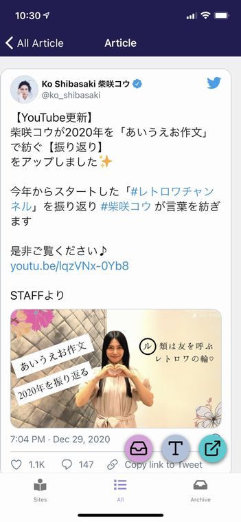
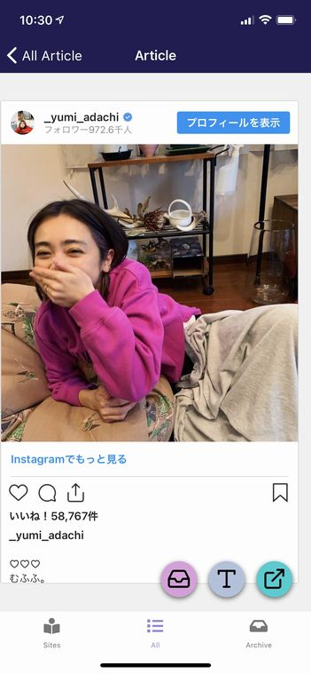
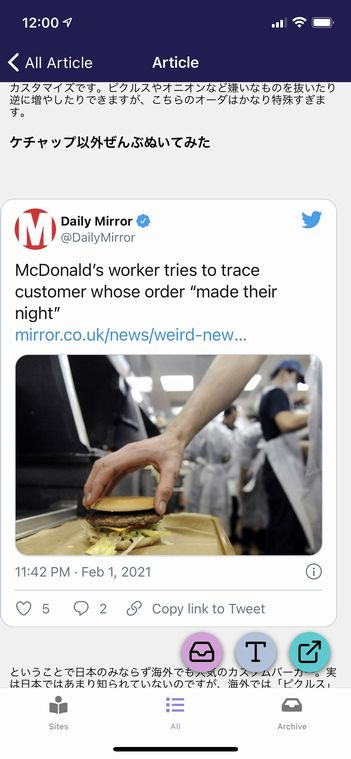

import { Link } from 'gatsby';

## kenmo readerがツイッターウィジェットの埋め込みに対応しました

長い間試行錯誤を重ねた結果、ついに記事本文に含まれるTwitterの埋め込みを完全に再現できました。



さらに、<Link to="/blog/2021-01-29">前回</Link>再現に成功したInstagramの埋め込みも、Twitterと同じやり方に変更した結果再現のクオリティが上がりました。



## 変更したコード

アプローチ方法は前回のInstagram埋め込みの時とそれほど変わりありません。

[react-native-render-html](https://github.com/meliorence/react-native-render-html)のcustom renderersを使って`blockquote`タグをWebViewを使って開きます。

Instagramの時には`blockquote`タグの`data-instgrm-permalink`属性に入っている**URL**を開きましたが、今回は`blockquote`タグの**HTML文字列**に`script`タグを合体させて開きました。

### 埋め込み部分のHTML

TwitterやInstagramの投稿が埋め込まれているHTMLはこんな感じになっています。

**安達祐実さん今年で40歳、アラフォーだったなんて信じられないとファン驚愕**

`https://yukawanet.com/archives/adati20210202.html`

**Twitter**の場合

```html
<blockquote class="twitter-tweet" data-width="550" data-dnt="true">
  <p lang="ja" dir="ltr">【YouTube更新】<br />柴咲コウが2020年を「あいうえお作文」で紡ぐ【振り返り】<br />をアップしました✨</p>
  <p>今年からスタートした「<a
      href="https://twitter.com/hashtag/%E3%83%AC%E3%83%88%E3%83%AD%E3%83%AF%E3%83%81%E3%83%A3%E3%83%B3%E3%83%8D%E3%83%AB?src=hash&amp;ref_src=twsrc%5Etfw">#レトロワチャンネル</a>」を振り返り
    <a
      href="https://twitter.com/hashtag/%E6%9F%B4%E5%92%B2%E3%82%B3%E3%82%A6?src=hash&amp;ref_src=twsrc%5Etfw">#柴咲コウ</a>
    が言葉を紡ぎます</p>
  <p>是非ご覧ください♪<a href="https://t.co/fgIVjUnNo0">https://t.co/fgIVjUnNo0</a></p>
  <p>STAFFより <a href="https://t.co/RHjHq3bii4">pic.twitter.com/RHjHq3bii4</a></p>
  <p>&mdash; Ko Shibasaki 柴咲コウ (@ko_shibasaki) <a
      href="https://twitter.com/ko_shibasaki/status/1343860437352206336?ref_src=twsrc%5Etfw">December 29, 2020</a></p>
</blockquote>
<p>
  <script async src="https://platform.twitter.com/widgets.js" charset="utf-8"></script>
```

**Instagram**の場合

```html
<blockquote class="instagram-media"
  style="background: #FFF; border: 0; border-radius: 3px; box-shadow: 0 0 1px 0 rgba(0,0,0,0.5),0 1px 10px 0 rgba(0,0,0,0.15); margin: 1px; max-width: 540px; min-width: 326px; padding: 0; width: calc(100% - 2px);"
  data-instgrm-captioned=""
  data-instgrm-permalink="https://www.instagram.com/p/CKqbnrUAyEo/?utm_source=ig_embed&amp;utm_campaign=loading"
  data-instgrm-version="13">
  <div style="padding: 16px;">
    <p>&nbsp;</p>
    <!-- 長いので省略 -->
    <p>&nbsp;</p>
    <p
      style="color: #c9c8cd; font-family: Arial,sans-serif; font-size: 14px; line-height: 17px; margin-bottom: 0; margin-top: 8px; overflow: hidden; padding: 8px 0 7px; text-align: center; text-overflow: ellipsis; white-space: nowrap;">
      <a style="color: #c9c8cd; font-family: Arial,sans-serif; font-size: 14px; font-style: normal; font-weight: normal; line-height: 17px; text-decoration: none;"
        href="https://www.instagram.com/p/CKqbnrUAyEo/?utm_source=ig_embed&amp;utm_campaign=loading" target="_blank"
        rel="noopener">安達祐実(@_yumi_adachi)がシェアした投稿</a></p>
  </div>
</blockquote>
<p>
  <script async src="//www.instagram.com/embed.js"></script>
```

どちらも`blockquote`タグと`script`の組み合わせで埋め込まれていることがわかります。

つまり、元のHTML文字列にTwitter/Instagramそれぞれのスクリプトを合体させてWebViewで開けば完全に再現できるのです。

### 実装したコード

```javascript
blockquote: (htmlAttribs, children, renderersProps, passProps, domNode) => {
  if (htmlAttribs.class == 'instagram-media') {
    const JS = '<script type="text/javascript" src="https://www.instagram.com/embed.js"></script>'
    const html = domNodeToHTMLString(passProps.domNode)
    const source = html + JS
    return (
      <AutoHeightWebView
        style={{ width: Dimensions.get('window').width - 15, marginTop: 35 }}
        source={{ html: source}}
        javaScriptEnabled={true}
        scrollEnabled={false}
    />
    )
  } else if (htmlAttribs.class == 'twitter-tweet') {
    const JS = '<script type="text/javascript" src="https://platform.twitter.com/widgets.js"></script>'
    const html = domNodeToHTMLString(passProps.domNode)
    const source = html + JS
    return (
      <AutoHeightWebView
        style={{ width: Dimensions.get('window').width - 15, marginTop: 35 }}
        source={{ html: source}}
        javaScriptEnabled={true}
        scrollEnabled={false}
      />
    )
  } else {
    return (
      <View style={styles.blockquote}>{children}</View>
    )
  }
},
```

`blockquote`タグのclassをif文で処理を分けるところまでは前回と同じです。

ここからが今回のポイントです。

```javascript
const JS = '<script type="text/javascript" src="https://www.instagram.com/embed.js"></script>'
const html = domNodeToHTMLString(passProps.domNode)
const source = html + JS
```

まず、合体させるための`script`を定義します。

次の`domNodeToHTMLString`ファンクションではDOMノードをHTML文字列に変換します。このファンクションは最近追加されたもののようでとてもラッキーでした。これで`blockquote`タグ内のHTML文字列が変数`html`に代入されます。

そして、一行上で定義した`script`と`html`を`source`として合体させます。

```javascript
<AutoHeightWebView
  style={{ width: Dimensions.get('window').width - 15, marginTop: 35 }}
  source={{ html: source}}
  javaScriptEnabled={true}
  scrollEnabled={false}
/>
```

通常のWebViewで`source`のHTML文字列をレンダリングしても一応は表示されるのですが、高さの調整が難しいので`AutoHeightWebView`を導入しました。

これでTwitter/Instagramの埋め込みが完全に再現できました。



実装したコードは以上です。

## まとめ

TwitterとInstagramの埋め込みの再現はアプリの初回リリースからの懸案事項だったので、3週間かかってしまいましたが最終的には解決できてよかったです。

次は、ダークモードの実装をしたいと思っています。

あとは、各サイトでフォントの拡大が効かない部分とか画像が表示されない部分などを<Link to="/blog/2021-01-15">以前やったように</Link>、該当のページのHTMLを確認してスタイルを調整していくという地道な作業をしていく予定です。


---